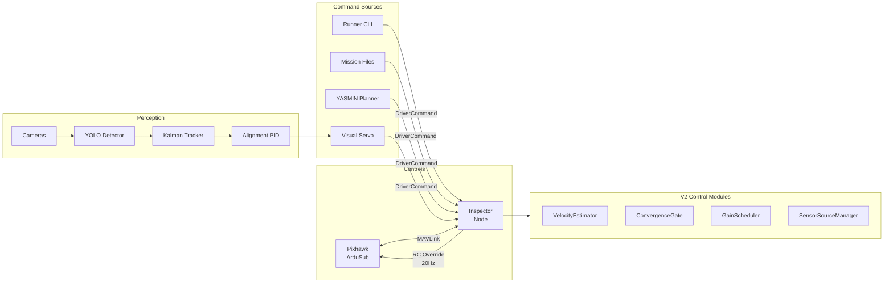
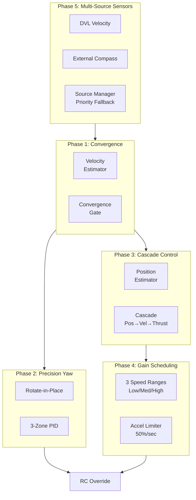
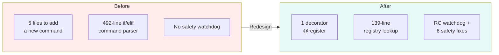
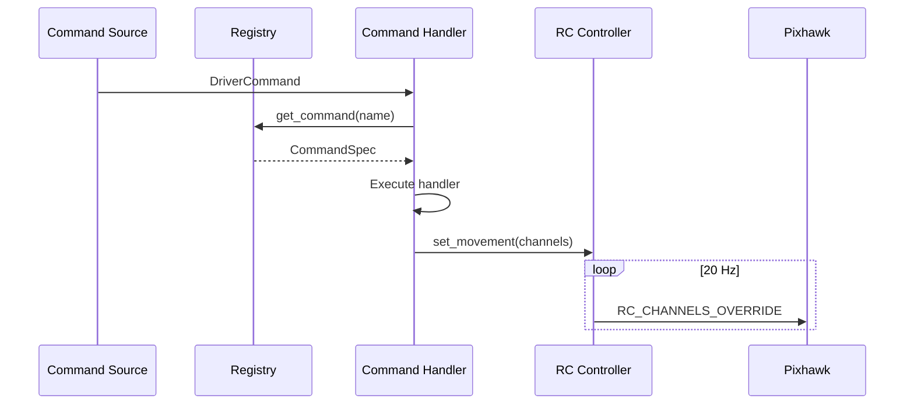

# BRACU Duburi 4.2 — Control & Perception Software

ROS 2 Humble workspace for the BRACU Duburi AUV 4.2. Controls the vehicle through a Pixhawk 2.4.8 running ArduSub via pymavlink. Perception via YOLO11 object detection with CUDA-accelerated inference, Kalman-filtered tracking, and PID-based visual servoing.

> **Branch:** `Control-Redesign-V2` — Advanced control features (convergence gates, cascade control, DVL integration)

**83 Python source files · 10 packages · ~16,500 lines**



---

## Table of Contents

1. [Hardware](#hardware)
2. [Packages & Codebase Structure](#packages--codebase-structure)
3. [Package Dependencies](#package-dependencies)
4. [Build & Quick Start](#build--quick-start)
5. [Getting Up and Running](#getting-up-and-running)
6. [Architecture](#architecture)
7. [System Architecture Deep Dive](#system-architecture-deep-dive)
8. [Configuration Profiles](#configuration-profiles)
9. [Live Parameter Tuning](#live-parameter-tuning)
10. [Using the Duburi CLI (Runner)](#using-the-duburi-cli-runner)
11. [Planning Missions Without the Runner](#planning-missions-without-the-runner)
12. [Logging](#logging)
13. [Vision & Perception](#vision--perception)
14. [Simulation: Gazebo and ArduSub SITL](#simulation-gazebo-and-ardusub-sitl)
15. [Topics & Messages](#topics--messages)
16. [Inspector Parameters](#inspector-parameters)
17. [Troubleshooting](#troubleshooting)
18. [Analysis & Documentation](#analysis--documentation)
19. [Dependencies](#dependencies)
20. [License](#license)

---

## ✨ What's New

### Control Redesign V2 (Current Development Branch)

Advanced control features for reliable autonomous missions:



**Features:**
| Phase | Feature | Problem Solved |
|-------|---------|----------------|
| 1 | Convergence Gates | Vehicle coasts past targets |
| 2 | Rotate-in-Place | U-turn corners → sharp 90° |
| 3 | Cascade Control | ±1m variance → ±0.2m |
| 4 | Gain Scheduling | High-speed overshoots |
| 5 | DVL + External IMU | IMU drift |

**Status**: Implemented, awaiting pool testing. See `analysis/guides/pool-testing/next_things_to_check.md`.

### Control Redesign V1 (Stable Branch)



**Key Changes:**
- **Single source of truth** - Commands defined via `@register` decorator
- **72% parser reduction** - 492 to 139 lines in command_parser.py
- **Clean Python API** - `DuburiClient` class for perception integration
- **6 safety fixes** - RC watchdog, PID anti-windup, thread safety
- **Live-tunable parameters** - All PID gains and brake settings via ROS2 param

See [`analysis/design-decisions/control-stack-redesign.md`](analysis/design-decisions/control-stack-redesign.md) for full details.

---

## Hardware

| Component | Spec |
|-----------|------|
| **Flight Controller** | Pixhawk 2.4.8 |
| **Firmware** | ArduSub (ArduPilot) |
| **Connection** | `/dev/ttyACM0` (serial, 115200 baud) |
| **Thrusters** | Blue Robotics T200 |
| **Channels** | Ch 1–4 lateral, Ch 5–8 depth |
| **Barometer** | BAR30 (depth sensing) |
| **Camera** | USB camera (V4L2 compatible) |
| **Compute** | Ubuntu 22.04, CUDA 12.8 (for YOLO inference) |

---

## Packages & Codebase Structure

### Package Overview

| Package | Modules | Lines | ROS Nodes | Description |
|---------|---------|-------|-----------|-------------|
| `duburi_interfaces` | — | — | — | Shared ROS 2 messages: `DriverCommand`, `TeleopCommand`, `VehicleState`, `VehicleDiagnostics`, `MavlinkEvent`, `DriverCommandFeedback`, `Detection`, `DetectionArray`, `AlignmentStatus`, `CameraStatus` |
| `duburi_common` | 2 | ~200 | — | Shared constants (`MISSION_PATHS`, `UNARMED_ALLOWED`) and command vocabulary (aliases, direction maps, prefix resolution) |
| `mavlink_inspector` | 9 | ~5,760 | `inspector` | MAVLink ↔ ROS bridge. Owns serial port, RC override, PID controllers, command dispatch, telemetry publishing. **V2 adds** velocity_control.py, sensor_sources.py |
| `mavlink_driver` | 5 | ~1,040 | `mission_executor`, `teleop_driver` | High-level command API (`driver_client.py`), mission file execution, joystick/teleop via `TeleopCommand` |
| `mavlink_runner` | 4 | ~920 | `runner` | Interactive `Duburi >` CLI with history, status dashboard, file-based missions |
| `mavlink_logger` | 1 | ~230 | `logger` | Logs all ROS topics to session-based CSV/JSON files |
| `vision` | 5 | ~900 | `detector_node`, `detector_standalone`, `alignment_controller` | YOLO11 detection, Kalman-filtered tracking, PID-based visual servoing |
| `vision_inspector` | 8 | ~810 | `camera_manager`, `camera_enum`, `camera_test`, `camera_calibrate`, `camera_record`, `camera_playback` | Multi-camera management, enumeration, testing, calibration, recording/playback |
| `duburi_planner` | 18 | ~2,100 | `mission_planner` | YASMIN FSM mission planner with reusable states |
| `duburi_blueos` | 6 | ~450 | `blueos_monitor` | BlueOS REST API companion client |

### Inspector Module Breakdown (V2)

The inspector (the core MAVLink bridge) is decomposed into 9 focused modules:

```
mavlink_inspector/
├── inspector_node.py       (1,212 lines)  Orchestrator — timers, publishers, V2 module wiring
├── command_handler.py        (987 lines)  DriverCommand dispatch + V2 helpers
├── movement_commands.py      (599 lines)  MOVEMENTS registry — 30+ handlers + rotate-in-place
├── connection_manager.py     (374 lines)  Serial lifecycle, heartbeat, reconnect with backoff
├── rc_controller.py          (373 lines)  PWM math, channel constants, trapezoidal ramp
├── pid_controller.py         (256 lines)  Generic PID — deadband, anti-windup, EMA derivative
├── telemetry_parser.py       (180 lines)  MAVLink message dispatch → vehicle state
├── velocity_control.py       (907 lines)  **V2** VelocityEstimator, ConvergenceGate, CascadeController, GainScheduler, AccelerationLimiter
└── sensor_sources.py         (871 lines)  **V2** DVLSource, ExternalYawSource, SensorSourceManager
```

### V2 Control Modules

| Module | Classes | Purpose |
|--------|---------|---------|
| `velocity_control.py` | VelocityEstimator, ConvergenceGate, PositionEstimator, CascadeController, GainScheduler, AccelerationLimiter | Phase 1-4 control improvements |
| `sensor_sources.py` | DVLSource, DVLIMUSource, ExternalYawSource, PixhawkYawSource, SensorSourceManager | Phase 5 multi-source sensors |

### Driver Module Breakdown

```
mavlink_driver/
├── driver_client.py        (262 lines)  make_command() factory (deprecated - use DuburiClient)
├── duburi_client.py        (350 lines)  **NEW** Clean Python API for control + perception
├── mission_parser.py       (100 lines)  parse_file_command() (rewritten - 54% reduction)
├── mission_executor.py     (318 lines)  Autonomous mission runner node
└── teleop_driver.py        (~70 lines)  Twist → TeleopCommand on /driver/teleop

> `just_commands.py` has been **deleted** — `just_*` prefix is now handled by the command grammar.
```

### Runner Module Breakdown

```
mavlink_runner/
├── command_parser.py       (139 lines)  parse_command() — **rewritten**, 72% reduction
├── runner.py               (268 lines)  Interactive REPL node with readline
├── constants.py            (~50 lines)  HELP_TEXT, re-exports from duburi_common.constants
└── status_display.py        (75 lines)  ANSI dashboard (battery, heading, servos)
```

> **Full module map** with every class, function, and import path:
> see [analysis/12_CODE_REFERENCE.md](analysis/12_CODE_REFERENCE.md)

---

## Build & Quick Start

### Prerequisites

```bash
# ROS 2 Humble must be sourced
source /opt/ros/humble/setup.bash

# Python deps
pip install pymavlink ultralytics opencv-python
```

### Build

```bash
cd /home/duburi/workspaces/duburi_ws
colcon build            # builds all 8 packages (~5s clean)
source install/setup.bash
```

### Clean rebuild (if you get stale cache errors)

```bash
rm -rf build install log && colcon build
source install/setup.bash
```

### Quick Start — Controls

```bash
# Terminal 1: Inspector (connects to Pixhawk) — start first, always
ros2 run mavlink_inspector inspector

# Terminal 2: Interactive CLI
ros2 run mavlink_runner runner

#             CMD["driver/command<br/>DriverCommand"]
            STATE["mavlink/vehicle_state<br/>VehicleState"]
            DET["vision/detections<br/>DetectionArray"]
            IMG["camera/image_raw<br/>Image"]
etection (GPU)
ros2 run vision detector_node --ros-args -p enable_display:=True

# Terminal 3 (optional): Visual servoing alignment
ros2 run vision alignment_controller
```

### Launch files (multi-node)

```bash
# Inspector + logger together
ros2 launch mavlink_inspector duburi_control.launch.py

# With custom config profile
ros2 launch mavlink_inspector duburi_control.launch.py \
    params_file:=$(ros2 pkg prefix mavlink_inspector)/share/mavlink_inspector/config/pool_test.yaml

# With individual overrides
ros2 launch mavlink_inspector duburi_control.launch.py \
    connection_port:=/dev/ttyACM1 enable_logger:=true

# Camera + detector together
ros2 launch vision vision.launch.py enable_display:=True confidence:=0.4
```

---

## Simulation: Gazebo and ArduSub SITL

Software-in-the-loop stack used for autonomous testing **without the pool**: **Gazebo Harmonic (gz sim 8)** ↔ **ArduPilot ArduSub JSON** ↔ **`mavlink_inspector`** over **UDP** (same ROS 2 graph as hardware).

**Deep dive (architecture, ports, GPU lab planning, optional simulators):**  
[analysis/17_SIMULATION_GAZEBO_ARUDSUB_SITL.md](analysis/17_SIMULATION_GAZEBO_ARUDSUB_SITL.md)

### What you need on a fresh machine

| Layer | Requirement |
|--------|-------------|
| OS | **Ubuntu 22.04** (Jammy) |
| ROS 2 | **Humble** — `sudo apt install ros-humble-desktop` (or your metapackage) |
| Gazebo | **Gazebo Harmonic** — `gz sim` reports **8.x**; metapackage `gz-harmonic` |
| ROS ↔ Gazebo | **`ros-humble-ros-gzharmonic-bridge`** (and related `ros-humble-ros-gzharmonic*` as needed) |
| ArduPilot | Clone [ArduPilot/ardupilot](https://github.com/ArduPilot/ardupilot), run `Tools/environment_install/install-prereqs-ubuntu.sh`, build SITL (`./waf configure --board sitl` then `./waf sub`) |
| Gazebo world + BlueROV model | A world such as **`bluerov2_underwater.world`** from **ArduPilot Gazebo** (e.g. [ArduPilot/ardupilot_gazebo](https://github.com/ArduPilot/ardupilot_gazebo)) or your team fork. Resource paths must resolve so `gz sim` finds the world and models (`GZ_SIM_RESOURCE_PATH` / `GZ_SIM_SYSTEM_PLUGIN_PATH` per upstream docs). |
| Duburi workspace | This repo built with `colcon build`, `source install/setup.bash` (or `.zsh`) |
| Python | **`pymavlink`** (`pip install pymavlink`) — used by `mavlink_inspector` |

Verify versions:

```bash
source /opt/ros/humble/setup.bash
ros2 doctor --report | head -5
gz sim --version
dpkg -l | grep -E 'ros-humble-ros-gzharmonic|gz-sim8-cli' | head -5
```

### Port and transport rule (important)

`sim_vehicle.py` **`--out=udp:HOST:PORT`** sends MAVLink **UDP datagrams** to that address. The inspector must **listen on UDP** with the same host/port:

```bash
-p connection_port:=udpin:127.0.0.1:5760
```

Using **`tcp:127.0.0.1:5760`** connects to **TCP** port 5760 (SITL’s primary MAVLink TCP listener). That is **not** the same socket as the UDP `--out` stream; you may see connect + sparse heartbeats then **heartbeat loss**. Always pair **`--out=udp:…`** with **`connection_port:=udpin:…`** (same host and port).

### Bring-up order (working sequence)

Run in **separate terminals**. Order matters: **Gazebo first** (JSON plugin), then **SITL**, then **bridge**, then **Duburi**.

**1 — Gazebo (from a directory / env where the world resolves)**

```bash
source /opt/ros/humble/setup.bash
gz sim -r bluerov2_underwater.world
```

`-r` runs the simulation (unpaused). Use **`gz sim`**, not legacy `ign gazebo`, so the generation matches **Harmonic**.

**2 — ArduSub SITL + MAVProxy UDP output**

From your ArduPilot tree (after `. ~/.profile` or equivalent so `sim_vehicle.py` is on `PATH`):

```bash
cd /path/to/ardupilot
sim_vehicle.py -v ArduSub -f vectored --model JSON \
  --out=udp:127.0.0.1:5760 --console
```

Adjust **`-f vectored`** / frame if your Gazebo model expects another SITL frame (some stacks use **`vectored_6dof`**). Keep **`--out`** port aligned with **`udpin`** below.

**3 — ROS 2 ↔ Gazebo bridge (camera + clock example)**

```bash
source /opt/ros/humble/setup.bash
ros2 run ros_gz_bridge parameter_bridge \
  /camera@sensor_msgs/msg/Image@gz.msgs.Image \
  /clock@rosgraph_msgs/msg/Clock@gz.msgs.Clock
```

Topic names must match **your** world’s sensor topics; adjust if your SDF uses different gz topic names.

**4 — Duburi workspace + mavlink_inspector (UDP in)**

```bash
cd /path/to/Duburi_ws
source /opt/ros/humble/setup.bash
source install/setup.bash
ros2 run mavlink_inspector inspector --ros-args \
  -p connection_port:=udpin:127.0.0.1:5760
```

**5 — Optional: runner, logger, vision**

```bash
ros2 run mavlink_runner runner
# ros2 run mavlink_logger logger
# vision stack as in [Quick Start — Perception](#quick-start--perception)
```

### One-line checklist

1. `gz sim -r <world>`  
2. `sim_vehicle.py … --model JSON --out=udp:127.0.0.1:<PORT> --console`  
3. `ros2 run ros_gz_bridge parameter_bridge …`  
4. `ros2 run mavlink_inspector inspector --ros-args -p connection_port:=udpin:127.0.0.1:<PORT>`  
5. Same `<PORT>` everywhere.

---

## Architecture

```mermaid
flowchart TB
    subgraph Hardware["Hardware Layer"]
        PIX[Pixhawk 2.4.8<br/>ArduSub Firmware]
        CAM[USB Cameras<br/>V4L2]
        BAR[BAR30<br/>Pressure Sensor]
    end
    
    subgraph Control["Control Stack (mavlink_inspector)"]
        CONN[Connection Manager<br/>Serial I/O + Reconnect]
        TEL[Telemetry Parser<br/>MAVLink → ROS]
        REG[("Command Registry<br/>@register decorator")]
        CMD[Command Handler<br/>Unified Dispatch]
        MOV[Movement Commands<br/>26 Handlers]
        RC[RC Controller<br/>Phase-Aware Ramp]
        PID_D[Depth PID]
        PID_Y[Yaw PID]
    end
    
    subgraph Commands["Command Sources"]
        CLI[Runner CLI<br/>Interactive]
        MIS[Mission Executor<br/>Autonomous]
        TEL_D[Teleop Driver<br/>Joystick]
        PLAN[YASMIN Planner<br/>State Machine]
        VIS_S[Visual Servo<br/>Alignment PID]
    end
    
    subgraph Perception["Perception Stack"]
        CAM_MGR[Camera Manager<br/>Multi-Camera]
        DET[YOLO11 Detector<br/>CUDA GPU]
        TRACK[Kalman Tracker]
        ALIGN[Alignment Controller<br/>Visual Servoing]
    end
    
    subgraph Topics["ROS 2 Topics"]
        T_CMD[/driver/command]
        T_STATE[/mavlink/vehicle_state]
        T_DET[/vision/detections]
        T_IMG[/camera/*/image_raw]
    end
    
    PIX <-->|MAVLink| CONN
    BAR --> PIX
    CONN --> TEL
    TEL --> T_STATE
    
    Commands -->|DriverCommand| T_CMD
    T_CMD --> CMD
    CMD --> REG
    REG --> MOV
    MOV --> RC
    PID_D --> RC
    PID_Y --> RC
    RC -->|RC_CHANNELS_OVERRIDE<br/>20 Hz| PIX
    
    CAM --> CAM_MGR
    CAM_MGR --> T_IMG
    T_IMG --> DET
    DET --> T_DET
    T_DET --> TRACK
    TRACK --> ALIGN
    ALIGN --> VIS_S
    
    T_STATE --> PLAN
    T_STATE --> MIS
    T_DET --> PLAN
```

### Data Flow Summary

1. **Inspector** connects to Pixhawk on `/dev/ttyACM0`, reads MAVLink at 50 Hz
2. **TelemetryParser** converts MAVLink messages → `VehicleState` (published 10 Hz)
3. **Upstream nodes** (runner, executor, teleop) publish `DriverCommand` to `/driver/command`
4. **CommandHandler** routes commands through dispatch tables to movement handlers
5. **RcController** applies trapezoidal velocity ramp at 20 Hz
6. **PidController** (depth + yaw) overrides channels when active
7. **Inspector** sends merged RC override to Pixhawk every 50ms



---

## Configuration Profiles

Three YAML config profiles live in `src/mavlink_inspector/config/`:

| Profile | File | Use Case |
|---------|------|----------|
| **defaults** | `defaults.yaml` | Standard parameters — all values documented |
| **pool_test** | `pool_test.yaml` | Shallow pool — conservative PID, lower ramp rate |
| **competition** | `competition.yaml` | Competition-tuned — aggressive PID, full thrust |

### Using Profiles

```bash
# Use a profile at launch
ros2 launch mavlink_inspector duburi_control.launch.py \
    params_file:=src/mavlink_inspector/config/pool_test.yaml

# Or with ros2 run
ros2 run mavlink_inspector inspector --ros-args \
    --params-file src/mavlink_inspector/config/pool_test.yaml

# Override individual params on top of a profile
ros2 run mavlink_inspector inspector --ros-args \
    --params-file src/mavlink_inspector/config/defaults.yaml \
    -p depth_kp:=600.0 -p depth_tolerance:=0.1
```

### Creating a Custom Profile

Copy `defaults.yaml` and modify as needed:

```bash
cp src/mavlink_inspector/config/defaults.yaml src/mavlink_inspector/config/my_pool.yaml
# Edit my_pool.yaml, then:
colcon build --packages-select mavlink_inspector
ros2 launch mavlink_inspector duburi_control.launch.py \
    params_file:=src/mavlink_inspector/config/my_pool.yaml
```

---

## Using the Duburi CLI (Runner)

The runner provides an interactive prompt for direct control and     Q5 -->|Yes| SUCCESS[System Ready]
ion

| Prefix | Meaning | Example |
|--------|---------|--------|
| *(bare)* | ArduSub firmware / standard | `depth 0.5`, `heading 90`, `turn left 45` |
| `~` | Software PID (smooth, closed-loop) | `~depth 0.5`, `~heading 90`, `~turn left 45` |
| `move` | Single/compound directional thrust | `move forward 50%`, `move forward-right 50%` |
| `at` | Body-frame vector thrust (arbitrary angle) | `at 45 60% 5s` (45° from forward) |
| `go` | Movement + PID heading hold | `go forward 90 50%`, `go forward-right 45 50%` |
| `cruise` | Movement + depth PID + heading PID | `cruise 0 90 0.5 60% 10s` |
| `just` | Instant (bypass PWM ramp) variant | `just forward`, `just go forward 90`, `just cruise ...` |

All old command names (`dive`, `p_dive`, `yaw`, `p_yaw`, `p_turn`) are kept as backward-compatible aliases.

### Starting the Runner

```bash
ros2 run mavlink_runner runner
```

### Input Features

- **Up/Down** – Command history
- **Left/Right** – Cursor movement
- History stored in `~/.duburi_history`

---

### Movement Commands

| Command | Example | Description |
|---------|---------|-------------|
| `move forward [gain%] [Ns]` | `move forward 50% 7s` | Move forward |
| `move back [gain%] [Ns]` | `move back 50% 3s` | Move backward |
| `move left [gain%] [Ns]` | `move left 50% 10s` | Strafe left |
| `move right [gain%] [Ns]` | `move right 70% 5s` | Strafe right |
| `move up [gain%] [Ns]` | `move up 40%` | Move up (indefinite) |
| `move down [gain%] [Ns]` | `move down 50% 2s` | Move down |
| `forward [gain%] [Ns]` | `forward 50% 5s` | Shorthand (no `move`) |

- **Gain** 0–100% (default 50%)
- **Duration** in seconds (`Ns`); omit for indefinite
- Order of gain/duration doesn't matter

---

### Diagonal Movement

Move in two horizontal directions at once. Speed is automatically scaled by $1/\sqrt{2} ≈ 71\%$ per axis so the resultant velocity vector matches your requested speed — the AUV doesn't go faster diagonally.

| Command | Example | Description |
|---------|---------|-------------|
| `move forward-right [gain%] [Ns]` | `move forward-right 60% 5s` | Diagonal forward-right |
| `move forward-left [gain%] [Ns]` | `forward-left 50% 3s` | Diagonal forward-left |
| `move back-right [gain%] [Ns]` | `back-right 40%` | Diagonal back-right |
| `move back-left [gain%] [Ns]` | `move back-left 50% 2s` | Diagonal back-left |

**Valid combinations:** Any pair of `{forward, back}` × `{left, right}`. Conflicting directions (e.g. `forward-back`) are rejected.

> **Why only horizontal?** Vertical movement (up/down) should use `~depth` or `depth` for PID-controlled depth hold. Raw throttle without PID drifts and is unreliable in water.

---

### Depth Control

Two depth control strategies are available. Use bare command for ArduSub firmware, `~` prefix for software PID:

| Command | Example | Description |
|---------|---------|-------------|
| `depth <m>` | `depth 0.5` | ArduSub ALT_HOLD firmware depth hold |
| `~depth` | `~depth` | Software PID — hold current depth (auto STABILIZE) |
| `~depth <m>` | `~depth 0.5` | Software PID — hold specific depth (auto STABILIZE) |
| `~depth off` | `~depth off` | Disable software depth PID |
| `surface` | `surface` | Ascend to surface (stops everything) |

- **`depth`** uses ArduSub’s built-in ALT_HOLD. Pixhawk’s firmware PID controls the throttle.
- **`~depth`** is our software PID running at 20 Hz. Auto-switches to STABILIZE mode. Overrides CH_THROTTLE each tick. Uses derivative-on-measurement and conditional integration to prevent overshoot.
- Both depth modes can be combined with forward/lateral movement — they only control the vertical axis.
- **Aliases:** `dive` = `depth`, `p_dive` = `~depth`

---

### Heading Control

Use bare command for bang-bang (fast, snappy), `~` prefix for PID (smooth, precise):

| Command | Example | Description |
|---------|---------|-------------|
| `heading <deg> [gain%]` | `heading 260 50%` | Bang-bang yaw to heading |
| `~heading <deg> [gain%]` | `~heading 260 50%` | PID smooth yaw to heading |
| `heading left [gain%] [Ns]` | `heading left 50% 5s` | Open-loop rotate left |
| `heading right [gain%] [Ns]` | `heading right 50% 5s` | Open-loop rotate right |

- `heading` completes once the heading is within 5° of target.
- `~heading` completes once within 3° (PID is smoother and more precise).
- Both are software-only — ArduSub doesn’t provide heading PID in MANUAL mode.
- **Aliases:** `yaw` = `heading`, `p_yaw` = `~heading`

### Relative Turn (from current heading)

| Command | Example | Description |
|---------|---------|-------------|
| `turn left <deg> [gain%]` | `turn left 90` | Bang-bang relative turn left |
| `turn right <deg> [gain%]` | `turn right 45 60%` | Bang-bang relative turn right |
| `~turn left <deg> [gain%]` | `~turn left 90` | PID smooth relative turn left |
| `~turn right <deg> [gain%]` | `~turn right 45` | PID smooth relative turn right |

- Turns are computed from the current heading (requires telemetry from inspector).
-    subgraph Control["Control Stack - mavlink_inspector"]
        CONN[Connection Manager<br/>Serial IO + Reconnect]
        TEL_P[Telemetry Parser<br/>MAVLink to ROS]
        REG[("Command Registry<br/>@register decorator")]
        CMD[Command Handler<br/>Unified Dispatch]
        MOV[Movement Commands<br/>26 Handlers]
        RC[RC Controller<br/>Phase-Aware Ramp]
        PID_D[Depth PID]
        PID_Y[Yaw PID]
    end
    
    subgraph CmdSources["Command Sources"]
        CLI[Runner CLI<br/>Interactive]
        MIS[Mission Executor<br/>Autonomous]
        TEL_D[Teleop Driver<br/>Joystick]
        PLAN[YASMIN Planner<br/>State Machine]
        VIS_S[Visual Servo<br/>Alignment PID]
    end
    
    subgraph Perception["Perception Stack"]
        CAM_MGR[Camera Manager<br/>Multi-Camera]
        DET[YOLO11 Detector<br/>CUDA GPU]
        TRACK[Kalman Tracker]
        ALIGN[Alignment Controller<br/>Visual Servoing]
    end
    
    subgraph Topics["ROS 2 Topics"]
        T_CMD["driver/command"]
        T_STATE["mavlink/vehicle_state"]
        T_DET["vision/detections"]
        T_IMG["camera/image_raw"]
    end
    
    PIX <-->|MAVLink| CONN
    BAR --> PIX
    CONN --> TEL_P
    TEL_P --> T_STATE
    
    CLI -->|DriverCommand| T_CMD
    MIS -->|DriverCommand| T_CMD
    TEL_D -->|DriverCommand| T_CMD
    PLAN -->|DriverCommand| T_CMD
    VIS_S -->|DriverCommand| T_CMD
PID overrides CH_THROTTLE (if `p_dive` active)
   - Layer 4: yaw PID overrides CH_YAW with correction toward 90°
3. **The AUV moves forward AND rotates toward 90° simultaneously from the first tick.**
4. **When heading 90° is reached** (within 3°): yaw PID output goes to zero. Forward thrust continues.
5. **After 5 seconds:** movement expires. Ramp smoothly decelerates to neutral. AUV stops.

> **Key insight:** `go` doesn't "first turn, then move." Translation and rotation happen in parallel from the very start.

#### Combining `go` with Depth

`go` only controls horizontal translation + yaw. To also hold depth:

```bash
Duburi > p_dive 0.5; go forward 90 60% 10s
```

> Can also be written with new names: `Duburi > ~depth 0.5; go forward 90 60% 10s`

This holds 0.5m depth (Layer 3) while moving forward toward 90° (Layers 2+4).

---

### Body-Frame Vector Movement (`at` commands)

Move in an arbitrary direction relative to the AUV body using a bearing angle. The bearing is decomposed into forward + lateral channels using cos/sin.

| Command | Example | Description |
|---------|---------|-------------|
| `at <deg> [gain%] [Ns]` | `at 45 60% 5s` | Move at 45° (forward-right diagonal) |
| `at <deg> [gain%] [Ns]` | `at 90 50% 3s` | Move at 90° (pure right strafe) |
| `at <deg> [gain%] [Ns]` | `at 180 50%` | Move at 180° (pure backward) |

**Bearing reference:** 0° = forward, 90° = right, 180° = backward, 270° = left.

> Why use `at` instead of `move forward-right`? Diagonals use fixed √2 scaling at 45°. `at` lets you move at *any* arbitrary angle (e.g. 30°, 60°, 120°).

---

### Coordinated Cruise

The `cruise` command combines body-frame vector movement, depth PID, and heading PID into a single coordinated manoeuvre. This is the most comprehensive command — the AUV moves in a direction, holds a heading, and maintains depth simultaneously.

| Command | Example | Description |
|---------|---------|-------------|
| `cruise <bearing°> <heading°> <depth_m> [gain%] [Ns]` | `cruise 0 90 0.5 60% 10s` | Move forward, hold 90° heading, hold 0.5m depth |
| `cruise <bearing°> <heading°> <depth_m> [gain%] [Ns]` | `cruise 45 45 1.0 50%` | Move at 45°, hold 45° heading, hold 1.0m depth |

- **bearing** — body-frame thrust direction (0° = forward)
- **heading** — target compass heading for yaw PID
- **depth** — target depth in meters for depth PID (0 = current depth)

---

### Instant (No-Ramp) Variants (`just` prefix)

All movement commands accept a `just` prefix that bypasses PWM ramping for instant thruster response. This is useful for emergency manoeuvres or when you need raw bang-bang control.

| Command | Example | Description |
|---------|---------|-------------|
| `just forward [gain%] [Ns]` | `just forward 50% 3s` | Instant forward thrust |
| `just back [gain%] [Ns]` | `just back 50%` | Instant backward thrust |
| `just surface` | `just surface` | Instant surface |
| `just at <deg> [gain%] [Ns]` | `just at 45 60%` | Instant vector movement |
| `just go forward <deg> [gain%] [Ns]` | `just go forward 90 60%` | Instant go + heading |
| `just cruise <bear> <head> <dep> [%] [s]` | `just cruise 0 90 0.5 60%` | Instant cruise |
| `just forward-right [gain%] [Ns]` | `just forward-right 50%` | Instant diagonal |

> **When to use `just`:** Emergency stops/corrections, testing thruster response, or when ramp delay is unacceptable. For normal operation, ramped commands are preferred — they're gentler on thrusters and produce smoother motion.

---

### How the RC Override Layering Works

Every 50ms, the inspector builds a single PWM message from 4 layers:

```
Layer 1: Neutral (1500) on all channels ─── baseline
Layer 2: Active movement (ramped) ─── sets only the channels the co```mermaid
%%{init: {'theme': 'neutral'}}%%
xychart-beta
    title "PWM Trapezoidal Profile (5s command)"
    x-axis "Time (seconds)" [0, 0.5, 1, 2, 3, 4, 4.5, 5, 5.5]
    y-axis "PWM Value" 1400 --> 1950
    line "PWM" [1500, 1500, 1700, 1900, 1900, 1900, 1700, 1500, 1400]
```

| Phase | Time | PWM | Description |
|-------|------|-----|-------------|
| Idle | 0s | 1500 | Neutral, no thrust |
| Ramp Up | 0-0.5s | 1500-1900 | Accelerate at ramp_rate |
| Cruise | 0.5-4.5s | 1900 | Maintain target thrust |
| Ramp Down | 4.5-5.0s | 1900-1500 | Decelerate smoothly |
| Brake | 5.0-5.5s | 1400 | Reverse thrust pulse |
ets CH_YAW only

PWM values are **ramped** (smooth acceleration) by default. `just *` variants bypass ramping for instant response.

Examples:
- `move forward` alone → Layer 2 sets forward thrust
- `move forward` + `p_dive 0.5` → Layer 2 sets forward, Layer 3 overwrites throttle
- `go forward 90` → Layer 2 sets forward, Layer 4 adds yaw PID
- `go forward-right 45` + `p_dive 0.3` → Layers 2+3+4 all active simultaneously

| Channel | What controls it | Priority |
|---------|------------------|----------|
| CH_FORWARD (5) | Movement commands | Layer 2 |
| CH_LATERAL (6) | Movement commands | Layer 2 |
| CH_THROTTLE (3) | `move up/down` (Layer 2), OR `p_dive`/`dive` (Layer 3) | Layer 3 overrides Layer 2 |
| CH_YAW (4) | `yaw left/right` (Layer 2), OR `go`/`p_yaw` (Layer 4) | Layer 4 overrides Layer 2 |

---

### Mode & Arm

| Command | Example |
|---------|---------|
| `mode <MODE>` | `mode MANUAL` / `mode ALT_HOLD` / `mode STABILIZE` |
| `arm` | Arm motors (non-blocking) |
| `disarm` | Disarm motors (non-blocking) |

Arm/disarm print confirmation when events are received.

---

### Stop & Actuators

| Command | Example |
|---------|---------|
| `stop` | Stop all thrusters |
| `grabber open` | Open grabber |
| `grabber close` | Close grabber |

---

### Chained Commands

Execute multiple commands on one line (runner waits for duration before next):

```bash
Duburi > arm; move forward 50% 5s; move left 50% 2s; stop; disarm
```

---

### File-Based Missions

```bash
Duburi > run <mission_name>
Duburi > run example_gate
Duburi > list missions
```

**Mission file locations (in order):**

1. `./missions/` (current dir        KP[kp higher] -->|More| Faster[Faster response]
        KP -->|Too much| Overshoot[Overshoot]
        KI[ki higher] -->|Eliminates| Error[Steady-state error]
        KI -->|Too much| Wind[Integral windup]
        KD[kd higher] -->|Reduces| Osc[Oscillation]
        KD -->|Too much| Slow[Sluggish response]
 move forward + PID yaw to 90°
sleep 9
forward-right 50% 3s          # diagonal adjustment
sleep 4
stop
surface
sleep 5
disarm
```

```
# Compound movement demo
arm
mode     subgraph Layers["PWM Layer Stack - Priority Bottom to Top"]
        direction TB
        L1["Layer 1: Neutral<br/>1500 on all channels"]
        L2["Layer 2: Movement<br/>Ramped thrust"]
        L3["Layer 3: Depth PID<br/>Throttle override"]
        L4["Layer 4: Yaw PID<br/>Yaw override"]
    end
    
    subgraph MergeLayer["Channel Merge - 20 Hz"]
        M1["CH_FORWARD from L2"]
        M2["CH_LATERAL from L2"]
        M3["CH_THROTTLE from L3 or L2"]
        M4["CH_YAW from L4 or L2"]
    end
    
    subgraph Output["RC_CHANNELS_OVERRIDE"]
        OUT["Combined PWM Message<br/>All 8 channels"]
    end
    
    L1 --> L2
    L2 --> L3
    L3 --> L4
    L4 --> M1
    L4 --> M2
    L4 --> M3
    L4 --> M4
    MergeLayer --> OUT
---------|-------------|
| `help` | Show all commands |
| `status` | Show vehicle status topic info |
| `quit` / `exit` / `q` | Exit runner |

---

## Planning Missions Without the Runner

You can plan and run missions without using the interactive runner.

---

### Option 1: Mission Executor Node

Predefined missions run as a ROS 2 node.

```bash
# Start inspector first
ros2 run mavlink_inspector inspector

# Run built-in pool test mission (after ~3s delay)
ros2 run mavlink_driver mission_executor

# With custom mission name (if supported by executor)
ros2 run mavlink_driver mission_executor --ros-args -p mission:=pool_test
```

The executor publishes `DriverCommand` messages to `/driver/command` with delays between steps.

---

### Option 2: Direct Topic Publishing

Control the AUV by publishing `DriverCommand` to `/driver/command`.

```bash
# Arm
ros2 topic pub --once /driver/command duburi_interfaces/msg/DriverCommand "{command: 'arm'}"

# Move forward 50% for 5 seconds
ros2 topic pub --once /driver/command duburi_interfaces/msg/DriverCommand "{command: 'move_forward', duration: 5.0, speed: 50}"

# Diagonal: forward-right for 3 seconds
ros2 topic pub --once /driver/command duburi_interfaces/msg/DriverCommand "{command: 'move_forward_right', duration: 3.0, speed: 50}"

# Software PID depth hold at 0.5m
ros2 topic pub --once /driver/command duburi_interfaces/msg/DriverCommand "{command: 'pid_depth', depth: 0.5}"

# Go forward + PID yaw to 90°, 60% for 5s
ros2 topic pub --once /driver/command duburi_interfaces/msg/DriverCommand "{command: 'go_forward', angle: 90.0, duration: 5.0, speed: 60}"

# Go diagonal forward-right + PID yaw to 45°
ros2 topic pub --once /driver/command duburi_interfaces/msg/DriverCommand "{command: 'go_forward_right', angle: 45.0, duration: 5.0, speed: 50}"

# PID yaw to heading 260°
ros2 topic pub --once /driver/command duburi_interfaces/msg/DriverCommand "{command: 'pid_yaw_to_heading', angle: 260.0, speed: 50}"

# Stop
ros2 topic pub --once /driver/command duburi_interfaces/msg/DriverCommand "{command: 'stop'}"

# Disarm
ros2 topic pub --once /driver/command duburi_interfaces/msg/DriverCommand "{command: 'disarm'}"
```

---

### Option 3: Custom Python Mission Node

Use `mavlink_driver.driver_client` to build your own mission node.

```python
#!/usr/bi        CAM1["video0 Forward Camera"]
        CAM2["video1 Down Camera"]
        V4L[V4L2 Driver]
    end
    
    subgraph Manager["camera_manager Node"]
        ENUM[Camera Enumeration]
        STREAM[Frame Streaming]
        CALIB[Calibration Load]
    end
    
    subgraph Detection["detector_node"]
        YOLO["YOLO11 Model<br/>CUDA GPU"]
        NMS[Non-Max Suppression]
        TRACK["Kalman Filter<br/>Object Tracking"]
    end
    
    subgraph Servo["alignment_controller"]
        LATERAL["Lateral PID<br/>Center X to Yaw"]
        VERTICAL["Vertical PID<br/>Center Y to Throttle"]
        FORWARD["Forward PID<br/>Size to Speed"]
    end
    
    subgraph Control["mavlink_inspector"]
        CMD["driver/command Topic"]
    end
    
    CAM1 --> V4L
    CAM2 --> V4L
    V4L --> Manager
    Manager -->|image_raw| Detection
    Detection -->|detections| Servo
ission_once(self):
        self._timer.cancel()
        self._publish(set_mode('MANUAL'))
        self._publish(arm(), delay=3.0)

        # Hold depth at 0.5m (software PID, works in MANUAL)
        self._publish(pid_depth(0.5), delay=3.0)

        # Move forward at 60% for 5s while PID-yawing to 90°
        self._publish(go_forward(angle=90, duration=5, speed=60))
        time.sleep(6)

        # Diagonal: forward-right at 50% for 3s
        self._publish(move_combo('forward-right', duration=3, speed=50))
        time.sleep(4)

        # Diagonal + heading: forward-left while yawing to 45°
        self._publish(go_combo('forward-left', angle=45, duration=4, speed=50))
        time.sleep(5)

        # Simple forward
        self._publish(move_forward(duration=3, speed=50))
        time.sleep(4)

        # Clean up
        self._publish(pid_depth_off())
        self._publish(stop())
        self._publish(surface(), delay=5.0)
        self._publish(disarm())

def main():
    rclpy.init()
    node = MyMissionNode()
    rclpy.spin(node)
    node.destroy_node()
    rclpy.shutdown()

if __name__ == '__main__':
    main()
```

---

### Option 4: Mission File as Reference

Use `missions/*.txt` files as mission descriptions even when not using the runner:

1. **With Runner:** `run example_gate`
2. **Without Runner:** Replicate the sequence in `mission_executor` or your custom node
3. **Scripting:** Parse the file and publish `DriverCommand` via a small script

---

### Option 5: Teleop via /cmd_vel

Use `teleop_driver` to drive the AUV with Twist messages (e.g., from a joystick or nav stack).
The driver converts `Twist` to a dedicated `TeleopCommand` message on `/driver/teleop`, with clean axis semantics (`linear_x/y/z`, `angular_z`). When the joystick returns to centre, `idle=true` clears movement without disrupting active depth PID or heading hold.

```bash
ros2 run mavlink_driver teleop_driver
# Publish to /cmd_vel (geometry_msgs/Twist)
# Single axis:
ros2 topic pub /cmd_vel geometry_msgs/msg/Twist "{linear: {x: 0.5, y: 0.0, z: 0.0}, angular: {x: 0.0, y: 0.0, z: 0.0}}"
# Multi-axis (forward + right + up + yaw simultaneously):
ros2 topic pub /cmd_vel geometry_msgs/msg/Twist "{linear: {x: 0.5, y: 0.5, z: 0.3}, angular: {x: 0.0, y: 0.0, z: 0.3}}"
```

The inspector subscribes to `/driver/teleop` and applies RC overrides directly from `TeleopCommand` fields — no field overloading needed.

---

## Logging

The logger creates **session folders** with rotating log files inside the workspace:

```
logs/
└── 2026-03-06_14-30-00/     # session timestamp
    ├── session.log           # all events + commands (RotatingFileHandler, 5 MB max, 3 backups)
    ├── events.log            # MAVLink events only
    ├── commands.log          # DriverCommand only
    └── state.csv             # throttled telemetry (1 Hz default)
```

```bash
# Start logger with defaults (logs/ in workspace root)
ros2 run mavlink_logger logger

# Custom log directory
ros2 run mavlink_logger logger --ros-args -p log_directory:=/path/to/logs

# Adjust rotation (10 MB max, 5 backups)
ros2 run mavlink_logger logger --ros-args -p max_log_bytes:=10485760 -p backup_count:=5

# Throttle state logging to 0.5 Hz
ros2 run mavlink_logger logger --ros-args -p state_log_interval:=2.0
```

### Runner Health Monitor

The runner automatically monitors the inspector connection. If no `VehicleState` messages arrive for 5+ seconds, a yellow warning appears:

```
⚠ No telemetry for 8s — is mavlink_inspector running?
```

The warning auto-clears when messages resume. Also visible in the `status` dashboard as "Telemetry stale."

---

## Vision & Perception

The perception stack handles camera input and object detection, publishing results as ROS 2 topics for downstream use.

### Quick Start

```bash
# Standalone test (camera + YOLO, no ROS pipeline needed)
ros2 run vision detector_standalone --ros-args -p device_id:=0

# Full ROS pipeline
# Terminal 1: Camera streaming
ros2 run vision_inspector camera_node --ros-args -p device_id:=0

# Terminal 2: YOLO detection (GPU by default)
ros2 run vision detector_node --ros-args -p enable_display:=True

# Terminal 3: See detections
ros2 topic echo /vision/detections
```

### vision_inspector – Camera Management

| Executable | Descr| `depth_kp` | 500.0 | 100-2000 | Higher = faster response, risk overshoot |
| `depth_ki` | 25.0 | 0-200 | Higher = eliminates steady-state error |
| `depth_kd` | 200.0 | 0-500 | Higher = dampens oscillation |
| `depth_max_integral` | 0.5 | 0.1-2.0 | Anti-windup cap for integral |
| `depth_tolerance` | 0.05 | 0.01-0.2 | Deadband in metres |
| `yaw_kp` | 2.0 | 0.5-10 | Higher = faster rotation |
| `yaw_ki` | 0.05 | 0-1 | Higher = eliminates heading drift |
| `yaw_kd` | 0.5 | 0-5 | Higher = dampens oscillation |
| `yaw_max_integral` | 50.0 | 10-200 | Anti-windup cap for integral |
| `ramp_rate` | 800 | 200-2000 | PWM/s - Higher = faster acceleration |
| `brake_strength` | 0.3 | 0-1 | Higher = harder stop (reverse thrust %) |
| `brake_duration` | 0.5 | 0.1-2.0 | Higher = longer brake pulse |
arget framerate |
| `camera_name` | `duburi_cam` | Frame ID for image headers |
| `calibration_file` | `""` | Path to calibration YAML |

```bash
# Enumerate cameras
ros2 run vision_inspector camera_enum

# Test a specific camera
ros2 run vision_inspector camera_test --ros-args -p device_id:=1

# Calibrate (9x6 checkerboard, 2.5cm squares)
ros2 run vision_inspector camera_calibrate --ros-args \
    -p board_width:=9 -p board_height:=6 -p square_size:=0.025

# Launch camera node with calibration
ros2 launch vi    Q3 -->|No| DEPTH_DONE[Depth PID tuned]
id:=0 calibration_file:=calibration/calibration_video0_20260306.yaml
```

### vision – YOLO Object Detection

| Executable | Description |
|------------|-------------|
| `detector_node` | ROS node: subscribes to image topic, runs YOLO, publishes detections |
| `detector_standalone` |     Q5 -->|No| YAW_DONE[Yaw PID tuned]
eeded) |

**detector_node parameters:**

| Parameter | Default | Description |
|-----------|---------|-------------|
| `model` | `yolo11n.pt` | YOLO model file |
| `confidence` | `0.5` | Detection confidence threshold |
| `device` | `auto` | Inference device (`auto`, `cpu`, or `cuda:0`) |
| `image_topic` | `/camera/forward/image_raw` | Input image topic |
| `enable_display` | `False` | Show OpenCV preview window |
| `publish_annotated` | `True` | Publish annotated image with bounding boxes |
| `max_det` | `50` | Max detections per frame |
| `classes` | `""` | Comma-separated class filter (empty = all) |
| `iou` | `0.45` | NMS IoU threshold |

```bash
# Basic detection (GPU, prints to terminal)
ros2 run vision detector_node

# With display and custom model
ros2 run vision detector_node --ros-args \
    -p enable_display:=True -p model:=yolov8s.pt -p confidence:=0.3

# Filter specific classes (e.g. only persons and cars)
ros2 run vision detector_node --ros-args -p classes:="0,2"

# Force CPU mode
ros2 run vision detector_node --ros-args -p device:=cpu

# Via launch file
ros2 launch vision vision.launch.py enable_display:=True confidence:=0.4
```

### vision – Alignment Controller (Visual Servoing)

The `alignment_controller` subscribes to `/vision/detections` and `/mavlink/vehicle_state`, runs PID loops (lateral, vertical, forward) to center the AUV on a detected target, and publishes `DriverCommand` to `/driver/command`. Uses `simple-pid` library with Kalman-filtered measurements.

| Parameter | Default | Description |
|-----------|---------|-------------|
| `target_class` | `person` | YOLO class to track |
| `pid_lat_kp/ki/kd` | `300/5/60` | Lateral PID gains |
| `pid_vert_kp/ki/kd` | `300/5/60` | Vertical PID gains |
| `pid_fwd_kp/ki/kd` | `250/3/50` | Forward PID gains |
| `max_speed` | `200` | Max PWM offset from neutral |
| `control_rate` | `10.0` | Control loop frequency (Hz) |
| `lost_timeout` | `2.0` | Seconds without detection before stop |

**Activation:** Send alignment commands via runner or `DriverCommand`:
- `lat_align` / `dep_align` / `align` / `align_forward` — proportional fallback
- `pid_lat_align` / `pid_dep_align` / `pid_align` / `pid_align_forward` — PID-controlled
- `vision_stop` — stop alignment

### Detection Message Format

**`Detection.msg`** – single detection:

| Field | Type | Description |
|-------|------|-------------|
| `class_name` | string | Class label (e.g. `person`, `gate`) |
| `class_id` | int32 | Numeric class ID from YOLO model |
| `confidence` | float32 | Detection confidence (0.0–1.0) |
| `bbox_x`, `bbox_y` | int32 | Top-left corner (pixels) |
| `bbox_w`, `bbox_h` | int32 | Bounding box size (pixels) |
| `center_x`, `center_y` | float32 | Normalized center (0.0–1.0, resolution-independent) |

**`DetectionArray.msg`** – per frame:

| Field | Type | Description |
|-------|------|-------------|
| `header` | Header | Timestamp + frame_id |
| `detections` | Detection[] | List of detections |
| `image_width` | int32 | Source image width |
| `image_height` | int32 | Source image height |

### Vision Data Flow

```
 USB Camera(s) ──► camera_manager ──► detector_node ──► /vision/detections
 /dev/videoN       (multi-cam)        (YOLO11 GPU)       (DetectionArray)
                       │                   │                    │
              /camera/<name>/image_raw   /vision/annotated   alignment_controller
              (sensor_msgs/Image)        (annotated frames)  (PID visual servo)
                                                                    │
                                                           /driver/command
                                                           (DriverCommand)
```

Normalized center coordinates (`center_x`, `center_y`) are designed for easy future MAVLink integration:

```
  center_x < 0.4 → target is left  → yaw_left
  center_x > 0.6 → target is right → yaw_right
  0.4–0.6        → centered        → move_forward
```

---

## Topics & Messages

| Topic | Type | Direction | Description |
|-------|------|-----------|-------------|
| `/driver/command` | `DriverCommand` | → Inspector | Movement and control commands |
| `/driver/feedback` | `DriverCommandFeedback` | Inspector → | Command acknowledgement (accepted/completed/reached) |
| `/mavlink/events` | `MavlinkEvent` | Inspector → | Arm/disarm, mode, movement events |
| `/mavlink/vehicle_state` | `VehicleState` | Inspector → | Armed, mode, depth, yaw, voltage (10 Hz) |
| `/mavlink/diagnostics` | `VehicleDiagnostics` | Inspector → | Heading rate, pressure, servos, RC, CPU (2 Hz) |
| `/driver/teleop` | `TeleopCommand` | teleop_driver → | Normalized joystick axes (dedicated teleop path) |
| `/cmd_vel` | `Twist` | joystick/nav → | Teleop input (converted to TeleopCommand by teleop_driver) |
| `/camera/<name>/image_raw` | `Image` | camera_manager → | Raw camera frames (bgr8, per camera) |
| `/vision/detections` | `DetectionArray` | detector_node → | YOLO detections per frame |
| `/vision/annotated_image` | `Image` | detector_node → | Frames with bounding boxes drawn |
| `/vision/alignment_status` | `AlignmentStatus` | alignment_controller → | Visual servo state + PID errors |

**DriverCommand fields:**

| Field | Description |
|-------|-------------|
| `command` | See command reference below |
| `mode` | For `set_mode`: flight mode name. For `cruise`/`just_cruise`: target heading (string, parsed to float). |
| `depth` | Target depth in meters (for `set_depth`, `pid_depth`, `cruise`). *Teleop: throttle PWM offset.* |
| `angle` | Target heading/bearing in degrees (for `yaw_to_heading`, `go_*`, `move_at`, `cruise`). *Teleop: yaw offset.* |
| `duration` | Duration in seconds (0 = indefinite). *Teleop: lateral PWM offset.* |
| `speed` | Gain 0–100 (percent). *Teleop: forward PWM offset.* |

**Command reference:**

| Command | Category | Description |
|---------|----------|-------------|
| `move_forward` | Movement | Single-axis forward |
| `move_back` | Movement | Single-axis backward |
| `move_left` | Movement | Single-axis strafe left |
| `move_right` | Movement | Single-axis strafe right |
| `move_up` | Movement | Single-axis up (prefer `pid_depth`) |
| `move_down` | Movement | Single-axis down (prefer `pid_depth`) |
| `move_at` | Vector | Body-frame vector movement at `angle` bearing |
| `move_forward_right` | Diagonal | Horizontal diagonal (√2 scaled) |
| `move_forward_left` | Diagonal | Horizontal diagonal (√2 scaled) |
| `move_back_right` | Diagonal | Horizontal diagonal (√2 scaled) |
| `move_back_left` | Diagonal | Horizontal diagonal (√2 scaled) |
| `go_forward` | Go | Move + PID yaw to `angle` |
| `go_back` | Go | Move + PID yaw to `angle` |
| `go_left` | Go | Move + PID yaw to `angle` |
| `go_right` | Go | Move + PID yaw to `angle` |
| `go_forward_right` | Go | Diagonal + PID yaw to `angle` |
| `go_forward_left` | Go | Diagonal + PID yaw to `angle` |
| `go_back_right` | Go | Diagonal + PID yaw to `angle` |
| `go_back_left` | Go | Diagonal + PID yaw to `angle` |
| `cruise` | Cruise | Vector move + depth PID + heading PID |
| `yaw_angle` | Heading | Legacy SET_ATTITUDE_TARGET |
| `yaw_to_heading` | Heading | Bang-bang yaw to `angle` |
| `pid_yaw_to_heading` | Heading | PID yaw to `angle` |
| `yaw_left` | Heading | Open-loop rotate left |
| `yaw_right` | Heading | Open-loop rotate right |
| `set_depth` | Depth | ALT_HOLD firmware depth to `depth` |
| `pid_depth` | Depth | Software PID depth to `depth` (0 = current) |
| `pid_depth_off` | Depth | Disable software depth PID |
| `surface` | Depth | Ascend to surface |
| `arm` | Control | Arm motors |
| `disarm` | Control | Disarm motors |
| `set_mode` | Control | Set flight mode (`mode` field) |
| `stop` | Control | Stop all movement + clear all PIDs |
| `open_grabber` | Actuator | Open grabber servo |
| `close_grabber` | Actuator | Close grabber servo |
| `teleop` | Teleop | Legacy: 4 axes via DriverCommand (prefer TeleopCommand on `/driver/teleop`) |
| `teleop_idle` | Teleop | Legacy: clear movement (prefer `TeleopCommand.idle=true`) |
| `just_*` | Instant | Any movement command with `just_` prefix bypasses PWM ramp |

---

## Inspector Parameters

The inspector node accepts the following ROS parameters for tuning. All defaults are defined in
`src/mavlink_inspector/config/defaults.yaml` — see [Configuration Profiles](#configuration-profiles)
for how to switch between pre-built profiles.

| Parameter | Default | Description |
|-----------|---------|-------------|
| `connection_port` | `/dev/ttyACM0` | Pixhawk serial port |
| `baud` | `115200` | Serial baud rate |
| `yaw_source` | `attitude` | Which MAVLink message updates yaw: `attitude` (ATTITUDE, recommended), `ahrs2` (AHRS2), or `both` (legacy, causes jitter) |
| `ramp_rate` | `800` | PWM velocity ramp rate (PWM/second). 800 = 0.5s full-range ramp |
| `depth_kp` | `500.0` | Depth PID proportional gain |
| `depth_ki` | `25.0` | Depth PID integral gain |
| `depth_kd` | `200.0` | Depth PID derivative gain |
| `depth_max_integral` | `0.5` | Depth PID max integral accumulator (anti-windup cap) |
| `depth_tolerance` | `0.05` | Depth PID deadband tolerance in metres |
| `yaw_kp` | `2.0` | Yaw PID proportional gain |
| `yaw_ki` | `0.05` | Yaw PID integral gain |
| `yaw_kd` | `0.5` | Yaw PID derivative gain |
| `yaw_max_integral` | `50.0` | Yaw PID max integral accumulator |
| `pid_max_rate` | `50` | Max PID output change per tick (PWM units). Prevents thruster hunting |
| `nominal_voltage` | `0.0` | Battery voltage for compensation (0 = disabled). Set to full-charge voltage to maintain consistent thrust as battery depletes |
| `surface_depth` | `0.0` | Target depth for `surface` command (metres) |
| `ack_timeout` | `3.0` | Seconds to wait for MAVLink ACK before retrying arm/disarm |
| `surface_throttle_duration` | `2.0` | Seconds of upward throttle after surface depth PID completes |

```bash
# Override parameters at launch
ros2 run mavlink_inspector inspector --ros-args \
  -p connection_port:=/dev/ttyACM1 \
  -p yaw_source:=attitude \
  -p depth_kp:=300.0 \
  -p depth_ki:=15.0
```

### PID Implementation Notes

- **Derivative on measurement** — both depth and yaw PIDs use derivative-on-measurement (not derivative-on-error) to avoid PWM spikes when setpoint changes. Depth uses `(depth - prev_depth)/dt`, yaw uses the gyro-measured heading rate from ATTITUDE messages.
- **Conditional integration** — integral accumulation pauses when PID output is saturated (`|output| ≥ 400 PWM`), preventing windup during large transients.
- **Yaw speed scaling** — the `speed` parameter on `pid_yaw_to_heading` now clamps max PID output (lower speed = gentler corrections).

---

## Troubleshooting

### Build Issues

| Problem | Fix |
|---------|-----|
| **Stale build artefacts** | `rm -rf build/ install/ log/ && colcon build` |
| **Symlink install permission errors** | Use `colcon build` without `--symlink-install` — the workspace uses merged installs |
| **"Package not found" after rebuild** | Re-source: `source install/setup.bash` |
| **CMake error on interfaces** | `colcon build --packages-select duburi_interfaces` first, then rebuild dependent packages |

### Runtime Issues

| Problem | Fix |
|---------|-----|
| **"No telemetry for Ns"** | Check Pixhawk USB cable. Run `ls /dev/ttyACM*` to verify port. Try `connection_port:=/dev/ttyACM1` |
| **Arm command times out** | Pixhawk may require GPS fix or pre-arm checks. Check QGroundControl for pre-arm failures |
| **PID oscillation** | Lower `depth_kp` / `yaw_kp`. Pool-tuned defaults are conservative — start there |
| **Depth drift** | Verify BAR30 is connected. Check `~depth` is active (not bare `depth` with ALT_HOLD) |
| **Import errors after refactor** | Run `colcon build` (not just the changed package). Circular imports were fixed in commit 87dab7e |
| **Camera not found** | Run `ros2 run vision_inspector camera_enum` to list V4L2 devices. Try `device_id:=1` |
| **YOLO slow / CPU-only** | Verify PyTorch CUDA: `python3 -c "import torch; print(torch.cuda.is_available())"` |
| **SITL: heartbeat lost after connect** | If using `--out=udp:…`, use **`udpin:HOST:PORT`** on the inspector, not **`tcp:`**. TCP and UDP do not share the same socket even on the same port number. |
| **No MAVLink on UDP** | Start **MAVProxy/SITL** before or after inspector, but ensure nothing else bound the same **UDP** port; only one listener on `udpin` per port. |
| **Gazebo / SITL desync** | Run **gz sim** before **sim_vehicle**; unpause the world (`-r`); bridge **`/clock`** if nodes must use sim time. |

### Quick Diagnostics

```bash
# Check if inspector is publishing
ros2 topic hz /mavlink/vehicle_state

# See current vehicle state
ros2 topic echo /mavlink/vehicle_state --once

# Check all active topics
ros2 topic list

# Check node health
ros2 node list
ros2 node info /mavlink_inspector

# Verify serial port
ls -la /dev/ttyACM*
dmesg | tail -20   # check USB connect/disconnect
```

---

## Analysis & Documentation

The `analysis/` folder contains organized technical documentation:

| Folder | Contents |
|--------|----------|
| [`architecture/`](analysis/architecture/) | System design, ROS interfaces, design issues |
| [`design-decisions/`](analysis/design-decisions/) | Core decisions, **Control Stack Redesign V1**, ArduSub constraints |
| [`guides/`](analysis/guides/) | Desk testing, simulation, BlueOS network, planner guide |
| [`reference/`](analysis/reference/) | Command reference, code reference, MAVLink deep dive |
| [`contributing/`](analysis/contributing/) | Known issues, recommendations, refactoring plan |
| [`code-review/`](analysis/code-review/) | Line-by-line analysis of each package |

> **Key Document:** See [`analysis/design-decisions/control-stack-redesign.md`](analysis/design-decisions/control-stack-redesign.md) for the complete Control Stack Redesign V1 documentation with architecture diagrams.

---

## Dependencies

### Controls
- **ROS 2 Humble** on Ubuntu 22.04
- **pymavlink:** `pip install pymavlink` or `sudo apt install python3-pymavlink`
- **PyYAML:** included with ROS 2 (used for config loading)

### Simulation (optional)
- **Gazebo Harmonic** (`gz-harmonic`, `gz-sim8-cli`) and **`ros-humble-ros-gzharmonic-bridge`**
- **ArduPilot** (SITL + `sim_vehicle.py`) and a **Gazebo JSON** BlueROV world (e.g. **ardupilot_gazebo**)

### Perception
- **OpenCV:** `pip install opencv-python` or `sudo apt install python3-opencv`
- **Ultralytics YOLO:** `pip install ultralytics`
- **Supervision:** `pip install supervision` (annotation library)
- **simple-pid:** `pip install simple-pid` (visual servo PID controllers)
- **PyTorch with CUDA 12.8:** Required for GPU inference (auto-detected by ultralytics)
- **v4l-utils (optional):** `sudo apt install v4l-utils` — for `camera_enum` detailed device info

### Quick Install

```bash
# Controls
pip install pymavlink

# Perception (GPU)
pip install opencv-python ultralytics supervision simple-pid
# Verify CUDA
python3 -c "import torch; print(f'CUDA: {torch.cuda.is_available()}, Device: {torch.cuda.get_device_name(0)}')"
```

---

## License

Apache-2.0
WARNING: No telemetry for 8s - is mavlink_inspector running?
