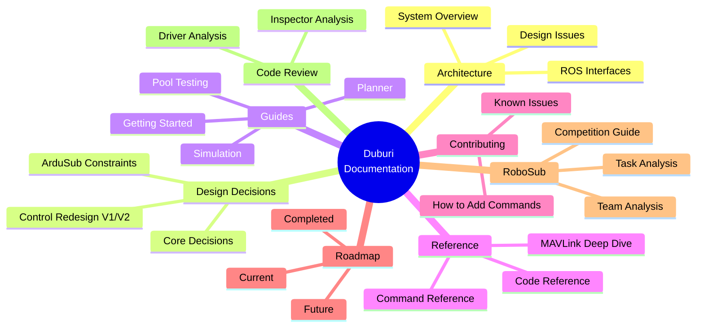
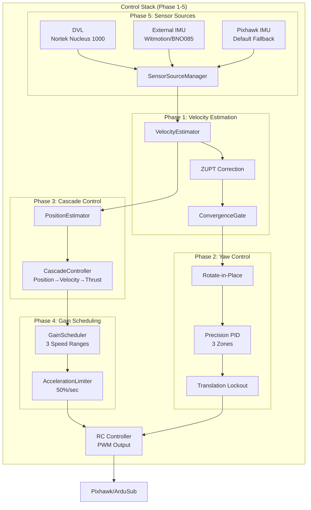
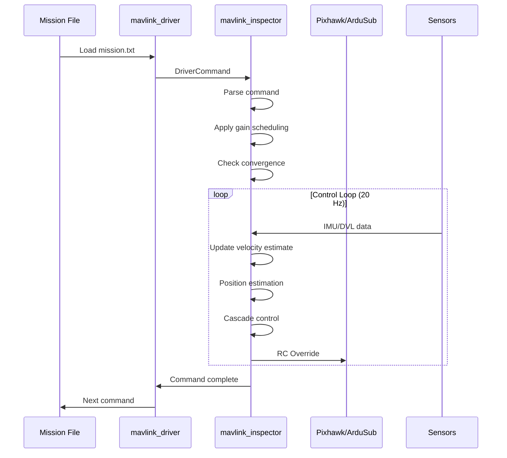

# Duburi 4.2 Documentation & Analysis

Welcome to the Duburi AUV documentation. This folder contains comprehensive analysis, guides, and reference documentation for developers and users.

## Quick Navigation



---

## Control Architecture Overview



## Message Flow



---

## 📁 Folder Structure

### 🏗️ [architecture/](architecture/)

System design and high-level architecture documentation.

| Document | Description |
|----------|-------------|
| [overview.md](architecture/overview.md) | High-level system overview |
| [system-architecture.md](architecture/system-architecture.md) | Detailed architecture diagrams |
| [ros-interfaces.md](architecture/ros-interfaces.md) | ROS2 messages, services, topics |
| [design-issues.md](architecture/design-issues.md) | Known architectural issues |

### 🎯 [design-decisions/](design-decisions/)

Why we made the decisions we made.

| Document | Description |
|----------|-------------|
| [control-stack-v2.md](design-decisions/control-stack-v2.md) | **V2** Complete Phase 1-5 design documentation |
| [control-stack-redesign.md](design-decisions/control-stack-redesign.md) | V1 control stack redesign |
| [core-decisions.md](design-decisions/core-decisions.md) | Core design decisions (26 entries) |
| [decisions-deep-dive.md](design-decisions/decisions-deep-dive.md) | Deep dive into design choices |
| [ardusub-constraints.md](design-decisions/ardusub-constraints.md) | ArduSub firmware constraints |
| [movement-vocabulary.md](design-decisions/movement-vocabulary.md) | Movement command vocabulary |
| [dvl-integration.md](design-decisions/dvl-integration.md) | **Phase 5** DVL integration technical plan |

### 📖 [guides/](guides/)

How-to guides for users and developers.

| Document | Description |
|----------|-------------|
| [ai-agent-guide.md](guides/ai-agent-guide.md) | Guide for AI coding agents |
| [desk-testing.md](guides/desk-testing.md) | Testing without vehicle |
| [simulation-setup.md](guides/simulation-setup.md) | Gazebo + ArduSub SITL |
| [blueos-network-setup.md](guides/blueos-network-setup.md) | BlueOS/Jetson network |
| [planner-guide.md](guides/planner-guide.md) | YASMIN state machine guide |
| [mission-planning.md](guides/mission-planning.md) | Mission planning analysis |
| [pool-testing/](guides/pool-testing/) | **V2** Pool testing guides and checklists |
| [dvl-integration-guide.md](guides/dvl-integration-guide.md) | **Phase 5** DVL quick start guide |

### 📚 [reference/](reference/)

Technical reference documentation.

| Document | Description |
|----------|-------------|
| [command-reference.md](reference/command-reference.md) | All CLI commands |
| [code-reference.md](reference/code-reference.md) | Code module map |
| [mavlink-deep-dive.md](reference/mavlink-deep-dive.md) | MAVLink protocol details |
| [blueos-package.md](reference/blueos-package.md) | BlueOS package analysis |

### 🤝 [contributing/](contributing/)

Guidelines for contributors.

| Document | Description |
|----------|-------------|
| [known-issues.md](contributing/known-issues.md) | Known issues & gotchas |
| [recommendations.md](contributing/recommendations.md) | Improvement recommendations |
| [refactoring-plan.md](contributing/refactoring-plan.md) | Refactoring roadmap |

### 🔍 [code-review/](code-review/)

Line-by-line code analysis.

| Document | Description |
|----------|-------------|
| [inspector-analysis.md](code-review/inspector-analysis.md) | mavlink_inspector deep dive |
| [runner-analysis.md](code-review/runner-analysis.md) | mavlink_runner analysis |
| [driver-analysis.md](code-review/driver-analysis.md) | mavlink_driver analysis |
| [vision-analysis.md](code-review/vision-analysis.md) | Vision system performance |

---

## 🚀 Quick Start Paths

### "I want to understand the codebase"
1. Start with [architecture/overview.md](architecture/overview.md)
2. Read [architecture/system-architecture.md](architecture/system-architecture.md)
3. Check [design-decisions/core-decisions.md](design-decisions/core-decisions.md)

### "I want to add a new command"
1. Read [design-decisions/control-stack-redesign.md](design-decisions/control-stack-redesign.md)
2. See the `@register` pattern in `movement_commands.py`
3. Check [reference/command-reference.md](reference/command-reference.md)

### "I want to run simulations"
1. [guides/simulation-setup.md](guides/simulation-setup.md)
2. [guides/desk-testing.md](guides/desk-testing.md)

### "I want to fix a bug"
1. [contributing/known-issues.md](contributing/known-issues.md)
2. [code-review/](code-review/) for relevant module
3. [contributing/recommendations.md](contributing/recommendations.md)

---

## 📊 Documentation Stats

| Metric | Value |
|--------|-------|
| Total documents | 27 |
| Total lines | ~12,000 |
| Categories | 6 |
| Diagrams | 50+ |

---

## 🔄 Recent Updates

### April 2026 - V2 Bug Fix Completion ✅

**ALL 30 ISSUES RESOLVED** — Production-ready for pool testing

- ✅ **3 CRITICAL** - GCS heartbeat 2Hz, RC override watchdog, depth from pressure sensor
- ✅ **7 HIGH** - Gravity compensation, thread safety, per-DOF integrals
- ✅ **10 MEDIUM** - DVL detection, V2 docs, ZUPT tuning, dynamic PID timing
- ✅ **6 LOW** - Variable clarity, parameter docs, configurable logging
- ✅ **4 INFO** - Telemetry watchdog, parameter validation, SITL support

**See:** [`roadmap/bugfix-completion-report.md`](roadmap/bugfix-completion-report.md) for complete technical details.

**Key Accomplishments:**
- Gravity-compensated velocity estimation (eliminates 49 m/s drift at 30° pitch)
- Accurate depth from SCALED_PRESSURE sensor (not MSL altitude)
- Thread-safe RC controller (all shared state locked)
- MAVLink compliant (2Hz heartbeat, 20Hz RC override)
- Production-ready error handling and validation

**Build Status:** ✅ 10/10 packages, 4.10s build time, zero errors

### March 2026 - Control Stack Redesign V2

- **Phase 1:** Velocity estimation with ZUPT, convergence gates
- **Phase 2:** Rotate-in-place, precision yaw PID
- **Phase 3:** Cascade control, position estimation
- **Phase 4:** Gain scheduling (3 speed ranges), acceleration limiting
- **Phase 5:** Multi-source sensors (DVL, External IMU)
  
### February 2026 - Control Stack Redesign V1 (Stable Branch)

- Decorator-based command registry
- 72% parser code reduction
- 6 critical safety fixes
- Clean Python API for perception

---

## 🧪 V2 Testing Recommendations

### Before Pool Testing

1. **SITL Validation**
   ```bash
   # Start ArduSub SITL
   cd ~/ardupilot/Tools/autotest
   python3 sim_vehicle.py -v ArduSub -f vectored_6dof --console --map
   
   # Start ROS2 Inspector
   ros2 launch mavlink_inspector inspector.launch.py
   ```
   
   **Verify:**
   - 2Hz heartbeat in diagnostics
   - Depth from pressure sensor (not altitude)
   - No RC timeout warnings
   - Gravity compensation (pitch 30° → velocity stays ~0 m/s)

2. **Movement Test Mission**
   
   Create `missions/test_square.txt`:
   ```
   arm
   mode MANUAL
   
   forward 30% 5s
   turn left 90 50%
   forward 30% 5s
   turn left 90 50%
   forward 30% 5s
   turn left 90 50%
   forward 30% 5s
   
   stop
   disarm
   ```
   
   **Expected:** Clean square with sharp 90° turns, no drift
   
3. **V2 Features Test**
   ```bash
   ros2 launch mavlink_inspector inspector.launch.py \
     params_file:=src/mavlink_inspector/config/v2_enabled.yaml
   ```
   
   **Test:**
   - Convergence gates (movement waits for settling)
   - Active braking (reduced overshoot)
   - Cascade control (smooth position tracking)
   - Gain scheduling (adaptive gains at different speeds)

### Pool Testing Checklist

See [`guides/pool-testing/next_things_to_check.md`](guides/pool-testing/next_things_to_check.md) for detailed procedures.

---

## 🔮 Future Development: DVL Integration

DVL (Doppler Velocity Logger) integration is planned for Phase 5. This will provide highly accurate bottom-relative velocity measurements for closed-loop control.

**Benefits of DVL:**
- Accurate velocity measurements (±0.2 cm/s)
- Closed-loop position control
- Eliminates IMU drift
- Improved mission accuracy (<10cm over 10m)

**Documentation:**
- [DVL Integration Plan](design-decisions/dvl-integration.md) - Complete technical design document
- [DVL Quick Start](guides/dvl-integration-guide.md) - Quick setup guide when hardware arrives

**Hardware:** Nortek Nucleus 1000 DVL (1000 kHz, 4-beam Janus, 15 Hz update rate)

**Integration Points:**
- New `dvl_driver` ROS2 package for sensor interface
- Modified `sensor_sources.py` for DVL/IMU fusion
- Updated `velocity_control.py` for DVL velocity input
- MAVLink VISION_SPEED_ESTIMATE messages to ArduSub

---

## See Also

- [Main README](../README.md) - Project overview
- [ROADMAP.md](ROADMAP.md) - Development roadmap
- [COMPETITIVE_ANALYSIS.md](COMPETITIVE_ANALYSIS.md) - Competitive landscape
