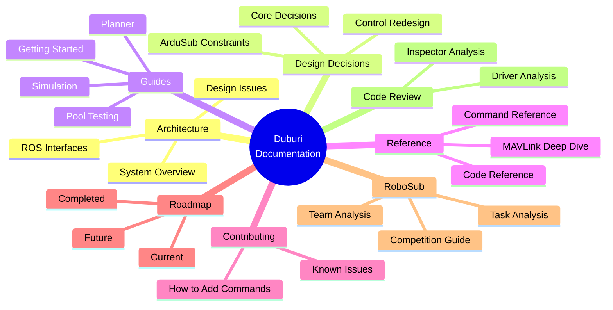

# Duburi 4.2 Documentation & Analysis

Welcome to the Duburi AUV documentation. This folder contains comprehensive analysis, guides, and reference documentation for developers and users.

## Quick Navigation

---

## 📁 Folder Structure

### 🏗️ [architecture/](architecture/)

System design and high-level architecture documentation.

| Document | Description |
|----------|-------------|
| [overview.md](architecture/overview.md) | High-level system overview |
| [system-architecture.md](architecture/system-architecture.md) | Detailed architecture diagrams |
| [ros-interfaces.md](architecture/ros-interfaces.md) | ROS2 messages, services, topics |
| [design-issues.md](architecture/design-issues.md) | Known architectural issues |

### 🎯 [design-decisions/](design-decisions/)

Why we made the decisions we made.

| Document | Description |
|----------|-------------|
| [control-stack-redesign.md](design-decisions/control-stack-redesign.md) | **NEW** V1 control stack redesign |
| [core-decisions.md](design-decisions/core-decisions.md) | Core design decisions |
| [decisions-deep-dive.md](design-decisions/decisions-deep-dive.md) | Deep dive into design choices |
| [ardusub-constraints.md](design-decisions/ardusub-constraints.md) | ArduSub firmware constraints |
| [movement-vocabulary.md](design-decisions/movement-vocabulary.md) | Movement command vocabulary |

### 📖 [guides/](guides/)

How-to guides for users and developers.

| Document | Description |
|----------|-------------|
| [ai-agent-guide.md](guides/ai-agent-guide.md) | Guide for AI coding agents |
| [desk-testing.md](guides/desk-testing.md) | Testing without vehicle |
| [simulation-setup.md](guides/simulation-setup.md) | Gazebo + ArduSub SITL |
| [blueos-network-setup.md](guides/blueos-network-setup.md) | BlueOS/Jetson network |
| [planner-guide.md](guides/planner-guide.md) | YASMIN state machine guide |
| [mission-planning.md](guides/mission-planning.md) | Mission planning analysis |

### 📚 [reference/](reference/)

Technical reference documentation.

| Document | Description |
|----------|-------------|
| [command-reference.md](reference/command-reference.md) | All CLI commands |
| [code-reference.md](reference/code-reference.md) | Code module map |
| [mavlink-deep-dive.md](reference/mavlink-deep-dive.md) | MAVLink protocol details |
| [blueos-package.md](reference/blueos-package.md) | BlueOS package analysis |

### 🤝 [contributing/](contributing/)

Guidelines for contributors.

| Document | Description |
|----------|-------------|
| [how-to-add-commands.md](contributing/how-to-add-commands.md) | **Step-by-step guide for adding new commands** |
| [known-issues.md](contributing/known-issues.md) | Known issues & gotchas |
| [recommendations.md](contributing/recommendations.md) | Improvement recommendations |
| [refactoring-plan.md](contributing/refactoring-plan.md) | Refactoring roadmap |

### 🗺️ [roadmap/](roadmap/)

Development timeline and planning.

| Document | Description |
|----------|-------------|
| [completed.md](roadmap/completed.md) | What we've accomplished |
| [current.md](roadmap/current.md) | Active development |
| [future.md](roadmap/future.md) | Planned features for RoboSub 2026 |
| [timeline.md](roadmap/timeline.md) | Gantt chart and sprint planning |

### 🏆 [robosub-analysis/](robosub-analysis/)

RoboSub competition resources.

| Document | Description |
|----------|-------------|
| [competition-guide.md](robosub-analysis/competition-guide.md) | Rules, scoring, logistics |
| [task-analysis.md](robosub-analysis/task-analysis.md) | Detailed task breakdown |
| [team-analysis.md](robosub-analysis/team-analysis.md) | Competitor TDR review |
| [hardware-comparison.md](robosub-analysis/hardware-comparison.md) | Hardware approaches |

### 🔍 [code-review/](code-review/)

Line-by-line code analysis.

| Document | Description |
|----------|-------------|
| [inspector-analysis.md](code-review/inspector-analysis.md) | mavlink_inspector deep dive |
| [runner-analysis.md](code-review/runner-analysis.md) | mavlink_runner analysis |
| [driver-analysis.md](code-review/driver-analysis.md) | mavlink_driver analysis |
| [vision-analysis.md](code-review/vision-analysis.md) | Vision system performance |

---

## 🚀 Quick Start Paths

### "I want to understand the codebase"
1. Start with [architecture/overview.md](architecture/overview.md)
2. Read [architecture/system-architecture.md](architecture/system-architecture.md)
3. Check [design-decisions/core-decisions.md](design-decisions/core-decisions.md)

### "I want to add a new command"
1. Read [contributing/how-to-add-commands.md](contributing/how-to-add-commands.md)
2. See [design-decisions/control-stack-redesign.md](design-decisions/control-stack-redesign.md)
3. Check [reference/command-reference.md](reference/command-reference.md)

### "I want to run simulations"
1. [guides/simulation-setup.md](guides/simulation-setup.md)
2. [guides/desk-testing.md](guides/desk-testing.md)

### "I want to test at the pool"
1. [guides/pool-testing/](guides/pool-testing/) — Field manual
2. [guides/pool-testing/startup-sequence.md](guides/pool-testing/startup-sequence.md)
3. [guides/pool-testing/tuning-guide.md](guides/pool-testing/tuning-guide.md)

### "I want to fix a bug"
1. [contributing/known-issues.md](contributing/known-issues.md)
2. [code-review/](code-review/) for relevant module
3. [contributing/recommendations.md](contributing/recommendations.md)

### "I want to prepare for RoboSub"
1. [robosub-analysis/task-analysis.md](robosub-analysis/task-analysis.md)
2. [roadmap/future.md](roadmap/future.md)
3. [roadmap/timeline.md](roadmap/timeline.md)

---

## 📊 Documentation Stats

| Metric | Value |
|--------|-------|
| Total documents | 27 |
| Total lines | ~12,000 |
| Categories | 6 |
| Diagrams | 50+ |

---

## 🔄 Recent Updates

- **Control Stack Redesign V1** - Complete architectural overhaul
  - Decorator-based command registry
  - 72% parser code reduction
  - 6 critical safety fixes
  - Clean Python API for perception

---

## See Also

- [Main README](../README.md) - Project overview
- [ROADMAP.md](ROADMAP.md) - Development roadmap
- [COMPETITIVE_ANALYSIS.md](COMPETITIVE_ANALYSIS.md) - Competitive landscape
