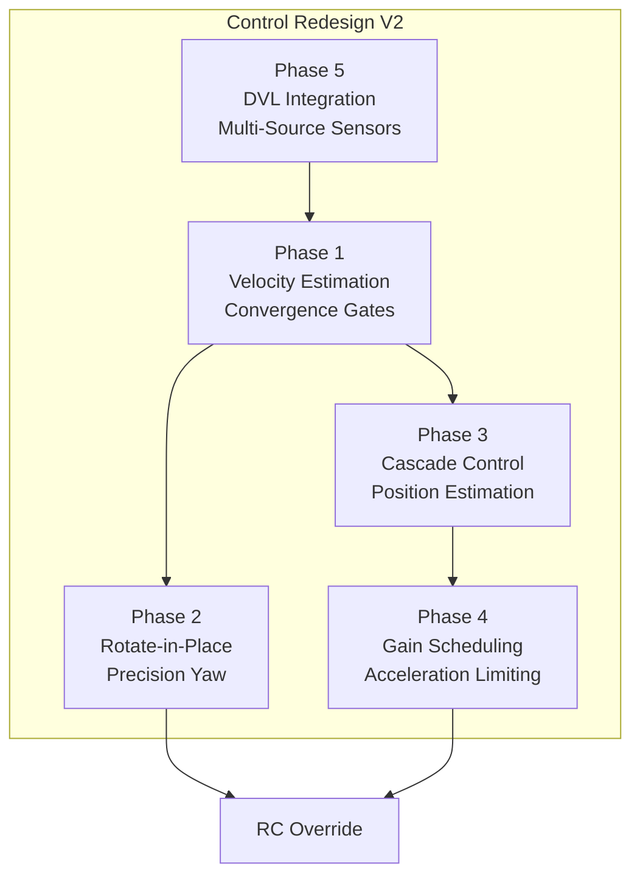
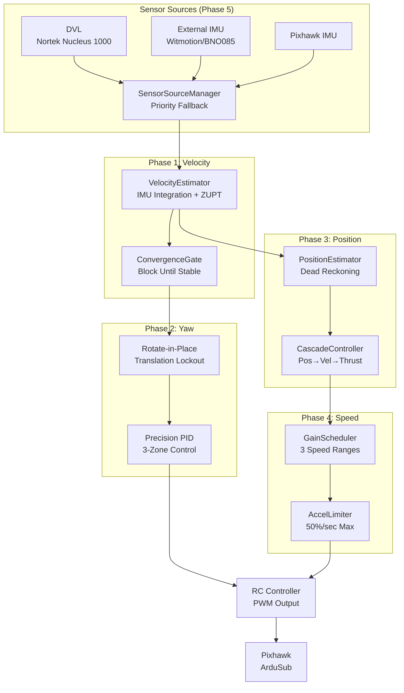

# BRACU Duburi 4.2 – Codebase Overview

## Purpose

This ROS 2 workspace controls the **BRACU Duburi AUV 4.2** (RoboSub vehicle). It connects to a Pixhawk 2.4.8 running ArduSub via MAVLink over serial (`/dev/ttyACM0`), and provides:

- A single point of MAVLink connection (no multiple nodes opening the same port)
- High-level movement commands (forward, left, depth, yaw, cruise, body-frame vector, etc.)
- Interactive CLI for pool testing
- File-based missions and YASMIN FSM autonomous missions
- Teleop via Twist and visual servo alignment
- YOLO-based object detection with Kalman filtering
- Logging for debugging
- Command feedback for mission coordination (DriverCommandFeedback)
- PWM velocity ramp for smooth thruster control
- Battery voltage compensation for consistent thrust

### Control Redesign V2 Features (Current Development)



**New Capabilities (V2 Branch)**:
- **Velocity estimation** from IMU with ZUPT drift correction
- **Convergence gates** to prevent cumulative drift between commands
- **Rotate-in-place** for sharp 90° corners (not U-turns)
- **Cascade control** (Position → Velocity → Thrust) for distance-based movement
- **Gain scheduling** for reliable high-speed operation (3 speed ranges)
- **Multi-source sensors** with priority fallback (DVL → External IMU → Pixhawk)

## Design Philosophy

1. **Single connection owner**: Only `mavlink_inspector` opens the serial port. All control flows through ROS topics.
2. **ArduSub constraints first**: ArduSub requires constant RC override and heartbeat. The design is driven by these requirements.
3. **Command abstraction**: High-level commands (e.g. `move left 50% 10s`) are translated to RC_CHANNELS_OVERRIDE by the inspector.
4. **Separation of concerns (DESIGN 5)**: Each command only sets the channels it owns. PID layers independently control depth (throttle) and heading (yaw).
5. **Non-blocking UX**: Arm/disarm and event handling avoid blocking the CLI.
6. **Mission flexibility**: Missions can be run from the CLI (`run gate`) or from custom Python nodes using `driver_client` or from the YASMIN FSM planner.
7. **Vision-control separation**: Detection runs independently; alignment controller closes the loop at camera frame rate.
8. **Configuration-driven features** (V2): All advanced features have enable/disable switches and tunable parameters.
9. **Graceful fallback** (V2): Sensor sources automatically fall back to alternatives when primary fails.

## Hardware Context

- **Pixhawk 2.4.8** – flight controller
- **ArduSub** – firmware
- **Channels**: 1=Pitch, 2=Roll, 3=Throttle (depth), 4=Yaw, 5=Forward, 6=Lateral
- **PWM**: 1100–1900, neutral 1500
- **Connection**: Serial 115200 baud
- **Cameras**: USB cameras via V4L2, typically 640x480 @ 30fps

## Reference Codebases

This design draws from:

- `/home/duburi/old_stuff/auv/src/mishu/mishu` – RoboSub-tested control (control.py, basic.py, control_utility.py)
- ArduSub pymavlink docs (ardusub.com, darksleep.com)
- ArduPilot Sub documentation
- YASMIN (Yet Another State MachINe) for ROS 2

## File Layout

```
duburi_ws/
├── src/
│   ├── duburi_interfaces/     # 11 custom messages (DriverCommand, TeleopCommand,
│   │                          #   VehicleState, VehicleDiagnostics, MavlinkEvent,
│   │                          #   DriverCommandFeedback, AlignmentStatus, Detection,
│   │                          #   DetectionArray, CameraStatus, CameraStatusArray)
│   ├── duburi_common/         # Shared constants and command vocabulary
│   ├── mavlink_inspector/     # Pixhawk connection, command execution, PID, ramp
│   │   ├── config/            #   defaults.yaml (74+ params), competition.yaml, pool_test.yaml
│   │   ├── mavlink_inspector/
│   │   │   ├── inspector_node.py      # Main orchestrator
│   │   │   ├── command_handler.py     # Command dispatch + helpers
│   │   │   ├── movement_commands.py   # @register decorated commands
│   │   │   ├── velocity_control.py    # V2: Phase 1-4 control classes
│   │   │   ├── sensor_sources.py      # V2: Phase 5 multi-source sensors
│   │   │   ├── rc_controller.py       # RC override with velocity ramp
│   │   │   ├── pid_controller.py      # PID controller class
│   │   │   ├── telemetry_parser.py    # MAVLink → vehicle state
│   │   │   └── connection_manager.py  # Serial connection + heartbeat
│   │   └── launch/            #   duburi_control.launch.py
│   ├── mavlink_driver/        # driver_client, mission_executor, teleop_driver
│   ├── mavlink_runner/        # Duburi > CLI
│   ├── mavlink_logger/        # Session logs under logs/
│   ├── vision/                # YOLO11 detection, Kalman tracking, PID visual servo
│   ├── vision_inspector/      # Multi-camera management, calibration, recording
│   ├── duburi_planner/        # YASMIN FSM mission planner with hierarchical states
│   │   ├── config/            #   planner.yaml
│   │   └── launch/            #   planner.launch.py
│   └── duburi_blueos/         # BlueOS REST API client for RPi4B companion
├── missions/                  # Mission .txt files (run gate, etc.)
└── analysis/                  # This documentation (30+ documents) + ROADMAP
```

## Codebase Statistics

| Metric | Value |
|--------|-------|
| Python source files | 85 |
| Total lines of code | ~12,000 |
| ROS 2 packages | 10 |
| Custom message types | 11 |
| ROS nodes | 15+ |
| Config parameters | 74+ (Phase 1-5) |
| Config files (YAML) | 6 |
| Launch files | 6 |

## Control Stack Architecture (V2)



## Key Modules (V2)

| Module | Lines | Purpose |
|--------|-------|---------|
| `velocity_control.py` | ~940 | VelocityEstimator, ConvergenceGate, PositionEstimator, CascadeController, GainScheduler, AccelerationLimiter |
| `sensor_sources.py` | ~800 | SensorSource (ABC), DVLSource, ExternalYawSource, DVLIMUSource, PixhawkYawSource, SensorSourceManager |
| `command_handler.py` | ~980 | Command dispatch, convergence helpers, gain scheduling integration |
| `inspector_node.py` | ~900 | Main orchestrator, 74+ parameters, module wiring |
| `movement_commands.py` | ~400 | @register decorated movement commands |
