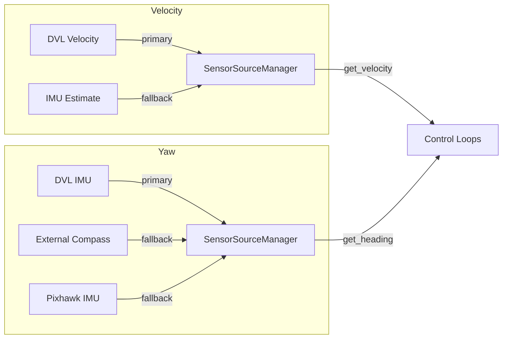

# Message Interfaces

## Overview

All inter-node communication uses custom messages in `duburi_interfaces`. This document explains each message, field semantics, and usage patterns.

---

## DriverCommand.msg

**Purpose:** Single abstraction for all AUV control commands. Used by runner, mission_executor, teleop_driver, and any custom mission node.

**Topic:** `/driver/command` (publish-only from drivers; subscribe-only in inspector)

### Fields

| Field | Type | Semantics | Notes |
|-------|------|-----------|-------|
| `command` | string | Action to perform | See command list below |
| `mode` | string | Flight mode name **or** heading (cruise) | `set_mode`: MANUAL/ALT_HOLD/STABILIZE. `cruise`/`just_cruise`: target heading in degrees (parsed back to float). |
| `depth` | float32 | Target depth in meters | Positive = below surface. For `set_depth`, `p_dive`, `cruise`. Inspector negates for ArduSub (negative = below). |
| `angle` | float32 | Heading/bearing in degrees 0-360 | For `yaw_angle`, `yaw_to_heading`, `pid_yaw_to_heading`, `go_*` (target heading), `move_at`/`just_move_at` (body-frame bearing), `cruise`/`just_cruise` (thrust bearing). |
| `duration` | float32 | Seconds to sustain movement | 0 = indefinite. Used by move_*, yaw_left, yaw_right, go_*, cruise, etc. |
| `speed` | int32 | Gain or PWM offset | 0-100 = percent (inspector converts via `percent_to_pwm`). >100 = raw PWM. |
| `status` | string | Optional metadata | Reserved for future use |

### Command Values

**Movement (basic):**
- `move_forward`, `move_back`, `move_left`, `move_right`, `move_up`, `move_down`
- Compound diagonals: `move_forward_right`, `move_forward_left`, `move_back_right`, `move_back_left`

**Movement (vector):**
- `move_at` — body-frame vector movement at arbitrary bearing (uses `angle` field)

**Yaw:**
- `yaw_angle` — legacy SET_ATTITUDE_TARGET (may not work in MANUAL)
- `yaw_to_heading` — bang-bang thruster rotation to target heading
- `pid_yaw_to_heading` — PID-controlled thruster rotation to target heading
- `yaw_left`, `yaw_right` — open-loop yaw

**Simultaneous movement + heading (go):**
- `go_forward`, `go_back`, `go_left`, `go_right` — single-axis movement + PID heading hold
- `go_forward_right`, `go_forward_left`, `go_back_right`, `go_back_left` — diagonal + heading

**Coordinated manoeuvre (cruise):**
- `cruise` — vector movement + depth PID + heading PID simultaneously
- Uses: `angle` = thrust bearing, `mode` = target heading, `depth` = target depth

**Depth:**
- `set_depth` (or `depth`) — firmware ALT_HOLD depth target
- `p_dive` (or `dive`) — software PID depth hold via throttle channel

**Lifecycle:** `arm`, `disarm`, `set_mode`, `stop`

**Actuators:** `open_grabber`, `close_grabber`

**Surface:** `surface` — clears all movement/PID and commands ascent

**Teleop:** Use the dedicated `/driver/teleop` topic with `TeleopCommand` (see below). The legacy `DriverCommand` command `teleop` / `just_teleop` remains only as a fallback in the inspector.

**Instant (`just_*`) variants:**
All movement commands accept a `just_` prefix for bypass-ramp (instant PWM) operation:
`just_move_forward`, `just_move_back`, `just_move_left`, `just_move_right`,
`just_move_up`, `just_move_down`, `just_move_at`, `just_move_forward_right`, etc.,
`just_surface`, `just_go_forward`, `just_go_forward_right`, etc.,
`just_cruise`

### Design Rationale

- **Single topic:** All control flows through one topic. Inspector is the only subscriber. Simplifies architecture.
- **speed as percent or PWM:** 0-100 maps to percent (user-friendly). Values >100 allow direct PWM for advanced use. Inspector branches on `0 < raw_speed <= 100`.
- **duration 0 = indefinite:** Allows "move left" without timeout; user sends `stop` when done.
- **`mode` field dual-use:** The `mode` string field carries either a flight mode name (for `set_mode`) or a heading value (for `cruise`). Since these commands are mutually exclusive, the overloading is unambiguous.

---

## TeleopCommand.msg

**Purpose:** Dedicated message for joystick/gamepad teleop (multi-axis thruster control). Replaces the old pattern of publishing `DriverCommand` with `command='teleop'` and overloading `speed` / `duration` / `depth` / `angle` to carry PWM offsets (Design Issue 7 — **resolved**; see `10_DESIGN_ISSUES.md`).

**Topic:** `/driver/teleop` (published by `teleop_driver`; subscribed by `mavlink_inspector`)

### Fields

| Field | Type | Semantics |
|-------|------|-----------|
| `linear_x` | float32 | Forward (+) / back (−) axis, typically normalized [−1.0, 1.0] |
| `linear_y` | float32 | Right (+) / left (−) axis [−1.0, 1.0] |
| `linear_z` | float32 | Up (+) / down (−) axis [−1.0, 1.0] |
| `angular_z` | float32 | Yaw: CCW/left (+) / CW/right (−) [−1.0, 1.0] |
| `speed` | int32 | Max PWM offset from neutral (e.g. default 200); scales axis magnitudes |
| `idle` | bool | When true, joystick is centred — clear movement without a full `stop` command |

### Design Rationale

- **Unambiguous semantics:** Loggers and future subscribers see axis fields with one meaning; no special case for `command == 'teleop'`.
- **Single teleop path:** `teleop_driver` publishes here; the inspector applies RC overrides from `TeleopCommand` directly.

---

## DriverCommandFeedback.msg

**Purpose:** Command acknowledgement published by the inspector for every handled command. Enables callers (mission executor, custom nodes) to verify command acceptance, track completion, or detect errors.

**Topic:** `/driver/feedback` (published by inspector; subscribed by mission nodes, logger)

### Fields

| Field | Type | Semantics |
|-------|------|-----------|
| `header` | std_msgs/Header | Timestamp (`frame_id='inspector'`) |
| `command` | string | The command string that was handled |
| `status` | string | One of: `accepted`, `reached`, `rejected`, `timeout`, `completed` |
| `error` | float32 | Numeric error value (e.g. heading error in degrees, depth error in metres) |
| `detail` | string | Human-readable detail about the status |

### Status Values

| Status | Meaning | Example |
|--------|---------|---------|
| `accepted` | Command received and processing started | `move_forward accepted` |
| `reached` | Target condition met (heading, depth) | `yaw_to_heading reached, error=1.2°` |
| `rejected` | Command invalid or cannot execute | `unknown command rejected` |
| `timeout` | Timed operation expired without reaching target | `yaw_to_heading timeout` |
| `completed` | Timed movement finished its duration | `go_forward completed, duration expired` |

### Design Rationale

- **Non-blocking:** Published asynchronously; callers don't need to wait.
- **Mission integration:** Mission executor can wait for `reached` before proceeding.
- **Safe shutdown:** `_publish_feedback()` catches exceptions and checks `rclpy.ok()`.

---

## MavlinkEvent.msg

**Purpose:** Broadcast MAVLink-related events for logging, UI, and confirmation.

**Topic:** `/mavlink/events`

### Fields

| Field | Type | Semantics |
|-------|------|-----------|
| `header` | std_msgs/Header | Timestamp, frame_id |
| `event_type` | string | Category: armed, disarmed, movement, mode_change, connected, etc. |
| `description` | string | Human-readable message |
| `raw_data` | string | Optional JSON/dump for debugging |

### Event Types

- `armed`, `disarmed`, `arm_failed`, `disarm_failed` — Arm/disarm confirmation
- `movement` — Any movement or stop
- `mode_change` — Flight mode changed
- `connected`, `connection_failed`, `connection_lost` — Connection state
- `command_ack` — MAVLink COMMAND_ACK received

### Design Rationale

- **Runner subscribes for arm/disarm:** Non-blocking; prints `[Armed.]` when event arrives.
- **Logger subscribes:** Writes all events to session/events logs.
- **Extensible:** New event types can be added without changing message definition.

---

## VehicleState.msg

**Purpose:** Current telemetry snapshot. Published at 10 Hz by inspector.

**Topic:** `/mavlink/vehicle_state`

### Fields

| Field | Type | Semantics |
|-------|------|-----------|
| `armed` | bool | Motors armed |
| `flight_mode` | string | ArduSub mode name |
| `depth` | float32 | Depth in m (negative below surface) |
| `yaw`, `pitch`, `roll` | float32 | Attitude in degrees |
| `voltage` | float32 | Battery voltage (V) |
| `current` | float32 | Battery current (A) |

### Design Rationale

- **depth 1:** Avoids multiple subscribers hammering MAVLink for AHRS2.
- **yaw 0-360:** Normalized for display and yaw_to_heading error calculation.

---

## V2 Topics (Control Redesign Phase 5)

Control Redesign V2 adds optional external sensor topics. These are only subscribed when enabled in config.

### DVL Topics (Nortek Nucleus 1000)

| Topic | Type | Direction | Description |
|-------|------|-----------|-------------|
| `/dvl/velocity` | `geometry_msgs/TwistWithCovarianceStamped` | Sub | DVL velocity (body-frame) |
| `/dvl/orientation` | `sensor_msgs/Imu` or `geometry_msgs/QuaternionStamped` | Sub | DVL internal IMU orientation |
| `/dvl/status` | Vendor-specific | Sub | DVL status (quality, lock) |

**Usage:** When `dvl_enabled: true`, the inspector subscribes to DVL velocity and uses it as primary velocity source (over IMU estimate). Falls back to IMU if DVL loses bottom lock.

### External IMU Topics

| Topic | Type | Direction | Description |
|-------|------|-----------|-------------|
| `/external_imu/yaw` | Configurable | Sub | External compass heading |
| `/external_imu/orientation` | `sensor_msgs/Imu` | Sub | Full orientation (if available) |

**Supported message types** for external yaw:
- `std_msgs/Float32` - Raw heading in degrees
- `sensor_msgs/Imu` - Extracts yaw from quaternion
- `geometry_msgs/Vector3Stamped` - Uses x field as yaw

**Configuration:**
```yaml
external_yaw_enabled: true
external_yaw_topic: "/external_imu/yaw"
external_yaw_msg_type: "std_msgs/Float32"  # or sensor_msgs/Imu
external_yaw_offset: 0.0  # Calibration offset in degrees
```

### Sensor Source Priority

When multiple sources are enabled, the `SensorSourceManager` uses priority fallback:

**Velocity sources** (configurable via `velocity_source_priority`):
1. DVL (most accurate, no drift)
2. IMU estimate (fallback, drifts over time)

**Yaw sources** (configurable via `yaw_source_priority`):
1. DVL internal IMU (if enabled)
2. External compass (WitMotion, BNO085, etc.)
3. Pixhawk IMU (always available fallback)



---

## Adding New Commands (V2 Updated)

With the decorator-based command registry (Control Redesign V1+), adding commands is simplified:

1. **Add decorated function** in `movement_commands.py`:
   ```python
   @register('my_command', CommandCategory.TRANSLATION, CommandTransport.TOPIC,
             description='My new command',
             channels=['CH_FORWARD'],
             aliases=['my_cmd'])
   def cmd_my_command(h, cmd):
       h.set_movement({CH_FORWARD: NEUTRAL_PWM + h.offset}, 'My command')
   ```

2. **Optionally add helper** in `driver_client.py` for Python API:
   ```python
   def my_command(self, speed=30, duration=5.0):
       return self.send_command('my_command', speed=speed, duration=duration)
   ```

3. **Add to command vocabulary** in `duburi_common/command_vocabulary.py` if needed.

4. **Update documentation**: `analysis/reference/command-reference.md`

The `@register` decorator automatically:
- Adds command to dispatch table
- Creates `just_*` variant for bypass-ramp
- Validates channels and parameters
- Logs command execution

---

## V2 Parameters Reference

Control Redesign V2 adds 74+ configuration parameters. See `defaults.yaml` for full list.

### Phase 1: Velocity Estimation & Convergence

| Parameter | Type | Default | Description |
|-----------|------|---------|-------------|
| `convergence_enabled` | bool | false | Enable convergence gates between commands |
| `convergence_velocity_threshold` | float | 0.05 | m/s threshold for "stopped" |
| `convergence_settling_time` | float | 0.2 | Seconds to stay below threshold |
| `convergence_timeout` | float | 5.0 | Max wait time (safety) |
| `imu_stopped_accel_threshold` | float | 0.02 | m/s² for ZUPT detection |
| `imu_stopped_time_required` | float | 0.3 | Seconds for ZUPT to trigger |

### Phase 2: Precision Yaw Control

| Parameter | Type | Default | Description |
|-----------|------|---------|-------------|
| `rotate_in_place_enabled` | bool | false | Enable sharp corners |
| `yaw_precision_deadband` | float | 5.0 | Degrees for precision zone |
| `yaw_final_deadband` | float | 1.0 | Degrees for final zone |
| `yaw_settling_time` | float | 0.5 | Seconds in final zone |
| `yaw_precision_kp_reduction` | float | 0.5 | Kp multiplier in precision |
| `yaw_feedforward_enabled` | bool | false | Enable predictive torque |

### Phase 3: Cascade Control

| Parameter | Type | Default | Description |
|-----------|------|---------|-------------|
| `cascade_enabled` | bool | false | Enable position control |
| `position_kp` | float | 0.5 | Position loop Kp |
| `position_ki` | float | 0.0 | Position loop Ki |
| `position_kd` | float | 0.1 | Position loop Kd |
| `position_tolerance` | float | 0.1 | Meters for convergence |
| `velocity_kp` | float | 400.0 | Velocity loop Kp |
| `velocity_ki` | float | 50.0 | Velocity loop Ki |
| `velocity_kd` | float | 30.0 | Velocity loop Kd |
| `max_velocity_setpoint` | float | 0.5 | m/s limit |

### Phase 4: Gain Scheduling

| Parameter | Type | Default | Description |
|-----------|------|---------|-------------|
| `gain_scheduling_enabled` | bool | false | Enable speed-adaptive gains |
| `accel_limiting_enabled` | bool | false | Enable acceleration ramp |
| `speed_range_low_max` | int | 30 | Low→Medium boundary (%) |
| `speed_range_medium_max` | int | 60 | Medium→High boundary (%) |
| `max_accel_pct_per_sec` | float | 50.0 | Max acceleration rate |
| `yaw_gains_low_kp` | float | 2.5 | Low speed yaw Kp |
| `yaw_gains_high_kp` | float | 1.2 | High speed yaw Kp |
| (+ 24 more gain parameters) | | | |

### Phase 5: Multi-Source Sensors

| Parameter | Type | Default | Description |
|-----------|------|---------|-------------|
| `dvl_enabled` | bool | false | Enable DVL velocity source |
| `dvl_topic` | string | /dvl/velocity | DVL topic name |
| `dvl_timeout` | float | 1.0 | Seconds before stale |
| `dvl_min_quality` | float | 0.5 | Minimum quality to use |
| `dvl_imu_enabled` | bool | false | Enable DVL internal IMU |
| `external_yaw_enabled` | bool | false | Enable external compass |
| `external_yaw_topic` | string | /external_imu/yaw | Topic name |
| `external_yaw_msg_type` | string | std_msgs/Float32 | Message type |
| `external_yaw_offset` | float | 0.0 | Calibration offset (°) |
| `velocity_source_priority` | list | [dvl, imu_estimate] | Fallback order |
| `yaw_source_priority` | list | [dvl_imu, external, pixhawk] | Fallback order |
