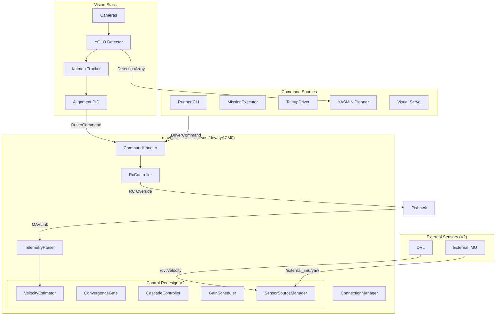
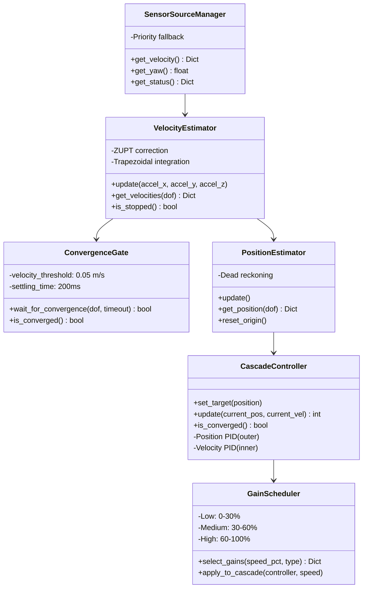

# Architecture

## Data Flow

## Package Roles

| Package | Role | Key Files |
|---------|------|-----------|
| `duburi_interfaces` | Shared message definitions | `msg/DriverCommand.msg`, `TeleopCommand.msg`, `MavlinkEvent.msg`, `VehicleState.msg`, `AlignmentStatus.msg`, `DetectionArray.msg` |
| `duburi_common` | Shared constants and command vocabulary | `command_vocabulary.py`, `constants.py` |
| `mavlink_inspector` | Owns Pixhawk connection, executes commands, publishes state/events | `inspector_node.py`, `command_handler.py`, `velocity_control.py`, `sensor_sources.py`, `rc_controller.py`, `pid_controller.py` |
| `mavlink_driver` | Helpers and alternative command sources | `driver_client.py`, `mission_executor.py`, `teleop_driver.py` |
| `mavlink_runner` | Interactive CLI (`Duburi >`) | `runner.py`, `command_parser.py` |
| `mavlink_logger` | Logs events, state, commands to `logs/` | `logger_node.py` |
| `vision` | YOLO detection, Kalman tracking, visual servo | `detector_node.py`, `alignment_controller.py`, `kalman_tracker.py` |
| `vision_inspector` | Camera management, calibration, recording | `camera_manager_node.py`, `frame_publisher.py`, `camera_device.py`, `camera_recorder.py` |
| `duburi_planner` | YASMIN FSM mission planner | `mission_node.py`, `planner_context.py`, `states/*`, `missions/*` |
| `duburi_blueos` | BlueOS REST API client for RPi4B companion | `blueos_monitor_node.py`, `blueos_client.py`, `health_checker.py` |

## Control Stack Modules (V2)

## Topic Summary

| Topic | Type | Publisher | Subscribers |
|-------|------|-----------|-------------|
| `/driver/command` | DriverCommand | runner, mission_executor, alignment_controller, planner | inspector, logger |
| `/driver/feedback` | DriverCommandFeedback | inspector | mission_executor |
| `/driver/teleop` | TeleopCommand | teleop_driver | inspector |
| `/mavlink/events` | MavlinkEvent | inspector | runner, mission_executor, logger |
| `/mavlink/vehicle_state` | VehicleState | inspector | runner, planner, alignment_controller, logger |
| `/mavlink/diagnostics` | VehicleDiagnostics | inspector | — |
| `/dvl/velocity` | TwistWithCovarianceStamped | DVL driver | inspector (V2) |
| `/external_imu/yaw` | Float32 | External IMU | inspector (V2) |
| `/cmd_vel` | Twist | teleop/joystick nodes | teleop_driver |
| `/camera/<name>/image_raw` | Image | camera_manager_node | detector_node |
| `/vision/detections` | DetectionArray | detector_node | alignment_controller, planner |
| `/vision/alignment_status` | AlignmentStatus | alignment_controller | planner |

## Execution Order

1. Start `mavlink_inspector` first (it opens the serial port).
2. Start camera and vision nodes (`camera_manager`, `detector_node`, optionally `alignment_controller`).
3. Start `mavlink_runner` or `mission_executor` or `duburi_planner` as needed.
4. Optional: start `mavlink_logger` for logging.
5. Optional (V2): Start DVL driver or external IMU publisher.

## Why Single Connection?

- Serial ports cannot be shared by multiple processes.
- pymavlink `recv_match` and `rc_channels_override_send` use the same connection.
- Centralizing in the inspector avoids port conflicts and keeps MAVLink logic in one place.

## Vision-Planner Integration

The `duburi_planner` uses a closed-loop architecture for visual tasks:

1. **SearchState**: Monitors `/vision/detections` while rotating to find target
2. **AlignState**: Enables `alignment_controller` which publishes to `/driver/teleop`
3. **Feedback**: `alignment_controller` publishes `/vision/alignment_status` with convergence info
4. **Planner decision**: AlignState waits for `aligned=True` or times out

This separation allows the alignment PID to run at vision frame rate (~30 Hz) while
the planner state machine operates at a higher level of abstraction.
