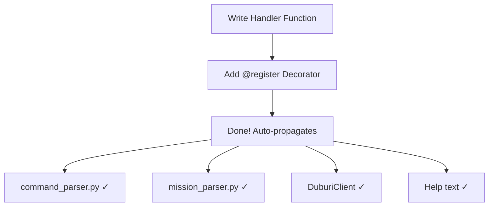

# How to Add New Commands

This guide explains how to add new movement commands to the Duburi AUV control system using the decorator-based registry pattern introduced in Control Stack Redesign V1.

## Overview



Adding a command now requires **one step** instead of the previous 4-5 file changes.

---

## Step 1: Understand the Registry

The command registry lives in `src/duburi_common/duburi_common/command_registry.py`.

### Key Concepts

```python
from enum import Enum
from dataclasses import dataclass
from typing import Callable, List, Optional

class CommandCategory(Enum):
    SYSTEM = "system"           # arm, disarm, set_mode, stop
    TRANSLATION = "translation" # move_forward, move_back, etc.
    HEADING = "heading"         # yaw_to_heading, yaw_left, etc.
    DEPTH = "depth"             # set_depth, pid_depth, surface
    COMPOUND = "compound"       # go_*, cruise
    ACTUATOR = "actuator"       # open_grabber, close_grabber
    VISION = "vision"           # Future: vision-triggered commands

class CommandTransport(Enum):
    SERVICE = "service"   # Instant, acknowledged (arm, disarm, set_mode)
    ACTION = "action"     # Long-running with feedback (future)
    TOPIC = "topic"       # Fire-and-forget movement commands

@dataclass
class CommandSpec:
    name: str
    category: CommandCategory
    transport: CommandTransport
    handler: Callable
    description: str = ""
    channels: List[str] = None
    supports_duration: bool = True
    supports_speed: bool = True
    supports_angle: bool = False
    requires_armed: bool = False
    is_pid: bool = False
```

---

## Step 2: Write Your Handler

Handlers live in `src/mavlink_inspector/mavlink_inspector/movement_commands.py`.

### Handler Signature

```python
def cmd_your_command(handler: 'CommandHandler', cmd: 'DriverCommand') -> None:
    """
    handler: The CommandHandler instance (access to PID, RC controller, etc.)
    cmd: The incoming DriverCommand message
    """
    pass
```

### Example: Simple Movement

```python
from duburi_common.command_registry import register, CommandCategory, CommandTransport
from .rc_controller import CH_FORWARD, CH_LATERAL, NEUTRAL_PWM

@register('move_diag_45', CommandCategory.TRANSLATION, CommandTransport.TOPIC,
          description='Move at 45° (forward-right diagonal)',
          channels=['CH_FORWARD', 'CH_LATERAL'])
def cmd_move_diag_45(handler, cmd):
    """Move diagonally at 45 degrees (forward + right)."""
    import math
    
    # Scale by √2 for diagonal (so total thrust matches single-axis)
    scale = 1.0 / math.sqrt(2)
    
    handler.set_movement(
        {
            CH_FORWARD: NEUTRAL_PWM + int(handler.offset * scale),
            CH_LATERAL: NEUTRAL_PWM + int(handler.offset * scale)
        },
        'Diagonal 45°'
    )
```

### Example: PID-Based Command

```python
@register('pid_hover_at', CommandCategory.COMPOUND, CommandTransport.TOPIC,
          description='PID-controlled hover at depth + heading',
          is_pid=True,
          supports_angle=True)
def cmd_pid_hover_at(handler, cmd):
    """Hover in place using both depth and yaw PID."""
    depth = cmd.target_depth if cmd.target_depth != 0 else cmd.depth
    heading = cmd.target_heading if cmd.target_heading != 0 else cmd.angle
    
    # Activate PIDs
    handler._depth_pid_enabled = True
    handler._depth_pid_setpoint = depth
    
    handler._yaw_pid_enabled = True
    handler._yaw_pid_setpoint = heading
    
    handler.get_logger().info(f'Hovering at depth={depth}m, heading={heading}°')
```

---

## Step 3: The @register Decorator

```python
@register(
    name='command_name',           # Canonical name (used in CLI/missions)
    category=CommandCategory.XXX,   # Determines grouping in help
    transport=CommandTransport.YYY, # SERVICE, ACTION, or TOPIC
    description='Brief description',
    channels=['CH_FORWARD'],        # Optional: which RC channels affected
    supports_duration=True,         # Accepts duration parameter?
    supports_speed=True,            # Accepts speed parameter?
    supports_angle=False,           # Accepts angle parameter?
    requires_armed=False,           # Must be armed to execute?
    is_pid=False                    # Is this a PID command?
)
def cmd_command_name(handler, cmd):
    ...
```

---

## Step 4: Using Handler Utilities

### `handler.offset`

Pre-calculated PWM offset from `cmd.speed_pct`:

```python
# handler.offset is typically (speed_pct / 100) * 400
# Default speed 50% → offset = 200 PWM
channels = {CH_FORWARD: NEUTRAL_PWM + handler.offset}
```

### `handler.set_movement(channels, label)`

Sets movement with automatic ramping:

```python
handler.set_movement(
    {CH_FORWARD: 1700, CH_LATERAL: 1300},  # Target PWM values
    'Forward-Left'                          # Label for logging
)
```

### PID Control

```python
# Enable depth PID
handler._depth_pid_enabled = True
handler._depth_pid_setpoint = 0.5  # meters

# Enable yaw PID  
handler._yaw_pid_enabled = True
handler._yaw_pid_setpoint = 90.0  # degrees

# Disable all PIDs (for stop command)
handler.stop_all_pids()
```

---

## Step 5: Add Aliases (Optional)

If you want short names or backward-compat aliases, add them to
`src/duburi_common/duburi_common/command_vocabulary.py`:

```python
ALIASES = {
    # Your aliases
    'diag': 'move_diag_45',
    'diag45': 'move_diag_45',
    # ... existing aliases
}
```

---

## Step 6: Test Your Command

### 1. Build

```bash
cd /path/to/Duburi_ws
colcon build --packages-select mavlink_inspector duburi_common
source install/setup.bash
```

### 2. Verify Registration

```bash
python3 -c "
from duburi_common.command_registry import get_all_commands
cmds = get_all_commands()
print(f'Total commands: {len(cmds)}')
print('Your command:', cmds.get('move_diag_45'))
"
```

### 3. Test in CLI

```bash
ros2 run mavlink_runner runner
# At prompt:
Duburi > move_diag_45 50% 3s
```

---

## Complete Example: Adding `strafe_circle`

A command that strafes in a circle pattern (for pool testing thrusters).

```python
# In movement_commands.py

import math
import time
from duburi_common.command_registry import register, CommandCategory, CommandTransport
from .rc_controller import CH_FORWARD, CH_LATERAL, NEUTRAL_PWM

@register('strafe_circle', CommandCategory.COMPOUND, CommandTransport.TOPIC,
          description='Strafe in a circle pattern (thruster test)',
          channels=['CH_FORWARD', 'CH_LATERAL'],
          supports_duration=True,
          supports_speed=True)
def cmd_strafe_circle(handler, cmd):
    """
    Strafe in a circular pattern.
    Duration determines circle time.
    """
    duration = cmd.duration if cmd.duration > 0 else 5.0
    start = time.time()
    
    # This runs in the command handler context
    # For long-running patterns, consider using a timer callback instead
    
    while time.time() - start < duration:
        elapsed = time.time() - start
        angle = (elapsed / duration) * 2 * math.pi  # Full circle
        
        forward = int(handler.offset * math.cos(angle))
        lateral = int(handler.offset * math.sin(angle))
        
        handler.set_movement(
            {
                CH_FORWARD: NEUTRAL_PWM + forward,
                CH_LATERAL: NEUTRAL_PWM + lateral
            },
            f'Circle {int(math.degrees(angle))}°'
        )
        
        time.sleep(0.05)  # 20 Hz update
    
    # Return to neutral
    handler.set_movement(
        {CH_FORWARD: NEUTRAL_PWM, CH_LATERAL: NEUTRAL_PWM},
        'Circle complete'
    )
```

---

## FAQ

### Q: Do I need to modify command_parser.py?

**No!** The parser automatically uses the registry. Your command is available immediately after registration.

### Q: What about mission files?

Mission files also auto-detect registry commands. Just use your command name:

```yaml
# missions/test_diag.mission
strafe_circle 50% 10s
sleep 2
move_diag_45 60% 5s
```

### Q: How do I add a command that uses the `just_` prefix?

You don't need to do anything special. The `just_` prefix is handled by the grammar parser:

```bash
just strafe_circle 50% 5s  # Works automatically - bypass_ramp=True
```

### Q: What if my command conflicts with an existing name?

The registry will raise a `ValueError` at import time if you try to register a duplicate name. Choose a unique name.

---

## Architecture Reference

```mermaid
flowchart TD
    subgraph Registration
        DEC[@register decorator] --> REG[("_REGISTRY<br/>dict")]
    end
    
    subgraph Dispatch
        CMD[DriverCommand] --> HAND[CommandHandler]
        HAND --> |get_command| REG
        REG --> |CommandSpec| HAND
        HAND --> |spec.handler| FUNC[Your Function]
    end
    
    subgraph Execution
        FUNC --> SET[set_movement]
        SET --> RC[RC Controller]
        RC --> |PWM| PIX[Pixhawk]
    end
```

---

## See Also

- [`command_registry.py`](../../src/duburi_common/duburi_common/command_registry.py) — Registry implementation
- [`movement_commands.py`](../../src/mavlink_inspector/mavlink_inspector/movement_commands.py) — Existing handlers
- [`command_vocabulary.py`](../../src/duburi_common/duburi_common/command_vocabulary.py) — Aliases
- [`control-stack-redesign.md`](../design-decisions/control-stack-redesign.md) — Full redesign documentation
