# Control Stack Redesign V1 Design Decision Document

## Executive Summary

A comprehensive architectural overhaul of the Duburi AUV control stack, addressing fundamental design issues while enabling future perception integration.

**Key Outcomes:**
- 72% reduction in parser code (492 → 139 lines)
- Single source of truth for commands (decorator-based registry)
- 6 critical safety fixes implemented
- Clean Python API for perception integration
- Live-tunable parameters via ROS2

---

## Table of Contents

1. [The Problem](#the-problem)
2. [Design Goals](#design-goals)
3. [Architecture Overview](#architecture-overview)
4. [Key Changes](#key-changes)
5. [Safety Fixes (C1-C6)](#safety-fixes-c1-c6)
6. [Command Registry Pattern](#command-registry-pattern)
7. [Message Evolution](#message-evolution)
8. [Movement Control](#movement-control)
9. [Perception Integration](#perception-integration)
10. [Potential Issues](#potential-issues)
11. [Migration Guide](#migration-guide)

---

## The Problem

### Before: Scattered Command Definitions

Adding a new command required changes in 4-5 files:

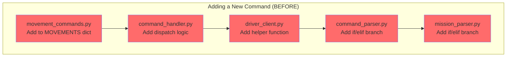

**Pain Points:**
1. **492-line if/elif chain** in command_parser.py
2. **219-line if/elif chain** in mission_parser.py
3. **Duplicate aliases** scattered across files
4. **just_commands.py** with 114 lines of boilerplate
5. **Overloaded message fields** (mode field repurposed for heading)
6. **No type safety** for command parameters

### Before: Safety Vulnerabilities

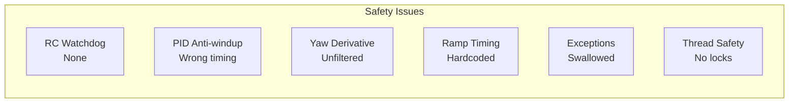

---

## Design Goals

```mermaid
mindmap
 root((Control Stack<br/>Redesign))
 Single Source of Truth
 Decorator-based registry
 Auto-generated parsers
 Shared vocabulary
 Safety First
 RC watchdog
 Fixed PID bugs
 Thread safety
 Perception Ready
 Clean Python API
 DuburiClient class
 Explicit parameters
 Live Tuning
 ROS2 param callbacks
 Dynamic PID gains
 Runtime brake config
```

---

## Architecture Overview

### After: Unified Command Flow

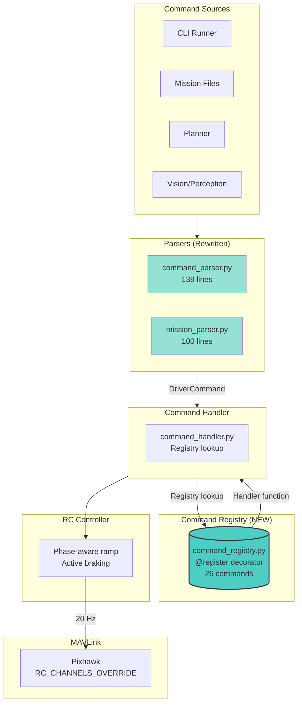

### Adding a New Command (AFTER)

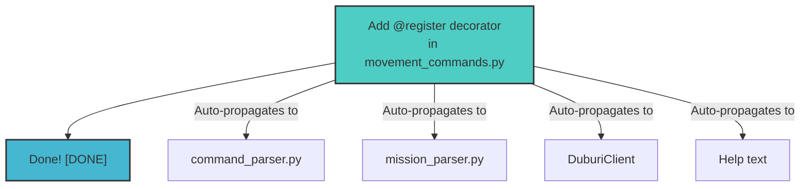

---

## Key Changes

### File Changes Summary

| File | Before | After | Change |
|------|--------|-------|--------|
| command_parser.py | 492 lines | 139 lines | -72% |
| mission_parser.py | 219 lines | 100 lines | -54% |
| just_commands.py | 114 lines | DELETED | -100% |
| DriverCommand.msg | 7 fields | 15 fields | +8 explicit fields |
| NEW: command_registry.py | | 180 lines | Central registry |
| NEW: duburi_client.py | | 350 lines | Clean API |
| NEW: AuvCommand.srv | | Service | System commands |

### Package Impact

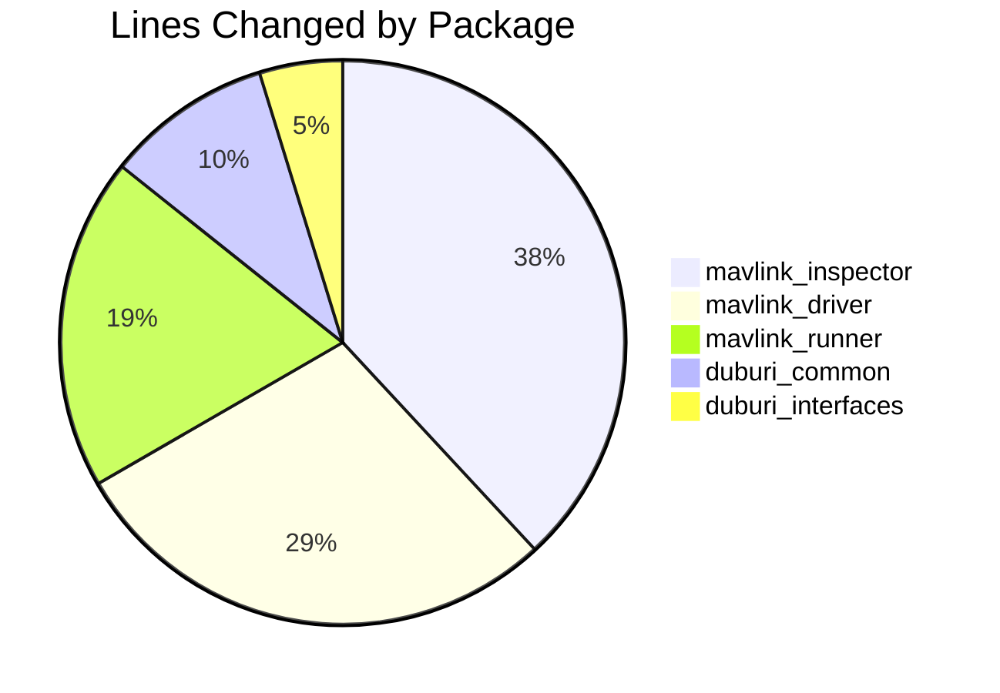

---

## Safety Fixes (C1-C6)

### C1: RC Watchdog

**Problem:** If RC override send failed, thrusters could be stuck at last PWM.

**Solution:**

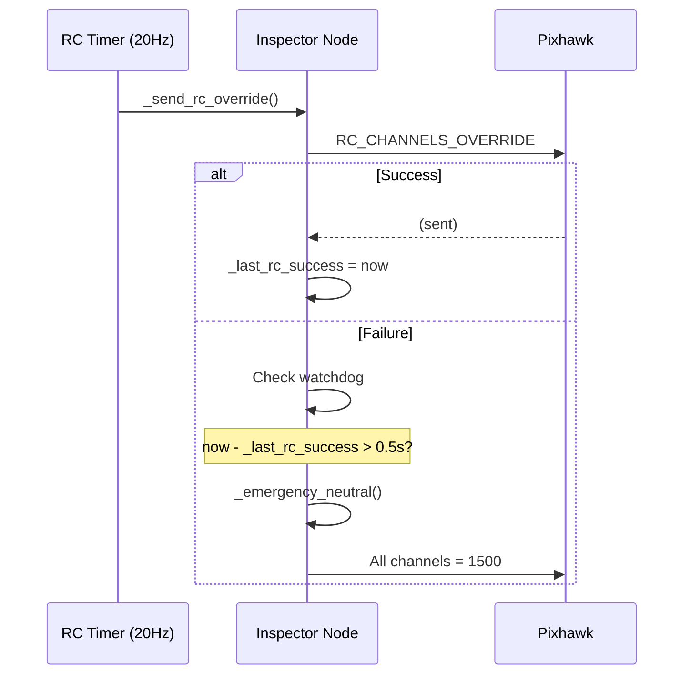

### C2: PID Anti-Windup Fix

**Problem:** Anti-windup checked _previous_ output saturation, not current.

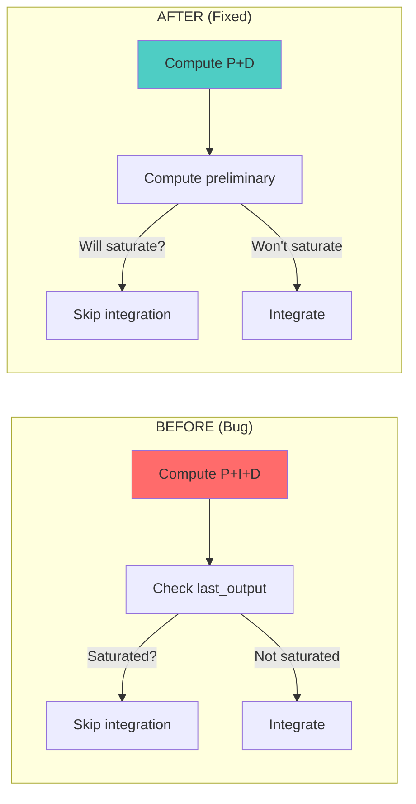

### C3-C6 Summary

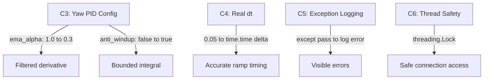

---

## Command Registry Pattern

### Decorator-Based Registration

```python
@register('move_forward', CommandCategory.TRANSLATION, CommandTransport.TOPIC,
 description='Thrust forward on CH_FORWARD',
 channels=['CH_FORWARD'])
def cmd_move_forward(handler, cmd):
 handler.set_movement(
 {CH_FORWARD: NEUTRAL_PWM + handler.offset},
 'Forward')
```

### Registry Structure

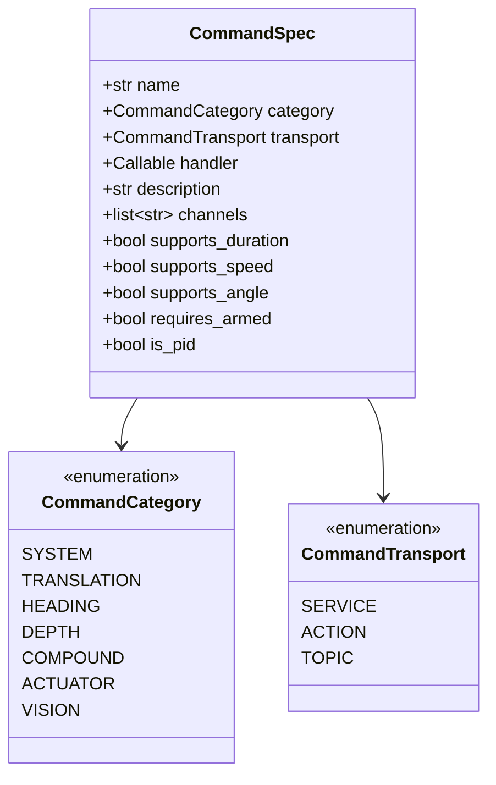

---

## Message Evolution

### DriverCommand.msg v2

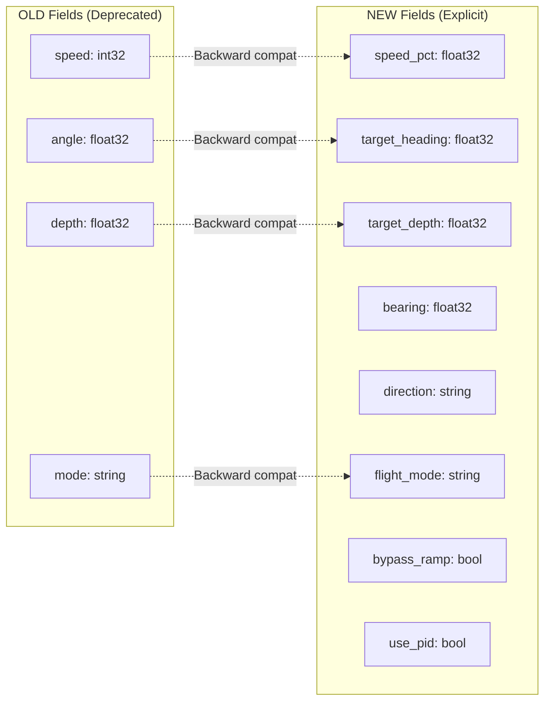

---

## Movement Control

### Phase-Aware Ramping

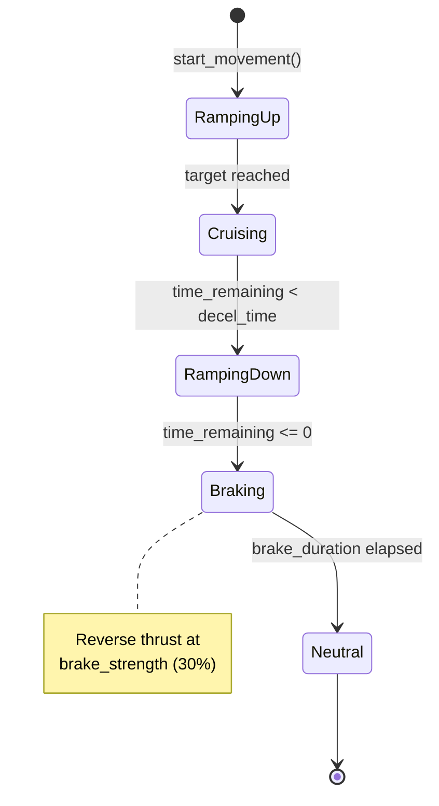

### PWM Profile Visualization

```
PWM

1900
 CRUISING PHASE

1500

1400 BRAKE
 ___
 time
 ↑ ↑ ↑ ↑
 ramp_up cruise ramp_down brake
```

---

## Perception Integration

### DuburiClient API

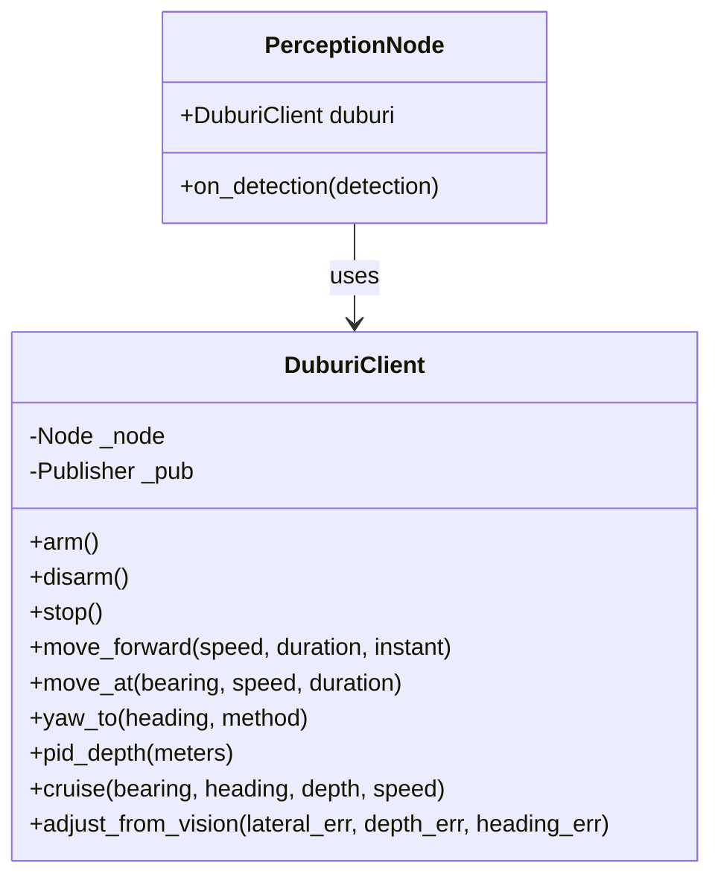

### Vision Servoing Integration

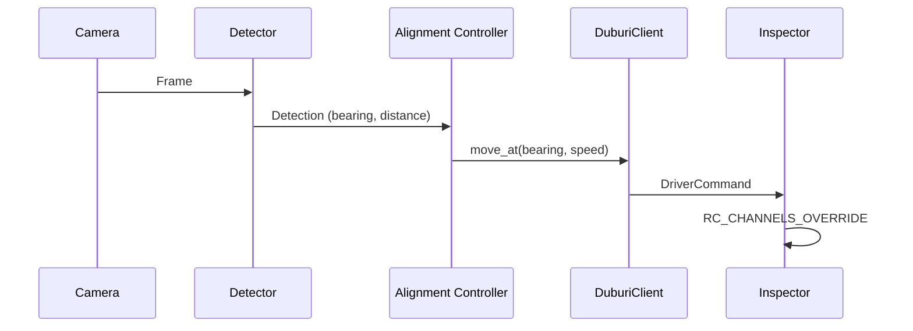

---

## Potential Issues

### Things to Watch

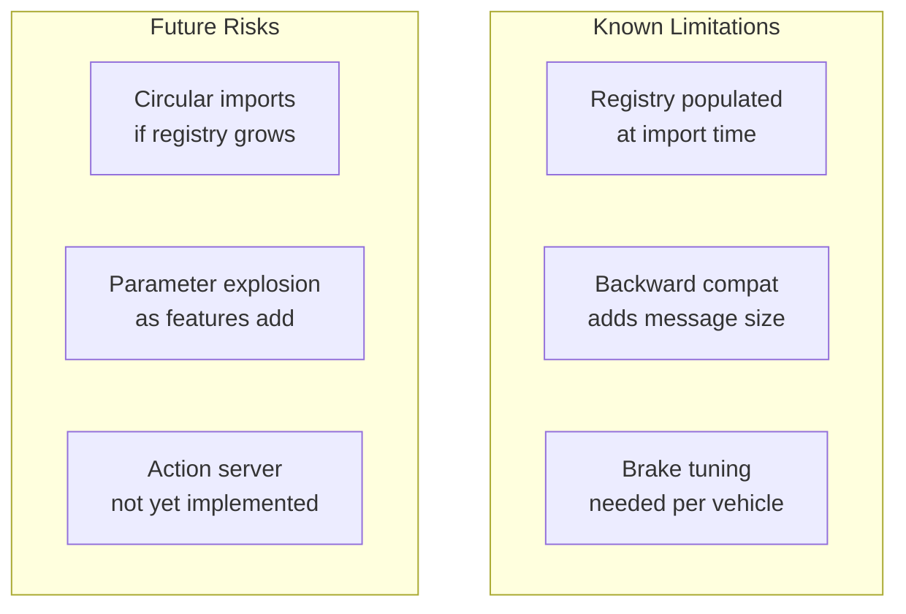

### Mitigation Strategies

| Risk | Mitigation |
|------|------------|
| Registry import order | Import movement_commands before using get_all_commands() |
| Backward compat bloat | Phase B will remove deprecated fields |
| Brake overshoot | Conservative defaults, live-tunable |
| Circular imports | Registry has no internal dependencies |

---

## Migration Guide

### For Mission Files

**No changes needed.** Old commands still work:

```bash
# Old syntax still works
move forward 50% 5s
heading 90

# New syntax also works
~depth 0.5 # PID depth
just forward 50% # Bypass ramp
```

### For Python Code

```python
# OLD (deprecated but works)
from mavlink_driver.driver_client import move_forward, arm
msg = move_forward(duration=3, speed=50)

# NEW (preferred)
from mavlink_driver.duburi_client import DuburiClient
duburi = DuburiClient(node)
duburi.arm()
duburi.move_forward(speed=50, duration=3.0)
```

### For Planner States

```python
# OLD - still works
ctx.send('move_forward', duration=3, speed=50)

# NEW - also available
ctx.duburi.move_forward(speed=50, duration=3)
```

---

## Conclusion

The Control Stack Redesign V1 transforms the codebase from a scattered, hard-to-maintain system into a unified, safe, and extensible architecture ready for perception integration.

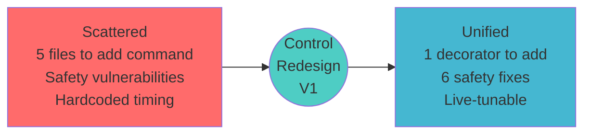
