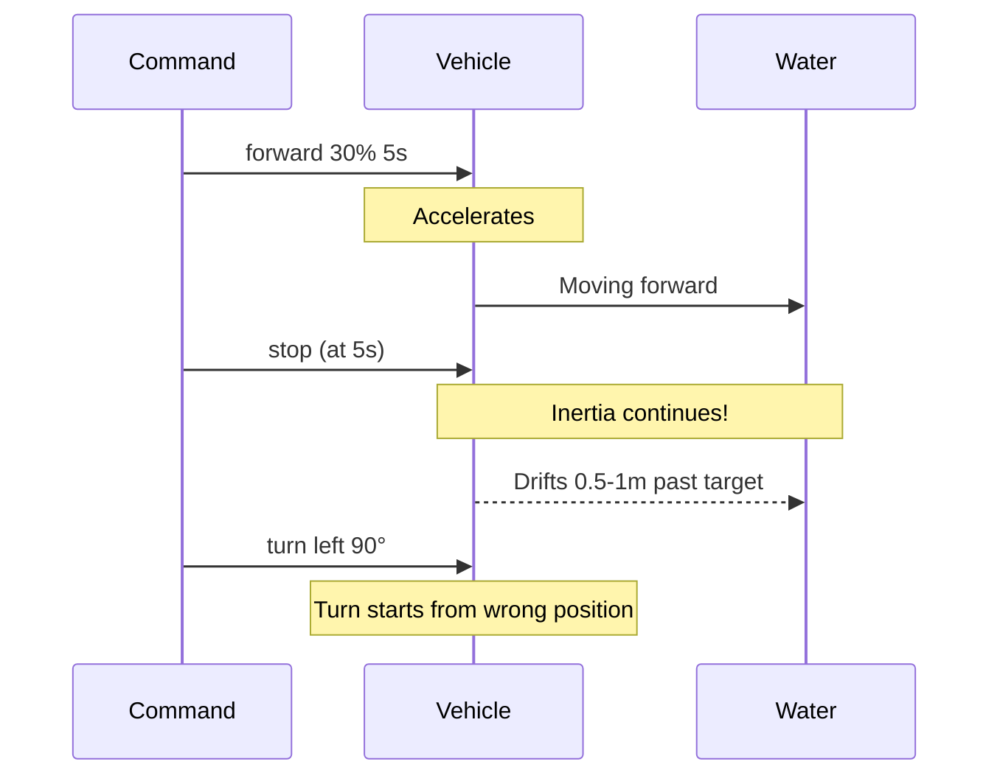
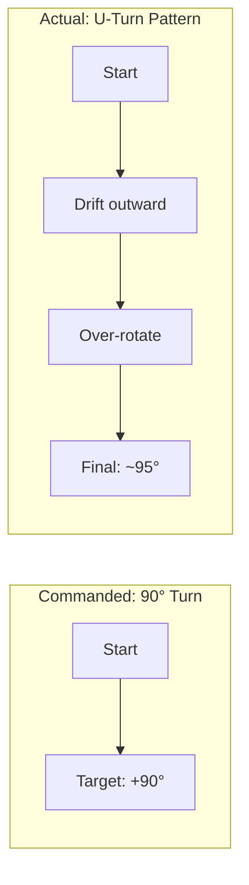
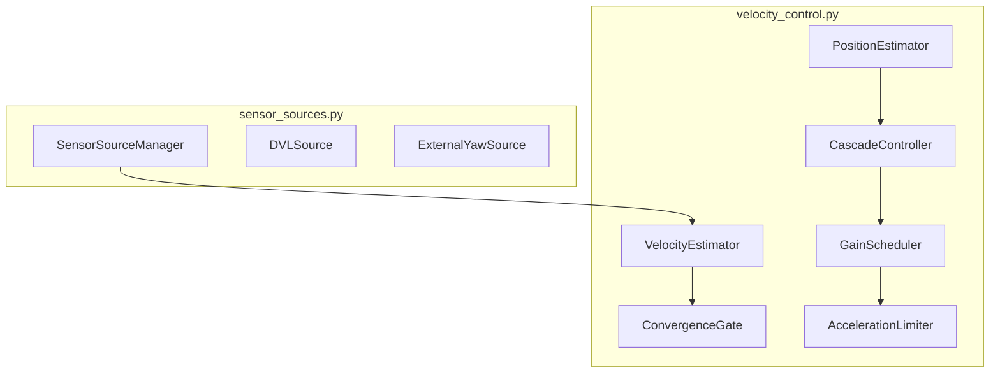
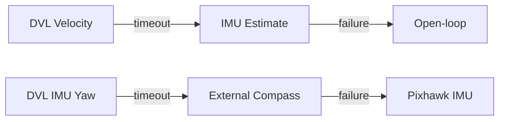
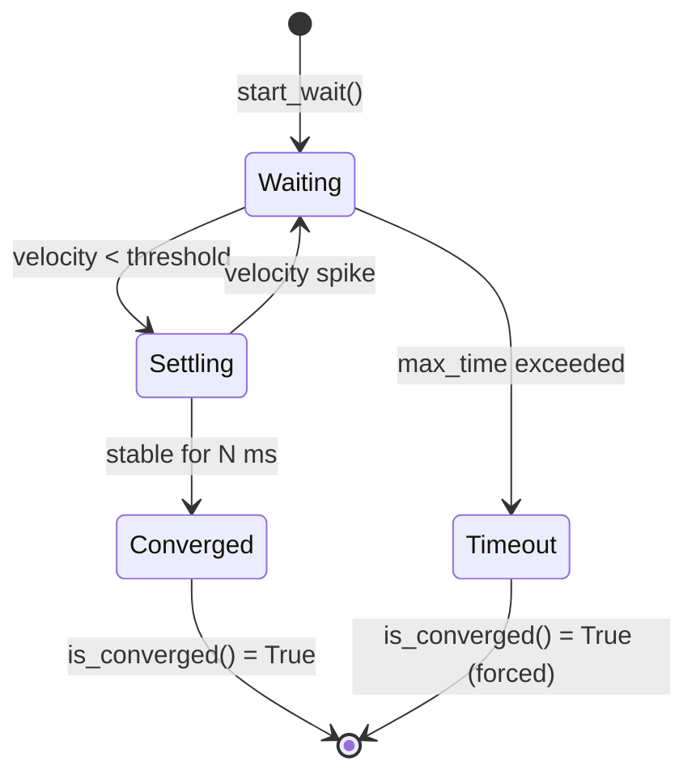
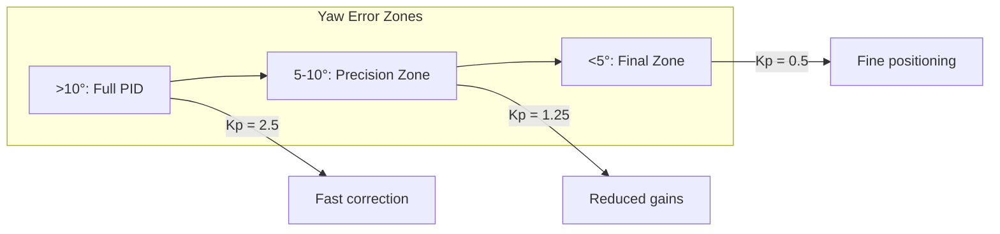
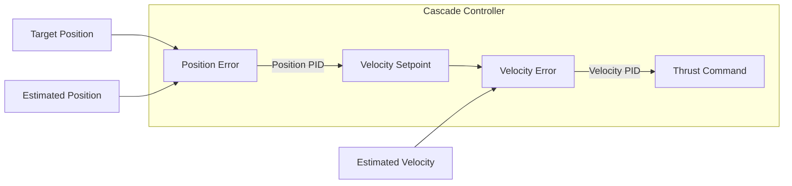
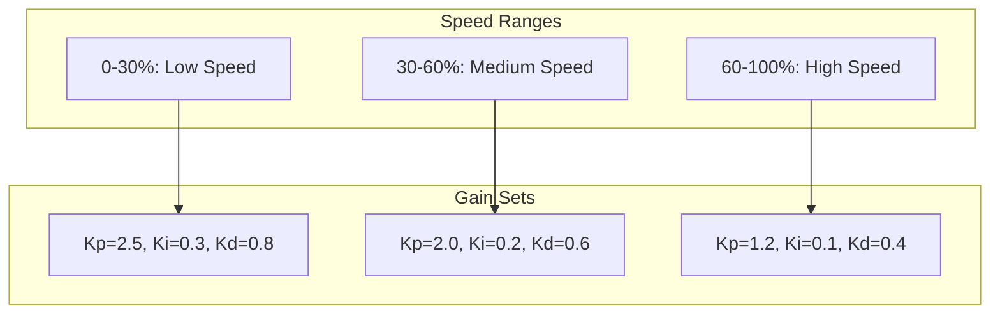
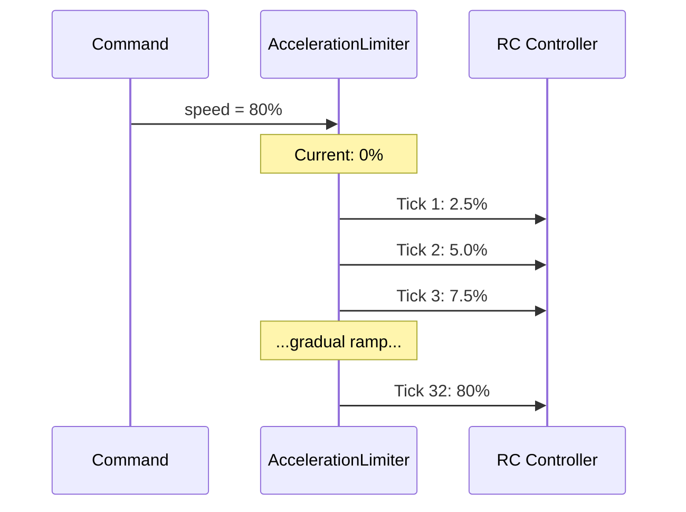
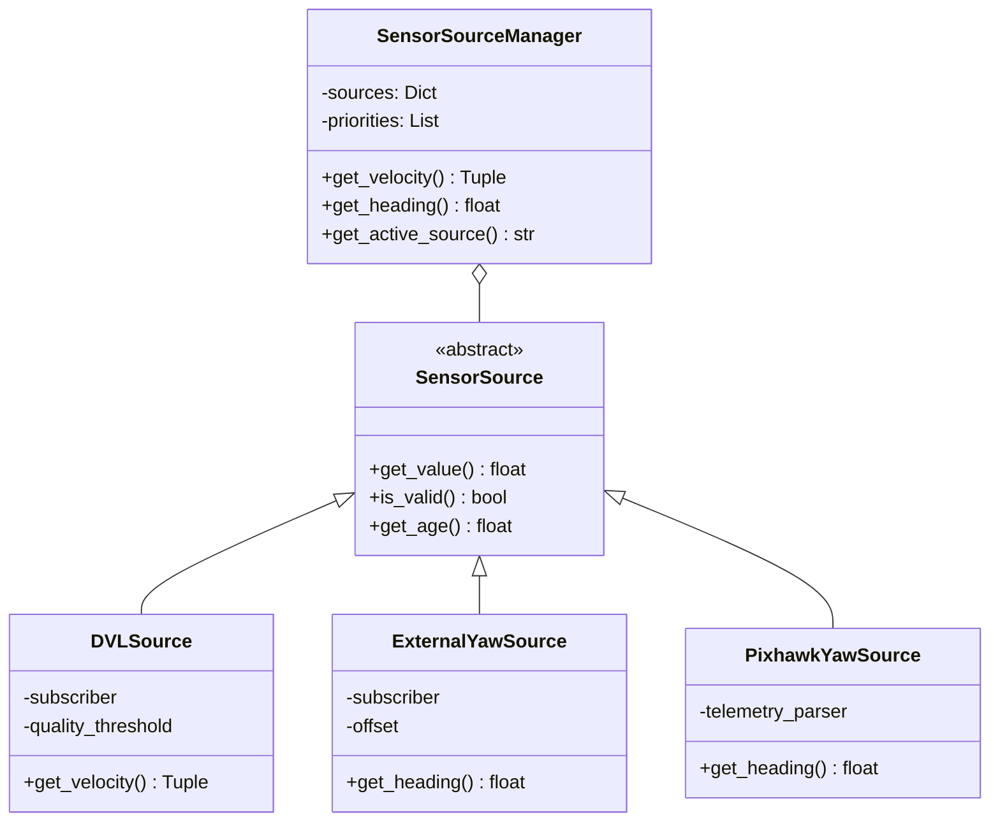

# Control Stack Redesign V2 Design Decision Document

## Executive Summary

Control Redesign V2 addresses fundamental control theory problems identified during mission testing. While V1 fixed *architectural* issues (god object, scattered commands), V2 fixes *control* issues (inertia, drift, overshoot).

**Key Outcomes:**
- 5-phase implementation addressing 3 critical control issues
- 74+ configuration parameters (all disabled by default for safety)
- Multi-source sensor architecture (DVL, external compass ready)
- Backward compatible all existing commands work unchanged

---

## Table of Contents

1. [Problems Identified](#problems-identified)
2. [Design Philosophy](#design-philosophy)
3. [Phase 1: Velocity Estimation & Convergence](#phase-1-velocity-estimation--convergence)
4. [Phase 2: Precision Yaw Control](#phase-2-precision-yaw-control)
5. [Phase 3: Cascade Control](#phase-3-cascade-control)
6. [Phase 4: Gain Scheduling](#phase-4-gain-scheduling)
7. [Phase 5: Multi-Source Sensors](#phase-5-multi-source-sensors)
8. [Implementation Details](#implementation-details)
9. [Testing Strategy](#testing-strategy)
10. [Configuration Reference](#configuration-reference)

---

## Problems Identified

### Problem 1: Movement Inertia



**Symptoms:**
- Vehicle overshoots target positions
- Chained commands start from wrong locations
- Square missions become parallelograms

**Root Cause:** Open-loop control with no velocity feedback. Commands end but momentum continues.

### Problem 2: Yaw Drift During Turns



**Symptoms:**
- 90° turns look like U-turns (vehicle drifts laterally)
- Yaw overshoots at high speeds
- Sequential turns accumulate error

**Root Cause:** Translation channels active during rotation → body drifts while turning.

### Problem 3: High-Speed Unreliability

| Speed Range | Reliability | Issue |
|-------------|-------------|-------|
| 0-30% | [DONE] Good | PID tuned for this range |
| 30-60% | WARNING Marginal | Slight overshoot |
| 60-100% | Poor | Massive overshoot, instability |

**Root Cause:** Single set of PID gains optimized for low speed. At high speeds, gains are too aggressive.

---

## Design Philosophy

### 1. Configuration-Driven

Every V2 feature has an enable/disable switch:

```yaml
# All off by default enable after testing
convergence_enabled: false
rotate_in_place_enabled: false
cascade_enabled: false
gain_scheduling_enabled: false
```

**Why:** Untested control code can damage hardware. Safe defaults let us test incrementally.

### 2. Modular Architecture



Each class is:
- Single-responsibility
- Independently testable
- Hot-swappable at runtime

### 3. Fallback Chains



**Why:** Sensors fail. External compass cable disconnects. DVL loses bottom lock. The system must degrade gracefully.

---

## Phase 1: Velocity Estimation & Convergence

### VelocityEstimator

**Purpose:** Estimate body-frame velocity from IMU accelerometer data.

```python
class VelocityEstimator:
 def update(self, accel_x, accel_y, accel_z, dt):
 # Trapezoidal integration (better than Euler)
 self.velocity[0] += 0.5 * (self.prev_accel[0] + accel_x) * dt
 self.velocity[1] += 0.5 * (self.prev_accel[1] + accel_y) * dt

 # ZUPT: Zero-velocity Update (drift correction)
 if self._is_stationary():
 self.velocity = [0.0, 0.0, 0.0]
```

**ZUPT (Zero-velocity Update):**
When accelerometer reads near-zero for N seconds, we know velocity must be zero. Reset integration to prevent drift accumulation.

| Parameter | Default | Description |
|-----------|---------|-------------|
| `imu_stopped_accel_threshold` | 0.02 m/s² | Accel magnitude for "stopped" |
| `imu_stopped_time_required` | 0.3 s | Duration to trigger ZUPT |

### ConvergenceGate

**Purpose:** Block next command until vehicle has stabilized.



**Key Insight:** We don't just wait for velocity to drop we wait for it to *stay* low. A momentary dip due to wave action doesn't count.

| Parameter | Default | Description |
|-----------|---------|-------------|
| `convergence_velocity_threshold` | 0.05 m/s | "Stopped" threshold |
| `convergence_settling_time` | 0.2 s | Time below threshold |
| `convergence_timeout` | 5.0 s | Safety timeout |

---

## Phase 2: Precision Yaw Control

### Rotate-in-Place Mode

**Core Idea:** During yaw commands, lock all translation channels to neutral.

```python
def _execute_rotate_in_place(self, target_heading, speed):
 # Lock translation
 self.rc_controller.set_movement({
 CH_FORWARD: NEUTRAL_PWM,
 CH_LATERAL: NEUTRAL_PWM,
 CH_THROTTLE: NEUTRAL_PWM,
 }, 'translation_lock')

 # Only yaw active
 self._yaw_to_heading = {
 'target': target_heading,
 'gain_offset': speed,
 'mode': 'rotate_in_place'
 }
```

**Result:** Vehicle rotates on its axis without drifting laterally.

### Two-Zone PID



| Zone | Error Range | Kp Multiplier | Purpose |
|------|-------------|---------------|---------|
| Normal | >10° | 1.0 | Fast gross correction |
| Precision | 5-10° | 0.5 | Prevent overshoot |
| Final | <5° | 0.2 | Fine positioning |

### Settling Time

Not just *reach* target *stay* at target:

```python
if abs(yaw_error) < self.final_deadband:
 if self.in_final_zone_since is None:
 self.in_final_zone_since = now
 elif now - self.in_final_zone_since > self.settling_time:
 return True # Actually converged
else:
 self.in_final_zone_since = None # Reset
```

| Parameter | Default | Description |
|-----------|---------|-------------|
| `yaw_precision_deadband` | 5.0° | Precision zone threshold |
| `yaw_final_deadband` | 1.0° | Final zone threshold |
| `yaw_settling_time` | 0.5 s | Time to stay in final zone |

---

## Phase 3: Cascade Control

### Position → Velocity → Thrust



**Why Cascade?**
- Position-only control is sluggish (integrator windup)
- Velocity-only control can't hold position
- Cascade gets best of both: responsive *and* accurate

### Dual PID Loops

**Outer Loop (Position):**
```python
velocity_setpoint = position_pid.compute(
 error=target_position - estimated_position,
 dt=dt
)
velocity_setpoint = clamp(velocity_setpoint, -0.5, 0.5) # m/s limit
```

**Inner Loop (Velocity):**
```python
thrust = velocity_pid.compute(
 error=velocity_setpoint - estimated_velocity,
 dt=dt
)
thrust = clamp(thrust, -400, 400) # PWM limit
```

| Parameter | Default | Description |
|-----------|---------|-------------|
| `position_kp` | 0.5 | Position Kp |
| `position_ki` | 0.0 | Position Ki (usually 0) |
| `position_kd` | 0.1 | Position Kd |
| `velocity_kp` | 400.0 | Velocity Kp |
| `velocity_ki` | 50.0 | Velocity Ki |
| `velocity_kd` | 30.0 | Velocity Kd |
| `max_velocity_setpoint` | 0.5 | m/s limit |
| `max_thrust_output` | 400 | PWM limit |

---

## Phase 4: Gain Scheduling

### Speed-Adaptive Gains



**Why Different Gains?**
- Low speed: Aggressive gains for responsiveness
- High speed: Reduced gains to prevent overshoot

| Parameter | Low | Medium | High |
|-----------|-----|--------|------|
| `yaw_kp` | 2.5 | 2.0 | 1.2 |
| `yaw_ki` | 0.3 | 0.2 | 0.1 |
| `yaw_kd` | 0.8 | 0.6 | 0.4 |
| `depth_kp` | 200 | 180 | 150 |
| `depth_ki` | 30 | 25 | 20 |
| `depth_kd` | 80 | 70 | 50 |
| `position_kp` | 0.7 | 0.5 | 0.3 |

### Acceleration Limiting



| Parameter | Default | Description |
|-----------|---------|-------------|
| `max_accel_pct_per_sec` | 50.0 | Max acceleration rate |
| `accel_limit_update_rate` | 20 Hz | Update frequency |

**Per-tick limit:** 50% / 20 Hz = 2.5% per tick

---

## Phase 5: Multi-Source Sensors

### Sensor Source Architecture



### Priority Fallback

```python
class SensorSourceManager:
 def get_velocity(self):
 for source_name in self.velocity_priority:
 source = self.sources.get(source_name)
 if source and source.is_valid():
 return source.get_velocity(), source_name
 return None, 'none'
```

**Default Priorities:**
- Velocity: `[dvl, imu_estimate]`
- Yaw: `[dvl_imu, external, pixhawk]`

### DVL Integration (Nortek Nucleus 1000)

| Topic | Type | Description |
|-------|------|-------------|
| `/dvl/velocity` | `TwistWithCovarianceStamped` | Body-frame velocity |
| `/dvl/orientation` | `Imu` or `QuaternionStamped` | Internal IMU orientation |

**Quality Filtering:**
```python
if msg.covariance[0] < self.min_quality:
 return None # Reject low-quality reading
```

### External Compass Support

**Supported Message Types:**
- `std_msgs/Float32` Raw heading in degrees
- `sensor_msgs/Imu` Extract yaw from quaternion
- `geometry_msgs/Vector3Stamped` Use x field

**Calibration Offset:**
```python
heading = raw_heading + self.offset
heading = heading % 360 # Normalize
```

---

## Implementation Details

### File Structure

```
src/mavlink_inspector/mavlink_inspector/
 velocity_control.py # Phase 1-4 classes (~940 lines)
 VelocityEstimator
 ConvergenceGate
 PositionEstimator
 CascadeController
 GainScheduler
 AccelerationLimiter

 sensor_sources.py # Phase 5 classes (~800 lines)
 SensorSource (ABC)
 DVLSource
 DVLIMUSource
 ExternalYawSource
 PixhawkYawSource
 SensorSourceManager

 inspector_node.py # +578 lines for wiring
 command_handler.py # +476 lines for helpers
 movement_commands.py # +144 lines for rotate-in-place
```

### Module Wiring (inspector_node.py)

```python
# Phase 1-4 initialization
self.velocity_estimator = VelocityEstimator(node=self)
self.convergence_gate = ConvergenceGate(node=self)
self.position_estimator = PositionEstimator(node=self)
self.cascade_controller = CascadeController(node=self)
self.gain_scheduler = GainScheduler(node=self)
self.acceleration_limiter = AccelerationLimiter(node=self)

# Phase 5 initialization
self.sensor_manager = SensorSourceManager(node=self)
```

### IMU Callback Integration

```python
def _handle_scaled_imu2(self, msg):
 # Extract accelerometer data
 accel_x = msg.xacc / 1000.0 # milli-g to g
 accel_y = msg.yacc / 1000.0
 accel_z = msg.zacc / 1000.0

 # Update velocity estimate
 if self.velocity_estimator_enabled:
 self.velocity_estimator.update(accel_x, accel_y, accel_z, dt)
```

---

## Testing Strategy

See `analysis/guides/pool-testing/next_things_to_check.md` for comprehensive testing guide.

### Phase 1 Testing

1. **ZUPT Test:** Let vehicle sit still, verify velocity resets to zero
2. **Convergence Test:** Run `forward 50% 3s`, verify next command waits
3. **Timeout Test:** Simulate stuck sensor, verify timeout triggers

### Phase 2 Testing

1. **Rotate-in-Place:** Run `sharp turn left 90 50%`, verify no lateral drift
2. **Precision Zone:** Observe PID output reduces near target
3. **Settling:** Verify vehicle holds position for settling_time

### Phase 3-4 Testing

1. **Cascade:** Compare overshoot with/without cascade
2. **Gain Scheduling:** Test same command at 30%, 60%, 90% verify stability
3. **Acceleration Limiting:** Verify smooth ramp-up

### Phase 5 Testing

1. **DVL:** Verify velocity reading when enabled
2. **Fallback:** Disconnect DVL, verify IMU fallback
3. **External Compass:** Verify heading with external source

---

## Configuration Reference

All parameters in `config/defaults.yaml`:

```yaml
# ========== PHASE 1: Velocity Estimation ==========
convergence_enabled: false
convergence_velocity_threshold: 0.05
convergence_settling_time: 0.2
convergence_timeout: 5.0
imu_stopped_accel_threshold: 0.02
imu_stopped_time_required: 0.3

# ========== PHASE 2: Precision Yaw ==========
rotate_in_place_enabled: false
yaw_precision_deadband: 5.0
yaw_final_deadband: 1.0
yaw_settling_time: 0.5
yaw_precision_kp_reduction: 0.5
yaw_feedforward_enabled: false

# ========== PHASE 3: Cascade Control ==========
cascade_enabled: false
position_kp: 0.5
position_ki: 0.0
position_kd: 0.1
position_tolerance: 0.1
velocity_kp: 400.0
velocity_ki: 50.0
velocity_kd: 30.0
max_velocity_setpoint: 0.5
max_thrust_output: 400

# ========== PHASE 4: Gain Scheduling ==========
gain_scheduling_enabled: false
accel_limiting_enabled: false
speed_range_low_max: 30
speed_range_medium_max: 60
max_accel_pct_per_sec: 50.0

# Low speed gains (0-30%)
yaw_gains_low_kp: 2.5
yaw_gains_low_ki: 0.3
yaw_gains_low_kd: 0.8
depth_gains_low_kp: 200.0
depth_gains_low_ki: 30.0
depth_gains_low_kd: 80.0
position_gains_low_kp: 0.7

# Medium speed gains (30-60%)
yaw_gains_medium_kp: 2.0
yaw_gains_medium_ki: 0.2
yaw_gains_medium_kd: 0.6
depth_gains_medium_kp: 180.0
depth_gains_medium_ki: 25.0
depth_gains_medium_kd: 70.0
position_gains_medium_kp: 0.5

# High speed gains (60-100%)
yaw_gains_high_kp: 1.2
yaw_gains_high_ki: 0.1
yaw_gains_high_kd: 0.4
depth_gains_high_kp: 150.0
depth_gains_high_ki: 20.0
depth_gains_high_kd: 50.0
position_gains_high_kp: 0.3

# ========== PHASE 5: Sensor Sources ==========
dvl_enabled: false
dvl_topic: "/dvl/velocity"
dvl_timeout: 1.0
dvl_min_quality: 0.5
dvl_imu_enabled: false
dvl_imu_topic: "/dvl/orientation"
external_yaw_enabled: false
external_yaw_topic: "/external_imu/yaw"
external_yaw_msg_type: "std_msgs/Float32"
external_yaw_offset: 0.0
external_yaw_timeout: 0.5
velocity_source_priority: ["dvl", "imu_estimate"]
yaw_source_priority: ["dvl_imu", "external", "pixhawk"]
```

---

## Migration from V1

V2 is fully backward compatible. To migrate:

1. **Pull Control-Redesign-V2 branch**
2. **Build:** `colcon build`
3. **Test without V2 features:** All existing commands work unchanged
4. **Enable features one at a time:**
 ```yaml
 convergence_enabled: true # Start here
 ```
5. **Pool test each feature before enabling next**

---

## Future Work

1. **DVL Package:** Separate ROS2 package for Nortek Nucleus 1000
2. **Trajectory Planning:** Pre-computed paths with feedforward
3. **Model Predictive Control:** For complex maneuvers
4. **External Compass Package:** BNO085 + ESP32 via MAVLink
5. **Closed-Loop Position:** GPS/acoustic positioning integration
