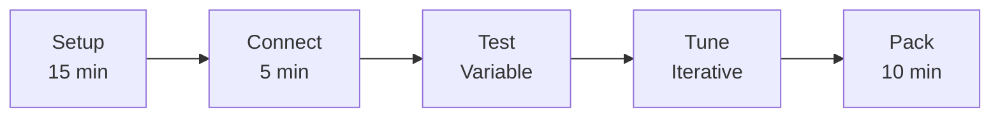

# Pool Testing Field Manual

Quick reference guides for pool testing operations.

## Quick Links

| Guide | Use When |
|-------|----------|
| [setup-checklist.md](setup-checklist.md) | Arriving at pool |
| [network-config.md](network-config.md) | Network issues |
| [startup-sequence.md](startup-sequence.md) | Starting system |
| [tuning-guide.md](tuning-guide.md) | Adjusting PID/ramp |
| [troubleshooting.md](troubleshooting.md) | Something breaks |
| [test-procedures.md](test-procedures.md) | What to test |

## Emergency Procedures

WARNING: **Kill Switch:** Always have physical kill switch accessible

WARNING: **Software Stop:** `stop` command in runner OR Ctrl+C on inspector

WARNING: **Manual Recovery:** Disarm, surface manually if needed
