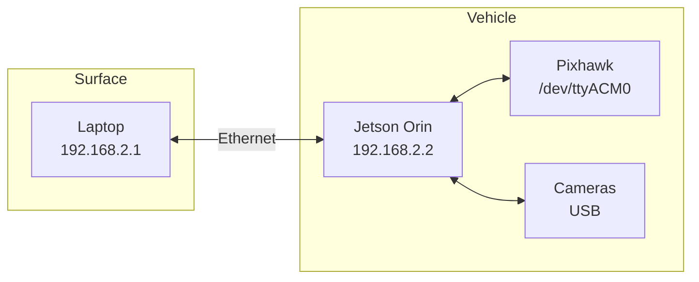

# Network Configuration

## IP Address Map



| Device | IP Address | Port | Notes |
|--------|------------|------|-------|
| Jetson | 192.168.2.2 | — | Vehicle compute |
| Laptop | 192.168.2.1 | — | Surface station |
| BlueOS | 192.168.2.2 | 80 | Web interface |
| MAVLink | 192.168.2.2 | 14550 | UDP (if networked) |

## Network Setup

### On Laptop

```bash
# Set static IP
sudo ip addr add 192.168.2.1/24 dev eth0
sudo ip link set eth0 up

# Verify
ping 192.168.2.2
```

### Verify Connection

```bash
# SSH to Jetson
ssh duburi@192.168.2.2

# Check BlueOS web interface
curl http://192.168.2.2/status
```

## WiFi Fallback

If Ethernet fails:
1. Jetson hotspot: `DUBURI_AUV`
2. Password: [your password]
3. Jetson IP: 10.42.0.1

## ROS 2 Multi-Machine Setup

```bash
# On laptop (to see Jetson ROS topics)
export ROS_DOMAIN_ID=42  # Must match Jetson

# On Jetson
export ROS_DOMAIN_ID=42
```
