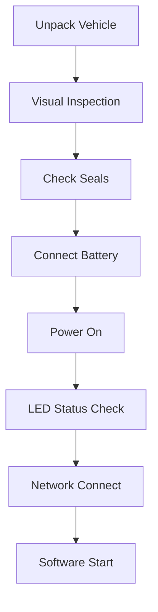

# Pool Setup Checklist

## Pre-Pool (Before Leaving Lab)

- [ ] Batteries charged (check voltage)
- [ ] SD cards cleared
- [ ] Laptop charged
- [ ] Network cables/adapters
- [ ] Tools: hex keys, screwdrivers
- [ ] Spare parts: connectors, o-rings

## At Pool Setup

### Step-by-Step

1. **Unpack** - Handle with care, check nothing loose
2. **Inspect** - Look for damage, loose connectors
3. **Seals** - All penetrators tight, o-rings greased
4. **Battery** - Connect, verify voltage
5. **Power** - Turn on, wait for boot (~30s)
6. **LEDs** - Pixhawk should be solid green/blue
7. **Network** - Connect Ethernet or WiFi
8. **Software** - Follow [startup-sequence.md](startup-sequence.md)

## Post-Pool Teardown

- [ ] Disarm and power off
- [ ] Fresh water rinse
- [ ] Dry exterior
- [ ] Disconnect battery
- [ ] Log session notes
- [ ] Pack securely
