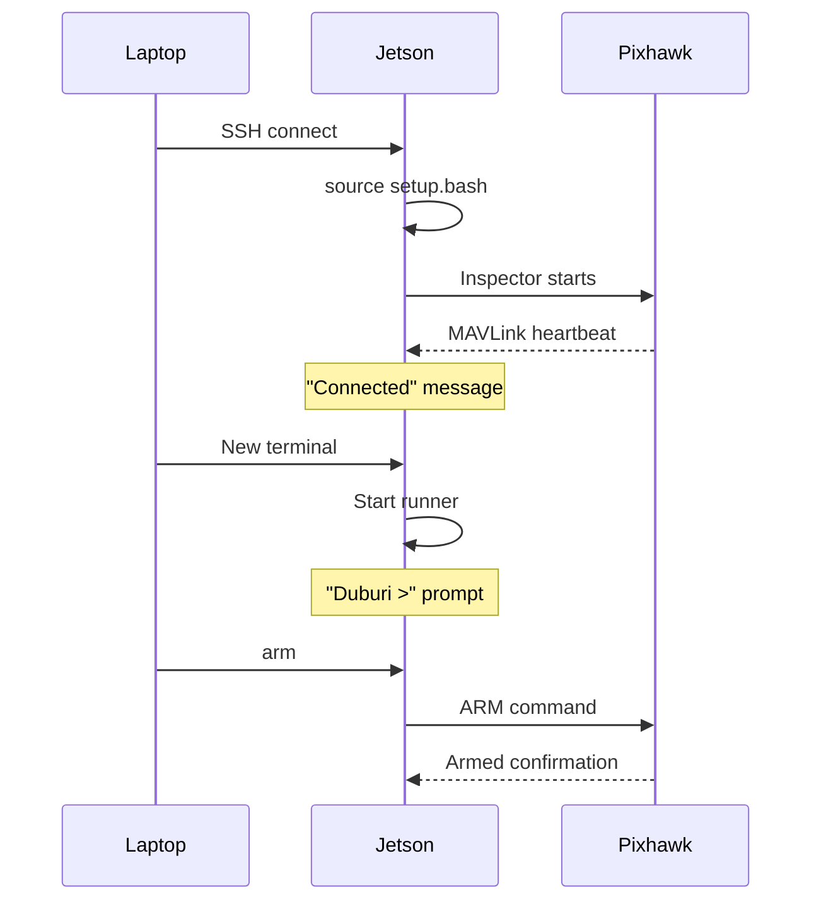

# Startup Sequence

## Quick Start (Copy-Paste)

### On Jetson (SSH in first)

```bash
# Terminal 1: Inspector
cd ~/Duburi_ws
source install/setup.bash
ros2 run mavlink_inspector inspector

# Terminal 2: Runner
cd ~/Duburi_ws
source install/setup.bash
ros2 run mavlink_runner runner

# Terminal 3: Logger (optional)
ros2 run mavlink_logger logger
```

## Detailed Sequence



## First Commands

```bash
# At Duburi > prompt:

# 1. Check status
status

# 2. Arm (motors will beep)
arm

# 3. Test depth sensor
~depth 0.0  # Should hold current depth

# 4. Test yaw
~heading 0  # Should hold current heading

# 5. Test movement (out of water!)
move forward 20% 2s

# 6. Stop everything
stop

# 7. Disarm
disarm
```

## Vision Stack (If Testing Perception)

```bash
# Terminal 4: Camera
ros2 run vision_inspector camera_manager

# Terminal 5: Detector
ros2 run vision detector_node --ros-args -p enable_display:=true

# View on laptop
ros2 run rqt_image_view rqt_image_view
```
