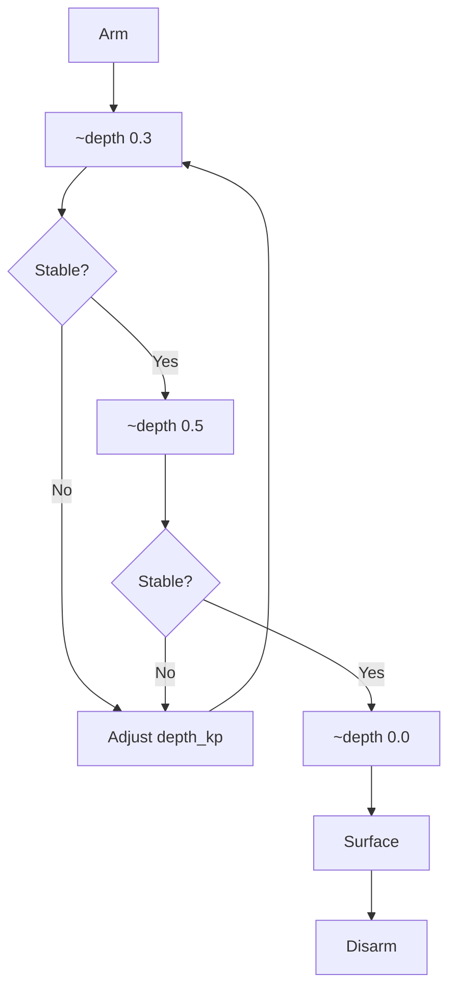

# Test Procedures

## Test Matrix

| Test | Package | Command | Success Criteria |
|------|---------|---------|------------------|
| Arm/Disarm | inspector | `arm` / `disarm` | Motors beep, status shows armed |
| Depth Hold | inspector | `~depth 0.5` | Holds within 5cm |
| Yaw Hold | inspector | `~heading 90` | Holds within 5° |
| Forward | inspector | `move forward 50% 3s` | Moves straight |
| Lateral | inspector | `move right 50% 3s` | Strafes without yaw |
| Diagonal | inspector | `move forward-right 50% 3s` | 45° movement |
| Cruise | inspector | `cruise 0 90 0.5 50% 10s` | All axes controlled |
| Camera | vision | `camera_manager` | Image visible |
| Detection | vision | `detector_node` | Bounding boxes appear |

## Depth Test Procedure

## Yaw Test Procedure

1. Arm
2. `~heading 0` - Note current heading
3. `~heading 90` - Should turn 90°
4. `~heading 180` - Should turn another 90°
5. `~heading 0` - Should return to start
6. Verify no drift, smooth motion

## Movement Test Procedure

1. Mark starting position (tape on pool edge)
2. `move forward 50% 3s`
3. Measure distance traveled
4. `move back 50% 3s`
5. Should return to start
6. Repeat for each axis
