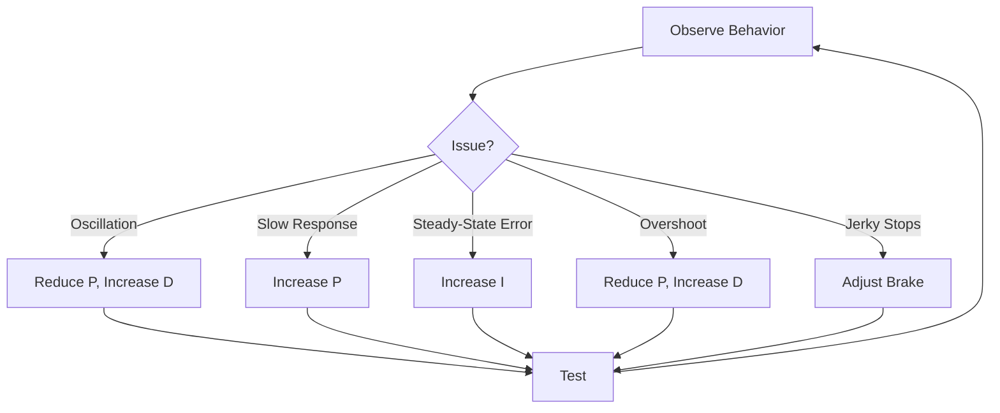

# Live Tuning Guide

## Tuning Workflow



## Parameter Quick Reference

### Depth PID

```bash
# If oscillating (bouncing up/down)
ros2 param set /mavlink_inspector depth_kp 400.0
ros2 param set /mavlink_inspector depth_kd 200.0

# If too slow to reach depth
ros2 param set /mavlink_inspector depth_kp 1000.0

# If steady-state error (stops above/below target)
ros2 param set /mavlink_inspector depth_ki 75.0

# Conservative starting point
ros2 param set /mavlink_inspector depth_kp 500.0
ros2 param set /mavlink_inspector depth_ki 25.0
ros2 param set /mavlink_inspector depth_kd 150.0
```

### Yaw PID

```bash
# If spinning past target
ros2 param set /mavlink_inspector yaw_kp 1.5
ros2 param set /mavlink_inspector yaw_kd 0.8

# If slow to turn
ros2 param set /mavlink_inspector yaw_kp 3.0

# Conservative
ros2 param set /mavlink_inspector yaw_kp 2.0
ros2 param set /mavlink_inspector yaw_ki 0.05
ros2 param set /mavlink_inspector yaw_kd 0.5
```

### Ramp and Brake

```bash
# Smoother acceleration
ros2 param set /mavlink_inspector ramp_rate 500

# More aggressive stopping
ros2 param set /mavlink_inspector brake_strength 0.5
ros2 param set /mavlink_inspector brake_duration 0.8

# Disable brake (coast to stop)
ros2 param set /mavlink_inspector brake_enabled false
```

## Recording Settings

After finding good values, save them:

```bash
# Dump current params
ros2 param dump /mavlink_inspector > my_tuned_params.yaml

# Copy to config
cp my_tuned_params.yaml src/mavlink_inspector/config/pool_tuned.yaml
```
