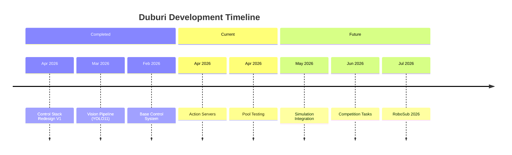

# Development Roadmap

This folder tracks Duburi development progress toward RoboSub 2026.

## Documents

| Document | Description |
|----------|-------------|
| [completed.md](completed.md) | What we've accomplished |
| [current.md](current.md) | Active development |
| [future.md](future.md) | Planned features |
| [timeline.md](timeline.md) | Competition timeline analysis |

## Quick Links

- **Legacy Document:** [../ROADMAP.md](../ROADMAP.md) — Full original roadmap with all details
- **Competition Analysis:** [../robosub-analysis/](../robosub-analysis/) — Detailed task breakdowns
- **Architecture:** [../architecture/](../architecture/) — System design documents
