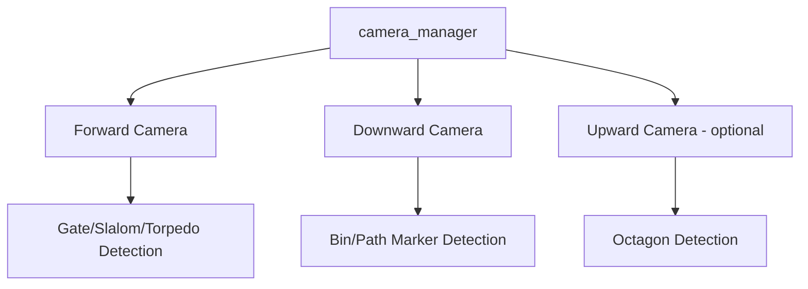
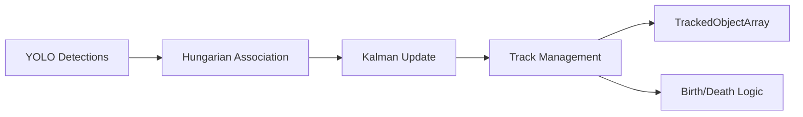
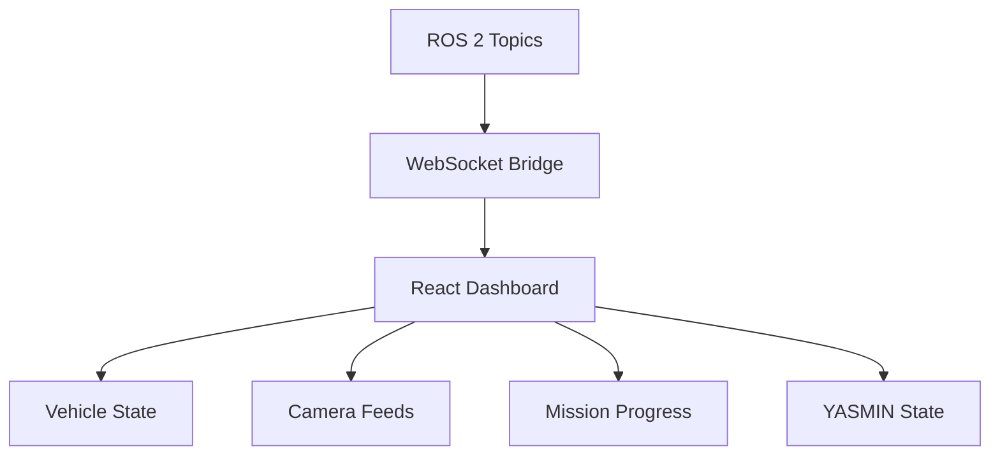
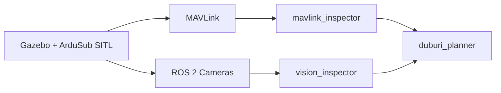
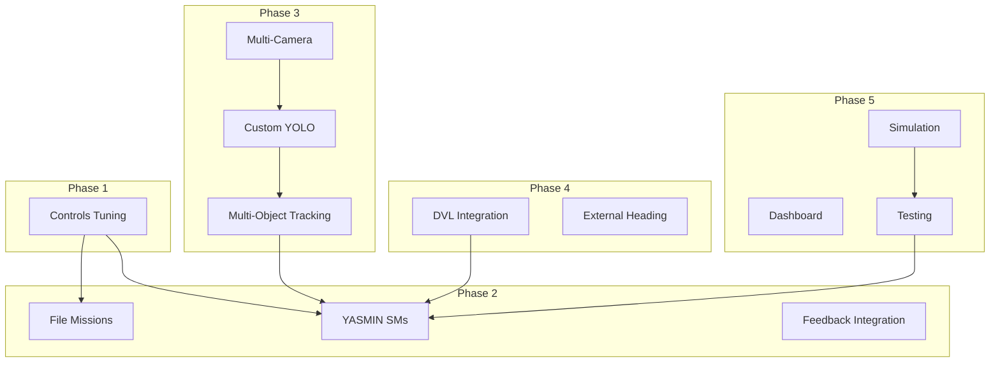

# Future Development

> Planned features and roadmap toward RoboSub 2026

---

## RoboSub 2026 Competition Task Analysis

> Theme: *"Restore and Recovery"* — underwater pipeline maintenance scenario

### Task Summary

| Task | Name | What We Have | What We Need |
|------|------|--------------|--------------|
| 1 | Begin Assessment (Gate) | ✅ YOLO, visual servo, gate SM | Custom YOLO model for props |
| 2 | Avoid Debris (Slalom) | 🟡 Detection pipeline | Multi-object tracking, slalom SM |
| 3 | Recon (Bins) | 🟡 Camera manager | Downward cam, dropper, bin SM |
| 4 | Deploy (Torpedoes) | 🔴 Visual servo only | Pinger, launcher, torpedo SM |
| 5 | Resupply (Octagon) | 🟡 Surface cmd, grabber | Pinger, octagon SM, pickup sequence |
| 6 | Return Home (Gate) | ✅ Reuse Task 1 | DVL for position tracking |

### Cross-Cutting Elements

- **Path Markers** (orange, on pool floor) — Need downward camera + YOLO model
- **Acoustic Pingers** (at Tasks 4 & 5) — Need hydrophone array + DOA algorithm
- **20-Minute Time Limit** — Need mission timeout + task prioritization

---

## Phase 3 — Perception Stack

### 3.1 Multi-Camera Setup

**Tasks:**
- [ ] Mount downward-facing USB camera
- [ ] Configure `camera_manager` for dual operation
- [ ] Test USB bandwidth with dual 640×480@30fps

### 3.2 Custom YOLO Models

**RoboSub prop classes:**

| Class | Task | Camera | Priority |
|-------|------|--------|----------|
| `gate_pole` | 1, 6 | Forward | HIGH |
| `gate_crossbar` | 1, 6 | Forward | HIGH |
| `red_pipe` | 2 | Forward | HIGH |
| `white_pipe` | 2 | Forward | HIGH |
| `bin_symbol_*` | 3 | Downward | MEDIUM |
| `torpedo_target` | 4 | Forward | MEDIUM |
| `octagon_frame` | 5 | Up/Down | LOW |
| `path_marker` | All | Downward | MEDIUM |

**Tasks:**
- [ ] Collect training data from pool sessions
- [ ] Augment with synthetic data (varied water conditions)
- [ ] Train YOLO11n with custom classes (target mAP > 0.8)
- [ ] Export to TensorRT for Orin Nano

### 3.3 Multi-Object Tracking

**Tasks:**
- [ ] Extend `KalmanObjectTracker` for N simultaneous tracks
- [ ] Implement Hungarian algorithm for detection-track association
- [ ] Publish `TrackedObjectArray` with track IDs

---

## Phase 4 — Additional Sensors

### 4.1 DVL Integration (Nortek Nucleus 1000)

**Why DVL is transformative:**

| Without DVL | With DVL |
|-------------|----------|
| `go forward 50% 5s` (open-loop) | `navigate to (3.0, 1.5, 0.5)` (closed-loop) |
| Distance depends on current, battery | Actual position feedback |
| No return-home capability | Dead reckoning with correction |

**Tasks:**
- [ ] Research/write ROS 2 DVL driver
- [ ] Publish velocity + position estimates
- [ ] Feed into Pixhawk EKF or software UKF
- [ ] Implement `NavigateToWaypoint` YASMIN state
- [ ] Test: ±20cm accuracy over 10m traverse

### 4.2 External Heading

**Tasks:**
- [ ] Evaluate Witmotion IMU vs Pixhawk compass
- [ ] If needed: mount external compass away from motors
- [ ] Feed external heading to yaw PID

### 4.3 Acoustic Pinger (Stretch Goal)

**Tasks:**
- [ ] Research hydrophone hardware options
- [ ] Evaluate MUSIC algorithm on Orin Nano
- [ ] Implement DOA node publishing bearing

---

## Phase 5 — Utils & Infrastructure

### 5.1 Dashboard / Digital Twin

**Features:**
- Real-time vehicle state (depth, heading, battery, mode)
- Camera feed with detection overlays
- Mission progress indicator
- YASMIN state visualization

### 5.2 Simulation Integration

**Tasks:**
- [ ] Connect Gazebo SITL to ROS 2 pipeline
- [ ] Create test world with competition props
- [ ] Run YASMIN missions in simulation
- [ ] Implement rosbag2 recording in launch files

### 5.3 Testing Infrastructure

**Tasks:**
- [ ] Unit tests for state machine transitions
- [ ] Integration tests with simulation
- [ ] Replay-and-evaluate workflow for rosbags

---

## Dependency Graph

---

## Risk Register

| Risk | Probability | Impact | Mitigation |
|------|-------------|--------|-----------|
| Orin Nano thermal throttle | High | Medium | Profile early; lazy inference; TensorRT |
| DVL integration delays | Medium | High | Test with simulated DVL; dead-reckoning fallback |
| YOLO underperforms on competition day | Medium | High | Heavy augmentation; multiple model variants |
| Insufficient pool testing time | High | High | Prioritize simulation; use pool for PID only |
| Actuator failure | Medium | Medium | Mechanical testing; software retry; graceful skip |
| USB camera disconnect underwater | Medium | High | Secure connectors; health monitoring; fallback |
| Battery depletion mid-mission | Low | Critical | Voltage watchdog; emergency surface; pre-check |

---

## Long-Term Vision

### Competition Day Strategy

**Priority order by points-per-time:**
1. Gate (easy, fast) — guaranteed points
2. Slalom (medium) — if tuned
3. Return Home (reuses Gate) — bonus points
4. Bins (if downward cam ready) — skip if not
5. Torpedoes/Octagon (require pinger) — skip if hardware not ready

### Post-RoboSub 2026

- DVL-based simultaneous localization and mapping (SLAM)
- Multi-vehicle coordination
- Machine learning for adaptive control
- Open-source release of full stack
