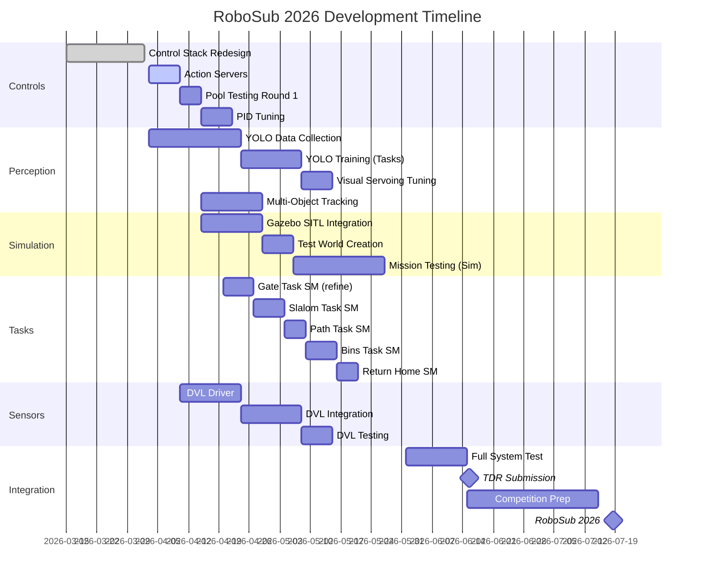
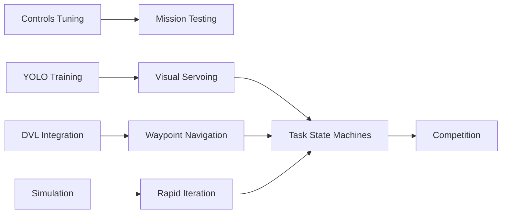

# RoboSub 2026 Timeline Analysis

**Competition Date:** July 2026 (assumed week 3)  
**Days Remaining:** ~100 days (from April 3, 2026)

---

## Critical Path



---

## Weekly Sprint Plan

| Week | Dates | Focus | Deliverable |
|------|-------|-------|-------------|
| 1 | Apr 1-7 | Action Servers | Long-running command support complete |
| 2 | Apr 8-14 | Pool Testing #1 | Validated PID params documented |
| 3 | Apr 15-21 | Simulation | Gazebo + SITL connected to ROS 2 |
| 4 | Apr 22-28 | YOLO Training | Custom model training started |
| 5 | Apr 29-May 5 | Slalom SM | Multi-pipe slalom state machine working |
| 6 | May 6-12 | DVL Integration | Position feedback operational |
| 7 | May 13-19 | Multi-Object Tracking | Track N objects simultaneously |
| 8 | May 20-26 | Bins Task | Downward camera + drop sequence |
| 9 | May 27-Jun 2 | Pool Testing #2 | Full task sequence validation |
| 10 | Jun 3-9 | Integration | All SMs connected, end-to-end test |
| 11 | Jun 10-16 | TDR + Fixes | Submit TDR, fix integration bugs |
| 12 | Jun 17-23 | Polish | Performance tuning, edge cases |
| 13 | Jun 24-30 | Pool Testing #3 | Competition simulation runs |
| 14 | Jul 1-7 | Final Prep | Pack, travel prep, last fixes |
| 15 | Jul 8-14 | Travel/Setup | Arrive at competition venue |
| 16 | Jul 15-21 | **RoboSub 2026** | **COMPETITION WEEK** |

---

## Phase Timeline

```
                    Apr 2026         May 2026         Jun 2026         Jul 2026
                    ─────────────────────────────────────────────────────────────
Phase 1 (Controls)  ████████░░░░░░░░░
                         │
Phase 2 (Missions)       ░░░████████████████░░░░░░░░░
                              │           │
Phase 3 (Perception)         ░░░░████████████████░░░░░
                                   │
Phase 4 (Sensors)                  ░░░░░░████████████████
                                              │
Phase 5 (Utils)             ░░░░░░░░░░░░░░████████████████
                    ─────────────────────────────────────────────────────────────
                                                         ▲
                                                    Competition
                                                    (Jul 15-21)
```

---

## Milestone Checkpoints

| Date | Milestone | Success Criteria |
|------|-----------|------------------|
| Apr 10 | **Pool Ready** | Action servers work, PID baseline documented |
| Apr 30 | **Simulation Up** | Full pipeline runs in Gazebo SITL |
| May 15 | **DVL Online** | Position feedback integrated |
| May 31 | **Core Tasks** | Gate, Slalom, Return Home SMs working in sim |
| Jun 15 | **TDR Submitted** | Technical Design Report complete |
| Jun 30 | **Competition Ready** | Full mission runs autonomously |
| Jul 15 | **RoboSub 2026** | 🏆 |

---

## Critical Dependencies



### Blocking Relationships

| Blocked Item | Requires | Resolution Date |
|--------------|----------|-----------------|
| Task SM testing | Simulation integration | Apr 21 |
| Waypoint navigation | DVL integration | May 12 |
| Bins task | Downward camera | May 20 |
| Torpedoes/Octagon | Acoustic pinger | **Stretch goal** |

---

## Resource Allocation

### Parallel Work Streams

These can proceed independently:

| Stream | Owner | Focus |
|--------|-------|-------|
| **Controls** | — | PID tuning, pool testing |
| **Vision** | — | YOLO training, tracking |
| **Sim** | — | Gazebo integration |
| **Sensors** | — | DVL driver |

### Bottlenecks

| Resource | Constraint | Mitigation |
|----------|------------|------------|
| Pool time | Limited availability | Prioritize PID tuning; use sim for logic |
| Jetson Orin Nano | Single compute unit | Profile early; optimize inference |
| Team size (~15) | Coordination overhead | Clear ownership per stream |

---

## Risk-Adjusted Timeline

### High Confidence (90%+ likely)

- Gate task working [DONE]
- Basic pool operation [DONE]
- Simulation connected

### Medium Confidence (60-80%)

- Slalom task working
- DVL integrated
- Custom YOLO deployed

### Lower Confidence (40-60%)

- Bins task (needs downward cam + dropper)
- All 6 tasks automated

### Stretch Goals (<40%)

- Acoustic pinger integration
- Torpedoes/Octagon tasks
- Full 20-minute autonomous run

---

## Competition Day Strategy

### Minimum Viable Mission (MVP)

```
Gate → Return Home
```
**Points:** ~200  
**Confidence:** Very High

### Target Mission

```
Gate → Slalom → Return Home
```
**Points:** ~400  
**Confidence:** High

### Full Mission (if all systems work)

```
Gate → Slalom → Bins → Return Home
```
**Points:** ~600  
**Confidence:** Medium

### Stretch (with pinger)

```
Gate → Slalom → Torpedoes → Octagon → Bins → Return Home
```
**Points:** ~900+  
**Confidence:** Low

---

## What to Do This Week

### Immediate (Today/Tomorrow)

1. [DONE] Finalize action server implementation
2. [DONE] Schedule pool session for Apr 8-10
3. [DONE] Start YOLO training data collection

### Before Pool Session

1. Pre-flight checklist complete
2. Logging infrastructure verified
3. Test cases documented

### After Pool Session

1. Document PID tuning results
2. Identify top 3 issues
3. Update timeline based on findings
