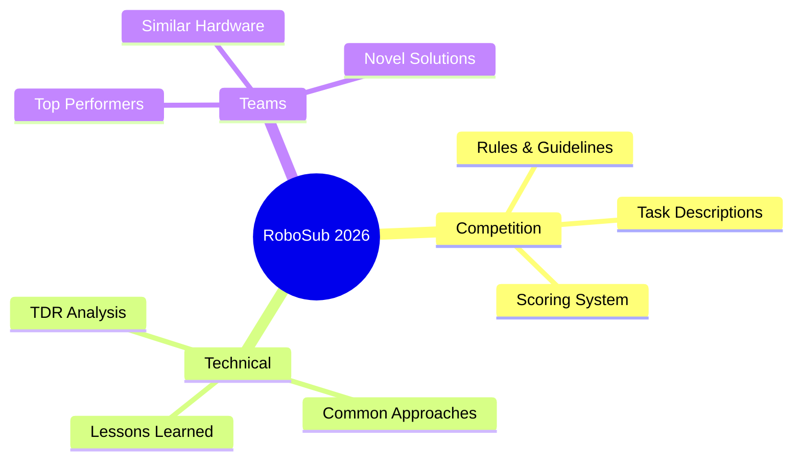

# RoboSub Competition Analysis

Resources, guidelines, and competitor analysis for RoboSub 2026.

## Documents

| Document | Description |
|----------|-------------|
| [competition-guide.md](competition-guide.md) | Rules, scoring, logistics |
| [task-analysis.md](task-analysis.md) | Detailed task breakdown |
| [team-analysis.md](team-analysis.md) | Competitor TDR review |
| [hardware-comparison.md](hardware-comparison.md) | Hardware approaches |
