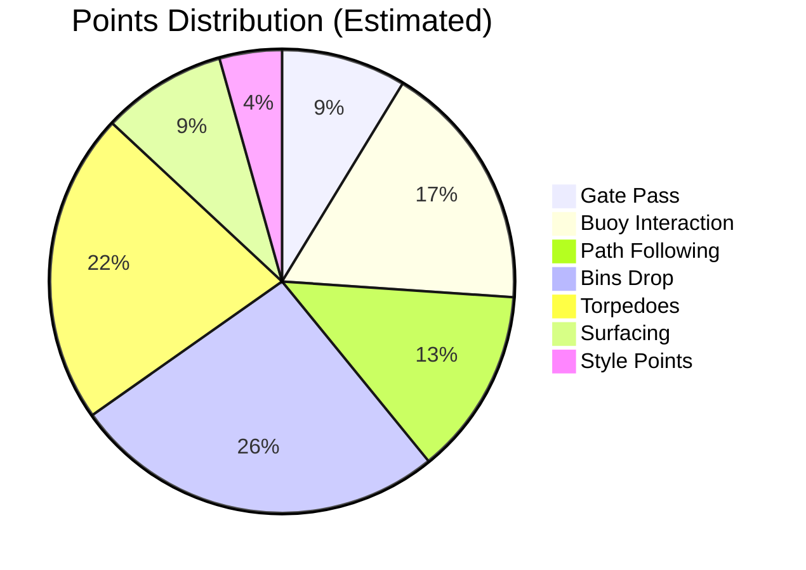

# RoboSub 2026 Competition Guide

## Overview

**Event:** RoboSub 2026
**Location:** TRANSDEC, San Diego, CA
**Theme:** "Restore and Recovery" — underwater pipeline maintenance

## Key Rules Summary

[Extract key rules from RoboNation documentation]

### Vehicle Requirements
- Fully autonomous operation
- Max dimensions: TBD
- Emergency kill switch required
- Acoustically activated or tether activated

### Competition Format
- Qualification runs
- Semi-finals
- Finals

### Scoring System

## Important Dates

| Date | Event |
|------|-------|
| TBD | Registration Deadline |
| TBD | TDR Submission |
| July 2026 | Competition Week |

## Links

- [RoboNation RoboSub](https://robonation.org/programs/robosub/)
- [Task Descriptions](https://robonation.gitbook.io/robosub-resources/)
- [Past Competition Results](https://robonation.org/programs/robosub/past-competitions/)
