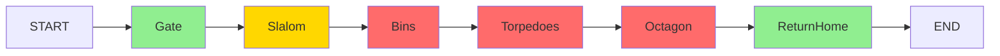

# RoboSub 2026 Task Analysis

> Source: [RoboNation Task Descriptions](https://robonation.gitbook.io/robosub-resources/section-3-autonomy-challenge/3.2-task-descriptions)
>
> Theme: *"Restore and Recovery"* — the AUV acts as a maintenance robot servicing a damaged underwater pipeline.

---

## Task Overview

| Task | Name | Points | Difficulty | Duburi Status |
|------|------|--------|------------|---------------|
| 1 | Begin Assessment (Gate) | ~100 | Easy | ✅ SM implemented |
| 2 | Avoid Debris (Slalom) | ~200 | Medium | ❌ Needs SM |
| 3 | Recon (Bins) | ~300 | Hard | ❌ Needs camera + SM |
| 4 | Deploy (Torpedoes) | ~250 | Hard | ❌ Needs actuator + SM |
| 5 | Resupply (Octagon) | ~200 | Hard | ❌ Needs pinger + SM |
| 6 | Return Home (Gate) | ~100 | Easy | 🟡 Reuse Task 1 |

---

## Task 1 — Begin Assessment (Gate)

### Description
Pass through a gate (two vertical poles with a horizontal bar). A "coin flip" mechanism determines which side the AUV enters from. After passing, the AUV selects a role (affects subsequent task order).

### Scoring
- Points for passing through gate
- Bonus for correct side entry after coin flip

### Perception Requirements
| Requirement | Status | Notes |
|-------------|--------|-------|
| Forward camera | ✅ | USB camera integrated |
| Gate pole detection | 🟡 | YOLO works, needs custom model |
| Crossbar detection | 🟡 | Needs custom model |
| Coin flip indicator | ❌ | Low priority — complex, low points |

### Control Requirements
| Requirement | Status | Notes |
|-------------|--------|-------|
| Heading hold | ✅ | Yaw PID implemented |
| Depth hold | ✅ | Depth PID implemented |
| Lateral correction | ✅ | Visual servo alignment |
| Forward drive | ✅ | `go_forward` command |

### State Machine Design

```
SearchGate ──detected──→ AlignGate ──aligned──→ DriveThrough ──→ [done]
     │                        │
     └──timeout──→ DeadReckonGate ──→ DriveThrough
                        │
                  AlignGate ──lost──→ SearchGate (retry ×3)
```

**States:**
- `SearchGate`: Rotate/search pattern until gate detected
- `AlignGate`: PID visual servo to center gate in frame
- `DriveThrough`: Forward drive with heading hold
- `DeadReckonGate`: Fallback — drive on last known heading

### Test Cases
- [ ] Gate detected at 5m, 3m, 1m distances
- [ ] Alignment converges within 5 seconds
- [ ] Drive-through without collision
- [ ] Dead reckoning fallback works when gate lost
- [ ] Recovery from partial occlusion

### Gap Checklist
- [ ] Train custom YOLO model on RoboSub gate props (orange poles + crossbar)
- [ ] Implement coin-flip visual detection (or skip — low points vs complexity)
- [ ] Tune alignment PID for gate-width target (approach distance matters)
- [ ] Test dead reckoning fallback with known heading

---

## Task 2 — Avoid Debris (Slalom)

### Description
Navigate through 3 sets of RED and WHITE vertical pipes arranged in a slalom pattern. The AUV must pass between each pair, alternating left and right.

### Scoring
- Points per gate cleared
- Bonus for completing all 3

### Perception Requirements
| Requirement | Status | Notes |
|-------------|--------|-------|
| RED pipe detection | ❌ | Needs YOLO class |
| WHITE pipe detection | ❌ | Needs YOLO class |
| Multi-object tracking | ❌ | Current tracker is single-object |
| Spatial reasoning | ❌ | Which color is left/right |

### Control Requirements
| Requirement | Status | Notes |
|-------------|--------|-------|
| Lateral correction | ✅ | Visual servo |
| Heading hold | ✅ | Yaw PID |
| Sequential waypoints | 🟡 | Needs SM iteration |

### State Machine Design

```
For each pipe pair (i = 1, 2, 3):
  SearchPipes_i ──detected──→ IdentifySide_i ──→ AlignPass_i ──→ DriveThrough_i
       │                                               │
       └──timeout──→ DeadReckonToNext_i                └──lost──→ SearchPipes_i
```

**States:**
- `SearchPipes`: Detect RED and WHITE pipe pair
- `IdentifySide`: Determine which color is left/right
- `AlignPass`: Position to pass on correct side
- `DriveThrough`: Navigate through gap
- `DeadReckonToNext`: Fallback — advance to next pair

### Test Cases
- [ ] Both pipes detected simultaneously
- [ ] Correct pass direction identified
- [ ] Smooth transition between pipe pairs
- [ ] Recovery when one pipe occluded
- [ ] Complete 3-pair slalom in < 60 seconds

### Gap Checklist
- [ ] Train YOLO model to detect RED pipe and WHITE pipe as separate classes
- [ ] Extend `KalmanObjectTracker` to multi-object (track both pipes in a pair)
- [ ] Implement slalom state machine with 3 sub-iterations
- [ ] Add spatial logic: determine pass direction based on color arrangement
- [ ] Waypoint fallback: if vision fails, dead-reckon forward to next pair

---

## Task 3 — Recon (Bins)

### Description
Locate bins on a 3D pipeline structure. Drop markers into the correct bins. Bins have visual indicators (symbols/colors) that determine which bin to target.

### Scoring
- Points per correct marker drop
- Penalties for wrong bin

### Perception Requirements
| Requirement | Status | Notes |
|-------------|--------|-------|
| Downward camera | ❌ | **Critical** — forward cam can't see bins |
| Bin outline detection | ❌ | Needs YOLO model |
| Symbol recognition | ❌ | Competition-specific props |
| Height estimation | ❌ | For drop altitude |

### Control Requirements
| Requirement | Status | Notes |
|-------------|--------|-------|
| Hover precision | 🟡 | Need < 5cm drift |
| Depth hold at altitude | ✅ | Depth PID |
| Downward visual servo | ❌ | Different axis mapping |

### State Machine Design

```
NavigateToBins ──arrived──→ SearchBins (downward cam) ──detected──→ IdentifyTarget
     │                            │                                      │
     └──timeout──→ [skip]         └──timeout──→ [skip]           AlignOverBin
                                                                        │
                                                                  DropMarker ──→ [done]
```

**States:**
- `NavigateToBins`: DVL waypoint or dead reckoning to bin area
- `SearchBins`: Downward camera search pattern
- `IdentifyTarget`: Match bin symbol to mission target
- `AlignOverBin`: Center over target bin (downward visual servo)
- `DropMarker`: Actuate dropper

### Test Cases
- [ ] Bin detected from 1m altitude
- [ ] Correct bin identified from 3 options
- [ ] Centering converges within 5 seconds
- [ ] Marker lands inside bin (±5cm accuracy)
- [ ] Multiple drops (if 2 markers available)

### Gap Checklist
- [ ] Mount and integrate downward camera (USB, V4L2)
- [ ] Train YOLO model for bin symbols (competition-specific props)
- [ ] Implement dropper actuator (solenoid/servo + `DriverCommand` handler)
- [ ] Implement hover-and-drop state machine
- [ ] Add downward visual servo mode (camera below, not forward)
- [ ] Test drop precision: ±5cm at 0.5m altitude

---

## Task 4 — Deploy (Torpedoes)

### Description
Fire torpedoes at designated targets. An acoustic pinger indicates the task location. Targets have visual markers indicating valid strike zones.

### Scoring
- Points per hit
- Bonus for bullseye

### Perception Requirements
| Requirement | Status | Notes |
|-------------|--------|-------|
| Acoustic pinger DOA | ❌ | No hardware |
| Target detection | ❌ | Needs YOLO model |
| Precise alignment | 🟡 | Tighter than gate |

### Control Requirements
| Requirement | Status | Notes |
|-------------|--------|-------|
| Stable hover | ✅ | Depth + heading hold |
| Zero drift at fire | 🟡 | Needs testing |
| Torpedo actuator | ❌ | Mechanical not integrated |

### State Machine Design

```
If pinger available:
  ListenForPinger ──bearing──→ NavigateToPinger ──arrived──→ SearchTargets
Else:
  DeadReckonToArea ──→ SearchTargets

SearchTargets ──detected──→ AlignToTarget ──aligned──→ FireTorpedo ──→ [done]
     │                            │
     └──timeout──→ [skip]         └──lost──→ SearchTargets (retry ×3)
```

**States:**
- `ListenForPinger`: Acoustic DOA estimation
- `NavigateToPinger`: Drive toward bearing
- `SearchTargets`: Visual search for torpedo targets
- `AlignToTarget`: Precision alignment (±2cm)
- `FireTorpedo`: Actuate launcher + confirm

### Test Cases
- [ ] Pinger bearing estimated within ±10°
- [ ] Target detected at 3m range
- [ ] Alignment holds for 2 seconds (firing window)
- [ ] Torpedo hits target center at 2m range
- [ ] Recovery if first shot misses

### Gap Checklist
- [ ] Research acoustic pinger hardware (hydrophones + DAQ)
- [ ] Implement torpedo launcher (mechanical + `DriverCommand` handler)
- [ ] Train YOLO model for torpedo targets
- [ ] Implement torpedo task state machine
- [ ] Tighten alignment PID for torpedo-level precision (±2cm lateral, ±2cm vertical)
- [ ] Test alignment stability at hover (must hold position for 1-2s while firing)

---

## Task 5 — Resupply (Octagon)

### Description
Surface inside an octagonal structure. Pick up objects from the octagon. An acoustic pinger indicates the octagon location.

### Scoring
- Points for surfacing inside octagon
- Additional points per object retrieved

### Perception Requirements
| Requirement | Status | Notes |
|-------------|--------|-------|
| Acoustic pinger DOA | ❌ | No hardware |
| Upward octagon detection | ❌ | Needs camera + model |
| Surface object detection | ❌ | Needs model |

### Control Requirements
| Requirement | Status | Notes |
|-------------|--------|-------|
| Precise positioning | 🟡 | Under octagon center |
| Controlled ascent | ✅ | `surface` command |
| Surface stability | 🟡 | Needs testing |
| Grabber control | ✅ | Open/close implemented |

### State Machine Design

```
If pinger available:
  ListenForPinger ──bearing──→ NavigateToPinger ──arrived──→ SearchOctagon
Else:
  DeadReckonToArea ──→ SearchOctagon

SearchOctagon (upward cam) ──detected──→ CenterUnder ──centered──→ Surface
     │                                        │
     └──timeout──→ SurfaceBlind               └──lost──→ SearchOctagon

Surface ──surfaced──→ SearchObjects ──found──→ GrabObject ──→ [done]
```

**States:**
- `ListenForPinger`: Acoustic DOA estimation
- `SearchOctagon`: Upward camera search
- `CenterUnder`: Position directly below octagon center
- `Surface`: Controlled ascent
- `SearchObjects`: Look for retrievable objects
- `GrabObject`: Approach + actuate grabber

### Test Cases
- [ ] Octagon detected from 2m below
- [ ] Centering within octagon boundary
- [ ] Surfacing inside octagon (no contact with edges)
- [ ] Object detected on surface
- [ ] Grabber secures object successfully

### Gap Checklist
- [ ] Acoustic pinger (shared with Task 4 — one hardware investment serves both)
- [ ] Upward or downward camera for octagon detection
- [ ] Octagon detection model (geometric shape detection or YOLO)
- [ ] Object detection and grab sequence state machine
- [ ] Test surface-inside-octagon positioning precision
- [ ] Grabber reliability testing under water

---

## Task 6 — Return Home (Gate)

### Description
Return through the starting gate from the opposite direction.

### Scoring
- Points for passing back through

### Perception Requirements
| Requirement | Status | Notes |
|-------------|--------|-------|
| Gate detection | ✅ | Same as Task 1 |
| Reverse approach | 🟡 | May look different |

### Control Requirements
| Requirement | Status | Notes |
|-------------|--------|-------|
| 180° turn | ✅ | Yaw PID |
| Long-range navigation | 🟡 | DVL/dead reckoning |
| Gate alignment | ✅ | Reuse Task 1 |

### State Machine Design

```
TurnAround (180° from start heading) ──→ NavigateHome (reverse heading, timed)
     │                                          │
     └──→ SearchGate (reuse Task 1) ──→ AlignGate ──→ DriveThrough ──→ [done]
```

### Test Cases
- [ ] 180° turn completes accurately
- [ ] Navigation back to start area
- [ ] Gate detected from reverse direction
- [ ] Pass-through without collision

### Gap Checklist
- [ ] Test 180° turn accuracy (yaw PID)
- [ ] Calibrate return navigation (distance + heading)
- [ ] Reuse gate state machine from Task 1
- [ ] Test gate appearance from reverse direction

---

## Cross-Task Elements

### Path Markers
- Orange markers placed on pool floor between tasks
- Detection enables confidence in navigation
- Lower priority than task completion

### Acoustic Pingers
- Located at Torpedoes (Task 4) and Octagon (Task 5)
- Same hardware serves both tasks
- If not implemented, use dead reckoning fallback

### Mission Strategy



**Priority Order (points-per-time):**
1. Gate (easy, fast) — **must complete**
2. Slalom (medium) — **high value**
3. Return Home (reuses Task 1) — **easy points**
4. Bins (if downward cam ready)
5. Torpedoes (if pinger ready)
6. Octagon (if pinger ready)

**Timeout Strategy:**
- [ ] Implement mission timeout in top-level YASMIN SM
- [ ] Skip remaining tasks → go to Return Home
- [ ] Profile per-task time in simulation
