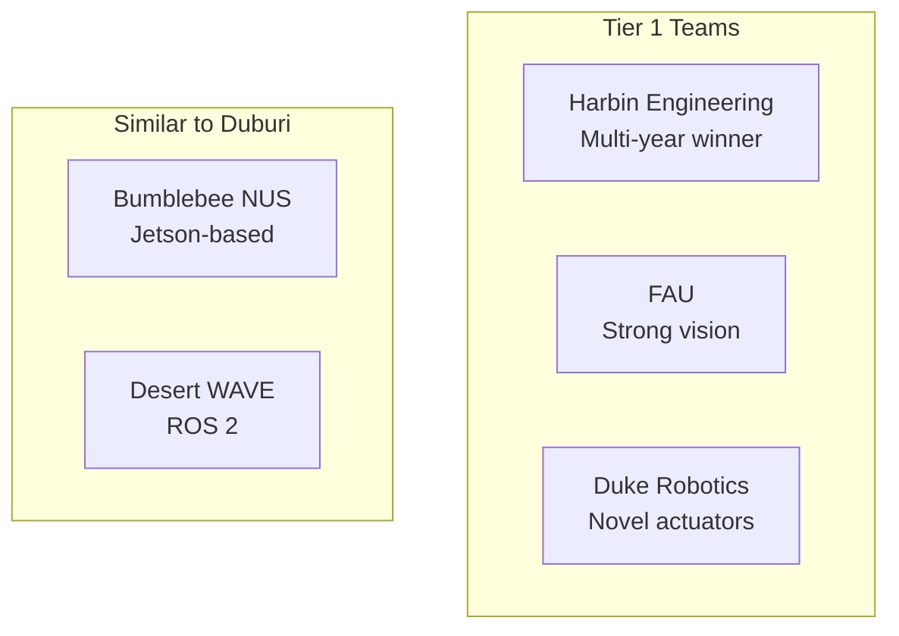

# Competitor Team Analysis

Analysis of top RoboSub teams' Technical Design Reports (TDRs).

> See also: [COMPETITIVE_ANALYSIS.md](../COMPETITIVE_ANALYSIS.md) for detailed Duburi vs competitor feature matrix.

---

## Top Teams Overview



---

## Bumblebee (NUS) Analysis

**Relevance:** Similar Jetson-based architecture, ROS 2, behavior trees

### Team Profile
| Dimension | Bumblebee (BBAUV 4.5) | Duburi 4.2 |
|-----------|----------------------|------------|
| Team size | 55 | ~15 |
| Compute | Jetson Orin AGX (32 GB) + i7 SBC | Jetson Orin Nano (8 GB) |
| Framework | ROS 2 Humble | ROS 2 Humble |
| Localization | DVL + FOG + IMU + UKF (custom) | IMU + DVL (EKF via Pixhawk) |
| Pool test hours | 300 | ~100 (est.) |
| Simulation hours | 100 | 0 |

### What They Do Well
1. **Modular mission planning** Py Trees behavior tree for composable task execution with automatic fallback
2. **Multi-stage perception** YOLO → XFeat → PnP → clustering fallback
3. **Custom UKF** Sensor fusion with vision recalibration
4. **Testing rigor** 300 hours in-water, 100 hours simulation
5. **Multi-vehicle strategy** Two vehicles for parallel development

### What We Can Learn
1. **Graceful degradation** Each capability should function independently. If vision fails, dead reckon.
2. **Perception pipeline layering** Multiple methods for same problem with automatic fallback
3. **Telegram telemetry** Simple pool-side alerts. We could forward critical events to a bot.
4. **Test infrastructure** Their testing infrastructure *is* their competitive advantage

### Their Architecture Patterns

**Behavior Tree Structure:**
```
Mission (root Sequence)
 Gate (Subtree with Selector fallback)
 Slalom (Subtree)
 Bins (Subtree)
...
```

**Perception Pipeline:**
```
Stage 1: YOLO detection (coarse)
Stage 2: XFeat feature matching (precise)
Stage 3: PnP pose estimation (3D)
Fallback: Revert to Stage 1 + proportional approach
```

---

## Desert WAVE Analysis

**Relevance:** Small team success, ArduSub firmware, dead reckoning

### Team Profile
| Dimension | Desert WAVE (Dragon) | Duburi 4.2 |
|-----------|---------------------|------------|
| Team size | 7 | ~15 |
| Compute | Jetson Xavier NX | Jetson Orin Nano (8 GB) |
| Framework | Custom (non-ROS) | ROS 2 Humble |
| Localization | DVL + FOG (dead reckoning) | IMU + DVL (EKF via Pixhawk) |
| Firmware | ArduSub (Pixhawk-based) | ArduSub (Pixhawk 2.4.8) |

### What They Do Well
1. **Dead reckoning works** 1-inch waypoint accuracy with Leica GPS survey
2. **Simplicity wins** Skip ML for navigation, focus on reliable waypoints
3. **Course survey methodology** Physical landmarks to triangulate underwater waypoints
4. **Speed through the course** Completed 3 runs in 20 minutes because waypoints are fast

### What We Can Learn
1. **Navigation/task separation** Navigate by waypoints (no vision), use vision only for task execution
2. **Pre-competition survey** Survey course markers to establish absolute waypoints
3. **Minimal complexity** A tiny team competing effectively by doing fewer things well
4. **Multiple runs strategy** Speed multiplies points

### Architecture Comparison

| Aspect | Desert WAVE | Duburi |
|--------|-------------|--------|
| Framework | Custom | ROS 2 Humble |
| Vision | HSV color threshold | YOLO11 |
| Control | ArduSub firmware PID | PID + Ramp |
| Navigation | GPS surveyed waypoints | Dead reckoning / visual |
| State Machine | Linear waypoints | YASMIN HFSM |

---

## Common Patterns Across Teams

### Vision Approaches

| Approach | Teams Using | Duburi Status |
|----------|-------------|---------------|
| YOLO variants | Most teams | [DONE] YOLO11n |
| Traditional CV (HSV) | Desert WAVE, backup | [MEDIUM] Not used |
| Feature matching (XFeat, ORB) | Bumblebee | [TODO] Missing |
| PnP pose estimation | Bumblebee | [TODO] Missing |
| Depth estimation | Bumblebee (DepthAnything) | [TODO] Missing |

### Control Approaches

| Approach | Teams Using | Duburi Status |
|----------|-------------|---------------|
| PID control | Universal | [DONE] Implemented |
| Model predictive control | Advanced teams | [TODO] Not planned |
| LQR | Some teams | [TODO] Not planned |
| Trajectory interpolation | Bumblebee | [TODO] Missing |
| QP thrust allocation | Bumblebee | [TODO] Missing |

### State Machine Patterns

| Pattern | Teams Using | Duburi Status |
|---------|-------------|---------------|
| Behavior trees | Bumblebee (Py Trees) | [TODO] Using YASMIN |
| Hierarchical FSM | Duburi | [DONE] YASMIN HFSM |
| SMACH | Older teams | [TODO] Deprecated |
| Linear sequences | Desert WAVE | [TODO] Too simple |

### Localization Approaches

| Approach | Teams Using | Duburi Status |
|----------|-------------|---------------|
| DVL integration | Most teams | [MEDIUM] Hardware only |
| Fiber optic gyro | Advanced teams | [TODO] Not planned |
| Custom UKF | Bumblebee | [TODO] Using Pixhawk EKF |
| GPS survey (surface) | Desert WAVE | [MEDIUM] Could adopt |
| Visual odometry | Bumblebee | [TODO] Missing |

---

## Lessons from Competitors

### Strategic Lessons

1. **Test infrastructure = competitive advantage** Teams with more simulation and pool time consistently outperform
2. **Graceful degradation beats perfection** Better to complete tasks with fallbacks than fail at complex solutions
3. **Small teams can win** Desert WAVE (7 people) competes with 50+ person teams by focusing on reliability
4. **Speed matters** Multiple course completions multiply points

### Technical Lessons

1. **Separate navigation from task execution** DVL/waypoints for navigation, vision for tasks
2. **Layer perception methods** Primary → secondary → fallback pipeline
3. **Test fallbacks explicitly** Every sensor failure should have a graceful recovery

### Operational Lessons

1. **Pre-competition course survey** Use GPS and markers to establish waypoints
2. **Telegram/Slack alerts** Pool-side team members get automated status
3. **Multi-vehicle development** If possible, parallelize hardware testing

---

## TDR Links (When Available)

| Team | Year | Link |
|------|------|------|
| Bumblebee NUS | 2025 | [TDR] |
| Desert WAVE | 2024 | [TDR] |
| Harbin Engineering | 2024 | [TDR] |
| FAU | 2024 | [TDR] |

---

## Recommendations for Duburi

### High Priority (adopt from competitors)

1. **Navigation/task split** Use DVL waypoints between tasks, vision only at task sites
2. **Fallback states in all SMs** Every `SearchX` state needs a `DeadReckonX` fallback
3. **Course survey protocol** Document waypoint establishment procedure

### Medium Priority

1. **Perception fallback pipeline** YOLO → HSV color → proportional approach
2. **Telegram telemetry** Forward `/mavlink/events` to a bot
3. **Simulation integration** Connect Gazebo to ROS 2 pipeline for faster iteration

### Lower Priority (nice to have)

1. **XFeat feature matching** For torpedo/bin precision alignment
2. **DepthAnything** Monocular depth for approach distance
3. **Custom UKF** Replace Pixhawk EKF for better tuning
